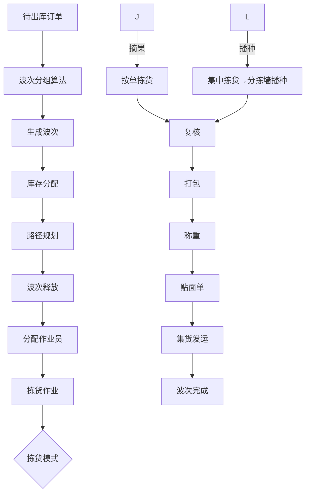
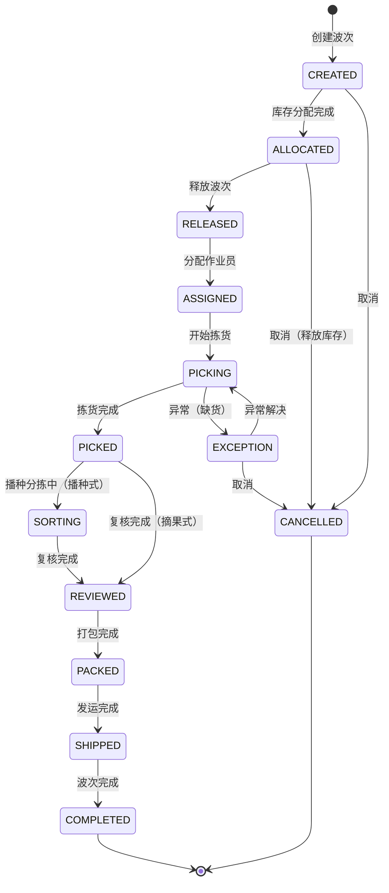

# 波次算法深度深化分析

---

## 一、业务定义与目标

### 1.1 定义

波次算法（Wave Algorithm）是WMS出库管理中，将大量待出库订单按照一定策略分组为"波次（Wave）"，并为每个波次规划最优拣货路径，以提高拣货效率、减少行走距离、平衡作业负荷的核心算法模块。

波次是出库作业的基本调度单位，一个波次包含若干个订单，作业人员按波次进行拣货作业。

### 1.2 核心目标

| 目标 | 衡量指标 |
|------|---------|
| 提高拣货效率 | 人均拣货件数提升 >30% |
| 减少行走距离 | 行走距离减少 >40% |
| 平衡作业负荷 | 各作业员工作量差异 <20% |
| 满足时效要求 | 订单按时出库率 >99% |
| 支持多种模式 | 覆盖摘果/播种/分区等模式 |

### 1.3 波次算法全景

```
波次算法
├── 波次分组算法
│   ├── 按订单类型分组（B2B/B2C/越库/调拨）
│   ├── 按快递商分组（顺丰/京东/中通）
│   ├── 按区域分组（同一库区/同一巷道）
│   ├── 按时间分组（定时波次/即时波次）
│   ├── 按SKU聚合分组（相同SKU订单合并）
│   ├── 按数量分组（固定订单数/固定件数）
│   ├── 按优先级分组（VIP订单/紧急订单）
│   └── 智能组合分组（多维度组合）
├── 波次参数配置
│   ├── 波次最大订单数
│   ├── 波次最大件数
│   ├── 波次最大SKU数
│   ├── 波次时间窗口
│   ├── 波次优先级
│   └── 波次自动释放条件
├── 拣货路径算法
│   ├── S型路径（蛇形）
│   ├── 分区路径（按区域分组）
│   ├── 最短路径（动态规划/TSP近似）
│   ├── 中点返回路径
│   ├── 最大间隙路径
│   └── 自定义路径
├── 波次调度
│   ├── 自动生成波次（定时/条件触发）
│   ├── 手动创建波次
│   ├── 波次优先级调度
│   ├── 波次分配给作业员
│   ├── 波次执行监控
│   └── 波次异常处理（缺货/暂停/取消）
└── 波次模式
    ├── 摘果式（一人一单/一人多单）
    ├── 播种式（先集后分/二次分拣）
    ├── 分区拣货（按区域分工）
    ├── 整托盘拣货（叉车作业）
    └── 混合模式（多模式组合）
```

---

## 二、业务流程图

### 2.1 波次生成与执行全流程



### 2.2 波次分组算法流程

```mermaid
flowchart TD
    A[获取待分配订单] --> B[过滤条件筛选]
    B --> C[按优先级排序]
    C --> D[按分组维度聚类]
    D --> E[检查波次参数限制]
    E -->{超限?}
    F -->|是| G[拆分为多个波次]
    F -->|否| H[生成波次]
    G --> H
    H --> I[库存预占]
    I --> J[波次入库]
```

---

## 三、状态机设计

### 3.1 波次状态机



---

## 四、核心业务场景详解

### 4.1 波次分组算法

**5种核心分组算法：**

1. **定时波次**：按固定时间间隔生成（如每30分钟），将时间窗口内的订单合并为波次。适用常规B2C订单。
2. **即时波次**：订单达到一定数量立即生成波次（如满50单）。适用大促高并发。
3. **按快递商分组**：同一快递商的订单合并，便于后续集货发运。适用多快递商场景。
4. **按区域分组**：同一库区/巷道的订单合并，减少行走距离。适用大仓库分区作业。
5. **智能组合**：多维度组合（优先级+快递商+区域+数量），适用复杂场景。

**波次参数限制：** 最大订单数（如200单）、最大件数（如500件）、最大SKU数（如100个），超限自动拆分。

### 4.2 拣货路径算法

**4种路径算法：**

1. **S型（蛇形）路径**：按库位编码顺序，从入口进入，S型行走覆盖所有需拣库位，最后从出口离开。最简单，适用常规仓库。
2. **分区路径**：将仓库分为多个区域，每个区域内S型，区域间按最优顺序连接。适用大型仓库。
3. **最短路径（TSP近似）**：使用最近邻算法/遗传算法动态计算最短路径，适用高价值/大件商品。
4. **中点返回路径**：从入口走到最远点，然后返回，适用库位分布在一侧的巷道。

**路径输出：** 库位顺序列表+预计行走距离+区域导航指引。

### 4.3 摘果式拣货

一人负责一个或多个订单，按订单逐个库位拣货，拣完一个订单的所有商品后送到复核区。适用B2B订单（SKU多、单量少）、高价值商品、需要严格按单管理的场景。

优点：简单直接，订单间不混淆；缺点：行走距离长，效率低。

### 4.4 播种式拣货（二次分拣）

先将波次内所有订单的相同SKU汇总，从库位拣出总数量，送到分拣墙/分拣区，再按订单逐个"播种"到对应格口。适用B2C电商（SKU少、单量大）。

流程：集中拣货→分拣墙播种→扫描商品→系统提示格口→扫描格口确认→放入商品→每个格口即一个订单。

优点：拣货行走距离短，效率高；缺点：需要分拣墙，二次分拣增加环节。

### 4.5 分区拣货

将仓库分为多个区域，每个作业员固定负责一个区域，订单跨区域时分区拣货后在集货区汇总。适用大型仓库、专业化分工。

### 4.6 波次调度与异常处理

**自动生成：** PowerJob定时任务（如每15分钟）检查待分配订单，按规则生成波次。条件触发（订单量达到阈值/紧急订单）即时生成。

**异常处理：**
- 缺货：标记缺货明细，触发紧急补货，部分订单可先出，缺货部分等待或取消
- 波次暂停：作业员暂停，库存保持预占
- 波次取消：释放所有预占库存，订单回到待分配池
- 作业员切换：波次可重新分配给其他作业员

---

## 五、库存变化分析

| 波次动作 | 库存变化 |
|---------|---------|
| 波次创建 | 不改变库存 |
| 库存分配 | 可用→预占（ALLOCATED） |
| 波次释放 | 预占不变 |
| 开始拣货 | 预占→拣货中（PICKING） |
| 拣货完成 | 拣货中不变 |
| 复核完成 | 拣货中→待发运（SHIPPING） |
| 发运完成 | 待发运→扣减（库存减少） |
| 波次取消 | 预占/拣货中→可用（释放） |

---

## 六、技术实现方案

### 6.1 核心表设计

```sql
-- 波次主表 wms_wave (wave_no/wave_type/status/priority/total_orders/total_skus/total_qty/warehouse_code/owner_code/created_by/started_at/completed_at)
-- 波次订单关联表 wms_wave_order (wave_id/outbound_order_id/order_no/status)
-- 波次拣货明细 wms_wave_pick_item (wave_id/order_id/sku/barcode/batch_no/location_code/plan_qty/picked_qty/status/sort_order)
-- 波次路径表 wms_wave_path (wave_id/location_code/sort_order/distance)
-- 波次作业员表 wms_wave_assignee (wave_id/assignee/assigned_at/started_at/finished_at)
```

### 6.2 波次分组核心逻辑

获取待分配订单→按优先级排序→按分组维度（快递商/区域/类型）聚类→检查波次参数限制（订单数/件数/SKU数）→超限拆分→生成波次→库存预占→保存波次及明细。

### 6.3 路径规划核心逻辑

获取波次所有需拣库位→去重→按路径算法排序（S型按库位编码/最短路径用最近邻算法）→计算相邻库位距离→累计总距离→输出拣货顺序。

S型路径：按库区→巷道→层→位排序，奇数巷道正向，偶数巷道反向。

### 6.4 LiteFlow波次执行编排

wave-execute.xml编排：分配库存组件→路径规划组件→波次释放组件→拣货执行组件→复核组件→打包组件→发运组件。每个组件可配置行业插件扩展点。

---

## 七、主流WMS对比

| 维度 | 富勒 | 曼哈特 | Blue Yonder | X WMS |
|------|------|--------|-------------|-------|
| 分组算法 | 定时+按类型 | 全维度智能分组 | AI动态分组 | 5种算法+智能组合 |
| 路径优化 | S型基础 | 高级TSP优化 | AI最优路径 | S型+分区+最短路径 |
| 波次模式 | 摘果+播种 | 全模式 | AI模式推荐 | 全模式+混合 |
| 自动波次 | 定时 | 智能触发 | AI预测触发 | 定时+条件+手动 |
| 异常处理 | 基础 | 完整 | AI预测缺货 | 完整+补货联动 |

---

## 八、常见业务问题与解决方案

| 问题 | 解决方案 |
|------|---------|
| 波次拣货效率低 | 路径优化+ABC库位优化+波次参数调优 |
| 缺货导致波次中断 | 实时库存校验+替代库位推荐+紧急补货+部分发货 |
| 波次订单积压 | 增加波次频率+调整波次参数+增加作业员 |
| 播种式分拣错误 | 格口条码校验+播种确认+复核把关 |
| 大促波次生成慢 | 批量处理+并行计算+预生成+限流 |
| 作业员负荷不均 | 智能任务分配+工作量平衡+波次大小调整 |
| 跨区波次行走远 | 分区波次+区域内聚合+区域间集货 |
| 紧急订单插队 | 优先级波次+即时生成+抢占资源 |

---

## 九、与其他模块的关联关系

| 关联模块 | 关联点 |
|---------|--------|
| 出库管理 | 订单→波次→拣货→发运全流程 |
| 库存管理 | 库存预占/分配/扣减 |
| RF作业 | 波次拣货任务执行 |
| 分配规则 | 波次库存分配策略 |
| 周转规则 | FIFO/FEFO分配 |
| 库位管理 | 路径规划依赖库位布局 |
| 人员绩效 | 波次作业量统计 |
| 消息通知 | 波次异常通知 |
| KPI报表 | 波次效率统计 |
| 行业插件 | 大促波次优化/GSP批次波次 |
