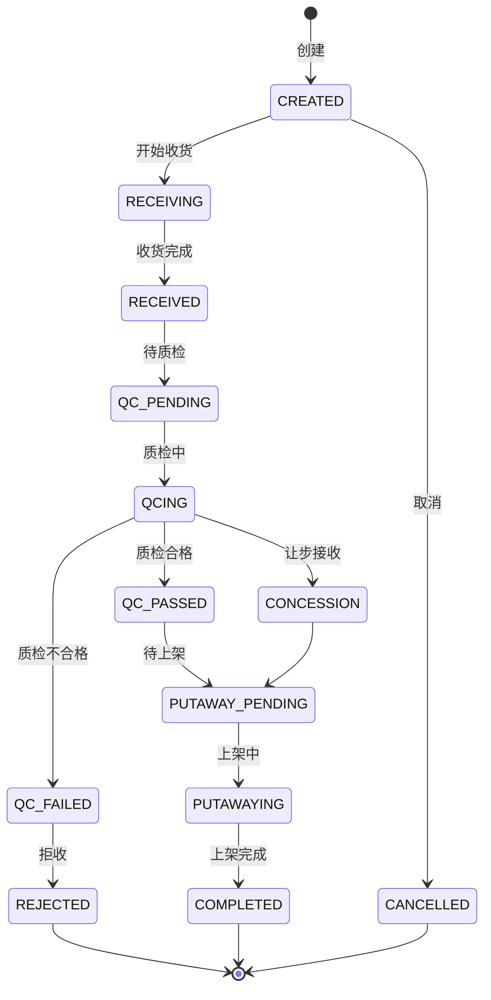

# 入库全流程深度深化分析

---

## 一、业务定义与目标

### 1.1 定义

入库管理（Inbound Management）是WMS中对商品从供应商/生产端到达仓库，经过预约、收货、质检、码盘、上架等环节，最终进入可售库存的全流程管理。涵盖采购入库、退货入库、调拨入库、越库入库、生产入库等多种入库类型。

### 1.2 核心目标

| 目标 | 衡量指标 |
|------|---------|
| 收货准确 | 收货准确率 >99.9% |
| 上架及时 | 上架及时率 >95% |
| 质检合规 | 质检覆盖率 100%（需质检商品） |
| 库存实时 | 库存更新延迟 <1分钟 |
| 差异可追溯 | 差异处理率 100% |

### 1.3 入库类型

| 类型 | 说明 | 触发来源 |
|------|------|---------|
| 采购入库 | 供应商送货 | ERP采购订单→ASN |
| 退货入库 | 客户退货 | 退货单/RMA |
| 调拨入库 | 其他仓库调入 | 调拨出库单 |
| 越库入库 | 直接转出库 | 越库订单 |
| 生产入库 | 产成品入库 | MES/生产系统 |
| 赠品入库 | 供应商赠品 | 采购单赠品行 |
| 盘盈入库 | 盘点多出 | 盘点调整 |

### 1.4 业务场景全景

```
入库全流程
├── 采购订单(PO)管理
├── ASN(预收货通知)管理
├── 预约管理（到仓预约/月台预约）
├── 收货管理
│   ├── 预约收货（有ASN）
│   ├── 盲收（无ASN）
│   ├── 越库收货
│   ├── 退货收货
│   ├── 逐件/逐箱/逐托盘收货
│   └── 收货差异处理（短收/超收/错收）
├── 质检管理(QC)
│   ├── 全检/抽检/免检
│   ├── 抽样方案（GB/T 2828.1）
│   ├── 检验项目
│   ├── 让步接收
│   └── 不合格品处理
├── 码盘管理
│   ├── 码盘规则
│   ├── SSCC托盘码生成
│   ├── 混盘/整盘
│   └── 托盘标签打印
├── 上架管理
│   ├── 推荐上架（上架规则引擎）
│   ├── 直接上架
│   ├── 整托盘上架
│   ├── 拆零上架
│   └── 上架确认
└── 入库完成（库存可用/回传ERP）
```

---

## 二、业务流程图

### 2.1 入库全流程

```mermaid
flowchart TD
    A[采购订单PO] --> B[ASN预收货通知]
    B --> C[到仓预约]
    C --> D[车辆到仓/月台分配]
    D --> E[卸货]
    E --> F[收货扫描]
    F --> G{收货差异?}
    H -->|有| I[差异记录+处理]
    H -->|无| J[质检判断]
    I --> J
    J -->{需要质检?}
    K -->|是| L[质检作业]
    L -->{质检结果}
    M -->|合格| N[码盘]
    O -->|不合格| P[不合格品隔离]
    Q -->|让步接收| N
    K -->|否| N
    N --> R[上架]
    R --> S[库存可用]
    S --> T[回传ERP]
    T --> U[入库完成]
    P --> V[退货供应商/销毁]
```

### 2.2 收货流程

```mermaid
flowchart TD
    A[扫描ASN/PO号] --> B[系统展示明细]
    B --> C[扫描商品条码/箱码/托盘码]
    C --> D[系统识别SKU匹配明细行]
    D --> E[输入实收数量]
    E --> F{批次/效期?}
    G -->|有| H[扫描/录入批次效期]
    G -->|无| I
    H --> I{校验}
    I -->{SKU匹配?数量超收?}
    J -->|异常| K[差异处理]
    J -->|正常| L[累计收货]
    K --> L
    L -->{全部完成?}
    M -->|否| C
    M -->|是| N[生成入库单]
    N --> O[商品入暂存区]
```

---

## 三、状态机设计

### 3.1 入库单状态机



---

## 四、核心业务场景详解

### 4.1 PO/ASN管理

PO（采购订单）来自ERP，是入库的源头。ASN（预收货通知）是供应商发货后推送WMS的到货通知，包含SKU/数量/批次/预计到货时间。ASN支持ERP推送/手动创建/导入，是预约收货的依据。

PO→ASN→入库单三级单据关系：PO是采购合同，ASN是发货通知，入库单是实际收货凭证。一个PO可分多次ASN发货，一个ASN可分多次收货。

### 4.2 预约与月台管理

供应商提前预约到仓时间，系统分配月台。车辆到仓后扫码签到，月台叫号，卸货作业。支持越库月台（收货后直接转发货区）、冷链月台（温控）。

### 4.3 收货作业

**预约收货（有ASN）：** 扫描ASN号→系统展示明细→逐行扫描商品条码/箱码/托盘码→输入实收数量→批次效期录入→差异处理（短收标记/超收审批/错收提示）→收货完成生成入库单→商品入暂存区。

**盲收（无ASN）：** 扫描商品条码→系统识别SKU→输入数量/批次/效期→选择供应商/货主→确认收货。

**越库收货：** 扫描ASN识别越库订单→收货时直接关联出库单→商品直接送发货区→不进入存储区。

**收货粒度：** 逐件（高价值/小件）、逐箱（扫描箱码自动展开明细）、逐托盘（扫描SSCC自动展开托盘商品）。

### 4.4 收货差异处理

- **短收**：实收<应收，标记短收，记录差异，ASN部分完成，可后续补收
- **超收**：实收>应收，需审批或拒收（按配置），超收部分可创建赠品行
- **错收**：SKU不匹配，提示错误，不允许收货
- **批次/效期差异**：与ASN不一致，记录实际批次效期

### 4.5 质检管理

质检规则配置（全检/抽检/免检），抽检按GB/T 2828.1抽样方案（AQL水平）。检验项目（外观/数量/规格/效期/功能）。合格→上架；不合格→隔离区，退货供应商或销毁；让步接收（轻微不合格，审批后正常入库）。

### 4.6 码盘管理

收货后商品码盘（散货码到托盘），生成SSCC-18托盘码，关联托盘内所有商品/批次/数量，计算总重量体积，打印托盘标签。支持整盘（单SKU）/混盘（多SKU）。

### 4.7 上架管理

**推荐上架：** 系统按上架规则推荐库位（同SKU集中/ABC分类近出口/重量适配低层/批次效期集中/库位容量校验），作业员导航到推荐库位→扫描库位码→扫描商品→输入数量→确认上架。

**直接上架：** 作业员扫描商品→扫描目标库位→校验可用性→确认。

**整托盘上架：** 叉车作业，扫描SSCC→推荐整托盘库位→扫描库位确认。

上架后库存从暂存区→存储库位（可用状态）。

### 4.8 越库入库

越库（Cross-Docking）：商品到仓后不进入存储区，直接分拣发运。收货时关联出库单，收货后库存直接预占分配，送到发货区，复核打包发运。适用快消品/促销品/高周转商品。

库存变化：收货后直接进入待发运状态，跳过存储环节。

---

## 五、库存变化分析

| 入库动作 | 库存变化 |
|---------|---------|
| 收货完成 | 暂存区可用+（AVAILABLE） |
| 质检中 | 暂存区可用不变（冻结质检区可选） |
| 质检合格 | 暂存区可用不变 |
| 上架完成 | 暂存区可用-，存储库位可用+ |
| 越库收货 | 暂存区+→直接预占分配→待发运 |
| 入库取消 | 暂存区可用-（回滚） |

---

## 六、技术实现方案

### 6.1 核心表设计

```sql
-- 采购订单 wms_purchase_order (po_no/supplier_code/owner_code/warehouse_code/status/total_qty/received_qty)
-- ASN单 wms_asn (asn_no/po_no/supplier_code/expected_date/status/carrier/waybill_no)
-- ASN明细 wms_asn_item (asn_id/sku/barcode/plan_qty/received_qty/batch_no/expiry_date)
-- 入库单 wms_inbound_order (inbound_no/asn_no/po_no/inbound_type/supplier_code/warehouse_code/owner_code/status/total_qty/actual_qty)
-- 入库明细 wms_inbound_item (inbound_id/sku/barcode/batch_no/production_date/expiry_date/plan_qty/actual_qty/diff_qty/location_code/status)
-- 收货差异 wms_inbound_diff (inbound_id/sku/diff_type/plan_qty/actual_qty/diff_qty/reason/status)
-- 质检单 wms_qc_order (qc_no/inbound_id/sku/qc_type/sample_qty/inspected_qty/status/result)
-- 码盘单 wms_palletize (pallet_no/sscc/inbound_id/total_qty/total_weight/status)
-- 托盘明细 wms_pallet_item (pallet_id/sku/batch_no/qty)
```

### 6.2 收货核心逻辑

扫描ASN→查询明细→扫描条码识别SKU→匹配明细行→校验（SKU在ASN中/数量不超收）→输入实收数量→批次效期→累计收货→全部完成生成入库单→库存增加到暂存区→触发质检/上架任务。

### 6.3 上架核心逻辑

扫描收货单/托盘→上架规则推荐库位（查询同SKU库位→ABC分区→容量校验→排序）→导航到库位→扫描库位码确认→扫描商品→输入数量→Oracle原子更新库存（暂存-，目标库位+）→记录库存流水。

### 6.4 LiteFlow入库编排

inbound-execute.xml：收货组件→质检组件→码盘组件→上架组件→完成组件。每个组件支持插件扩展（GSP质检/冷链温度校验）。

---

## 七、主流WMS对比

| 维度 | 富勒 | 曼哈特 | Blue Yonder | X WMS |
|------|------|--------|-------------|-------|
| 入库类型 | 基础类型 | 全类型 | AI智能入库 | 7种类型全覆盖 |
| 收货方式 | 预约+盲收 | 全方式 | AI收货优化 | 预约+盲收+越库+逐件箱托 |
| 质检管理 | 基础 | 完整GSP | AI质检 | 全检抽检+GB2828+让步接收 |
| 上架规则 | 基础 | 高级规则引擎 | AI推荐库位 | 完整规则引擎+ABC+容量 |
| 越库 | 有限 | 完整 | AI越库调度 | 完整越库流程 |
| 差异处理 | 基础 | 完整 | AI差异预测 | 完整差异+审批+追溯 |

---

## 八、常见业务问题与解决方案

| 问题 | 解决方案 |
|------|---------|
| 收货数量不准 | 逐件扫描+称重校验+双人复核+差异记录 |
| 批次效期录入错误 | 条码自动识别+效期格式校验+预警 |
| 上架库位不合理 | 上架规则优化+ABC分类+库位利用率分析+定期优化 |
| 质检耗时 | 抽检方案优化+免检通道+并行质检+PDA移动质检 |
| 越库混乱 | 越库标识+专用月台+流程隔离+系统引导 |
| 供应商送货不准时 | 预约管理+月台调度+迟到统计+供应商考核 |
| 盲收SKU识别错 | 条码库完善+模糊匹配+人工确认+商品图片 |
| 入库回传ERP失败 | 异步队列+重试+失败告警+人工补传 |

---

## 九、与其他模块的关联关系

| 关联模块 | 关联点 |
|---------|--------|
| 采购/ERP | PO/ASN来源，入库结果回传 |
| 库存管理 | 收货增加库存，上架库位移动 |
| 质检管理 | 入库质检流程 |
| 库位管理 | 上架库位推荐/校验 |
| RF作业 | 收货/上架PDA作业 |
| 标签条码 | 托盘标签/商品标签打印 |
| 批次管理 | 批次/效期录入与关联 |
| 费收管理 | 入库操作费/仓储费计算 |
| 预约月台 | 到仓预约/月台分配 |
| 行业插件 | GSP质检/冷链温度校验 |
| API平台 | ASN推送/入库回传API |
| KPI报表 | 入库效率/准确率统计 |
