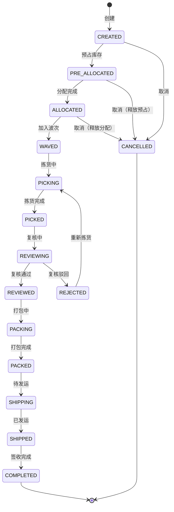

# 出库全流程深度深化分析

---

## 一、业务定义与目标

### 1.1 定义

出库管理（Outbound Management）是WMS中对商品从仓库发出到客户/下游仓库的全流程管理，涵盖订单接收、库存预占、分配、波次拣货、复核、打包、称重、贴面单、集货发运、回单等环节。

### 1.2 核心目标

| 目标 | 衡量指标 |
|------|---------|
| 出库准确 | 出库准确率 >99.95% |
| 发货及时 | 按时发货率 >99% |
| 拣货高效 | 拣货效率 >100件/小时/人 |
| 库存准确 | 超卖率 = 0 |
| 异常可控 | 异常处理率 100% |

### 1.3 出库类型

| 类型 | 说明 | 触发来源 |
|------|------|---------|
| 销售出库(B2C) | 电商订单发货 | 电商平台订单 |
| 销售出库(B2B) | 批发/经销发货 | ERP销售订单 |
| 调拨出库 | 调往其他仓库 | 调拨单 |
| 退货出库 | 退回供应商 | 退货单 |
| 越库出库 | 越库直发 | 越库订单 |
| 赠品出库 | 赠品发出 | 订单赠品行 |
| 报废出库 | 不合格品销毁 | 质检不合格 |
| 盘亏出库 | 盘点亏损 | 盘点调整 |

### 1.4 业务场景全景

```
出库全流程
├── 订单管理（订单接收/校验/合并/拆分）
├── 库存预占（下单预占/超时释放）
├── 库存分配（分配规则/FIFO/FEFO/库位属性）
├── 波次管理（分组/路径/调度）
├── 拣货管理（摘果/播种/整托/整箱/拆零）
├── 复核管理（扫描复核/称重复核）
├── 打包管理（选箱/装箱/称重/贴面单）
├── 集货管理（按快递/路线集货）
├── 发运管理（装车/发车/回单）
├── 异常处理（缺货/复核差异/取消回滚）
└── 逆向流程（取消/拦截/退货）
```

---

## 二、业务流程图

### 2.1 出库全流程

```mermaid
flowchart TD
    A[订单接收] --> B[订单校验]
    B --> C[库存预占]
    C --> D[库存分配]
    D --> E[波次分组]
    E --> F[拣货作业]
    F --> G[复核]
    G -->{复核通过?}
    H -->|否| I[差异处理/退回拣货]
    I --> F
    H -->|是| J[打包]
    J --> K[称重]
    K --> L[获取面单]
    L --> M[贴面单]
    M --> N[集货]
    N --> O[装车发运]
    O --> P[回单签收]
    P --> Q[出库完成]
```

### 2.2 库存预占与分配流程

```mermaid
flowchart TD
    A[订单创建] --> B[检查可用库存]
    B -->{库存充足?}
    C -->|否| D[缺货/部分预占]
    C -->|是| E[预占库存]
    E --> F[预占成功]
    F --> G[等待分配]
    G --> H[分配规则计算]
    H --> I[指定库位/批次]
    I --> J[分配完成→波次]
    D --> K[缺货通知/等待补货]
```

---

## 三、状态机设计

### 3.1 出库单状态机



---

## 四、核心业务场景详解

### 4.1 订单管理

订单来源：电商平台推送（淘宝/京东/拼多多/抖音）、ERP销售单、手动创建。订单校验（商品有效性/地址/黑名单/重复订单），订单合并（同一客户多单合并），订单拆分（跨仓库/超重量/特殊商品拆分）。

### 4.2 库存预占

下单时立即预占库存（可用→预占ALLOCATED），防止超卖。预占超时自动释放（如30分钟未支付）。Redis预占+Oracle双写：Redis做快速预占检查，Oracle做最终一致性。部分预占（库存不足时部分预占，缺货部分等待）。

### 4.3 库存分配

按分配规则从具体库位/批次分配库存。分配规则结合周转规则（FIFO先入先出/FEFO先效期先出/LIFO后入先出）和库位属性（ABC分区/整箱区/拆零区/批次属性）。分配后库存从预占→锁定到具体库位。

### 4.4 波次拣货

详见波次算法模块。支持摘果式（一人一单，B2B）、播种式（先集后分，B2C）、分区拣货、整托盘/整箱/拆零拣货。

### 4.5 复核

逐件扫描商品条码校验（是否在订单中/数量/批次/效期），实时进度展示，异常处理（错扫/多扫/漏扫）。称重复核（电子秤读取重量与理论重量对比，误差范围内通过）。复核通过进入打包，驳回归回拣货。

### 4.6 打包称重

推荐包装箱（按商品体积/重量），选择箱型，商品装箱，称重（自动电子秤/手动），校验重量，获取快递面单（面单池/API实时），打印面单，贴面单扫描关联订单，封箱确认。

### 4.7 集货发运

按快递商/路线/车次集货，扫描面单集货，装车确认，发车确认，回传物流信息，回单签收。

### 4.8 越库出库

越库订单收货后直接分配出库，不进入存储区，收货→预占→分配→复核→打包→发运，跳过上架和拣货。

### 4.9 异常处理

- **缺货**：拣货时库位无货，标记缺货，检查其他库位，有库存推荐替代库位，无库存部分缺货/取消，触发紧急补货和库位盘点
- **复核差异**：多货/少货/错货，退回拣货重新处理，记录差异
- **订单取消**：未发货可取消，释放预占/分配库存；已拣货需回库；已发货需拦截
- **快递拦截**：已发货订单拦截，联系快递退回

---

## 五、库存变化分析

| 出库动作 | 库存变化 |
|---------|---------|
| 订单创建预占 | 可用→预占（ALLOCATED） |
| 库存分配 | 预占→锁定具体库位 |
| 开始拣货 | 预占→拣货中（PICKING） |
| 拣货完成 | 拣货中不变 |
| 复核完成 | 拣货中→待发运（SHIPPING） |
| 打包完成 | 待发运不变 |
| 发运完成 | 待发运→扣减（库存减少） |
| 订单取消 | 预占/拣货中→可用（释放） |
| 越库出库 | 收货暂存→直接待发运→扣减 |

---

## 六、技术实现方案

### 6.1 核心表设计

```sql
-- 出库单 wms_outbound_order (outbound_no/order_type/order_source/customer_code/warehouse_code/owner_code/shop_code/status/total_qty/total_amount/express_code/waybill_no)
-- 出库明细 wms_outbound_item (outbound_id/sku/barcode/batch_no/plan_qty/allocated_qty/picked_qty/packed_qty/shipped_qty/location_code/status)
-- 库存预占 wms_inventory_allocation (outbound_id/sku/batch_no/location_code/allocated_qty/status/expire_time)
-- 波次 wms_wave (关联出库单)
-- 拣货明细 wms_pick_item (wave_id/outbound_id/sku/location_code/plan_qty/picked_qty/status)
-- 复核记录 wms_review_record (outbound_id/sku/barcode/scanned_qty/result)
-- 打包记录 wms_pack_record (outbound_id/package_no/box_type/weight/waybill_no/status)
-- 出库差异 wms_outbound_diff (outbound_id/sku/diff_type/plan_qty/actual_qty/diff_qty/reason/status)
```

### 6.2 库存预占核心逻辑

Redis原子预占（Lua脚本：检查可用库存→扣减可用→增加预占），Oracle记录预占明细，超时定时任务释放。预占失败返回缺货。部分预占（有多少占多少）。

### 6.3 库存分配核心逻辑

按分配规则查询可用库存（周转规则排序+库位属性过滤），逐条分配直到满足数量，更新预占明细为已分配，锁定库位库存。Oracle原子SQL更新（乐观锁版本号）。

### 6.4 出库取消回滚

按状态回滚：CREATED直接取消；PRE_ALLOCATED释放Redis预占+Oracle预占；ALLOCATED释放分配；PICKING需先回库（库存从拣货中→可用）再取消；已发货不可取消需走退货。

---

## 七、主流WMS对比

| 维度 | 富勒 | 曼哈特 | Blue Yonder | X WMS |
|------|------|--------|-------------|-------|
| 出库类型 | 基础 | 全类型 | AI智能出库 | 8种全覆盖 |
| 库存预占 | 基础 | 完整 | AI预测预占 | Redis+Oracle双写 |
| 分配规则 | 基础 | 高级规则引擎 | AI最优分配 | 周转+库位+批次组合 |
| 拣货模式 | 摘果+播种 | 全模式 | AI模式推荐 | 全模式+路径优化 |
| 复核打包 | 基础 | 完整 | AI复核 | 扫码+称重+视频 |
| 异常处理 | 基础 | 完整 | AI预测异常 | 完整+补货联动 |
| 越库 | 有限 | 完整 | AI越库调度 | 完整越库流程 |

---

## 八、常见业务问题与解决方案

| 问题 | 解决方案 |
|------|---------|
| 超卖 | 实时预占+Redis原子操作+库存校准+安全库存 |
| 拣货错货 | 三重扫码校验+库位绑定+相似商品预警+复核 |
| 缺货频繁 | 库存准确率提升+安全库存+紧急补货+动态盘点 |
| 大促发货慢 | 波次优化+预打包+面单预取+增加人员设备 |
| 复核效率低 | 称重复核+批量复核+扫码枪连续扫描 |
| 面单获取失败 | 面单池预取+多快递商切换+失败重试+降级 |
| 订单取消库存不释放 | 状态机严格控制+超时自动释放+回滚流程 |
| 快递发错 | 集货扫码校验+按快递分区+装车确认 |

---

## 九、与其他模块的关联关系

| 关联模块 | 关联点 |
|---------|--------|
| 订单/电商/ERP | 订单来源，发货回传 |
| 库存管理 | 预占/分配/扣减全流程 |
| 波次算法 | 波次分组/路径规划 |
| RF作业 | 拣货/复核/打包PDA作业 |
| 分配规则 | 库存分配策略 |
| 周转规则 | FIFO/FEFO/LIFO |
| 库位管理 | 拣货库位/路径 |
| 标签条码 | 快递面单/商品条码 |
| 费收管理 | 出库操作费/快递费 |
| 退货管理 | 出库退货逆向流程 |
| API平台 | 订单推送/发货回传API |
| 行业插件 | 大促出库优化/GSP批次出库 |
| KPI报表 | 出库效率/准确率统计 |
