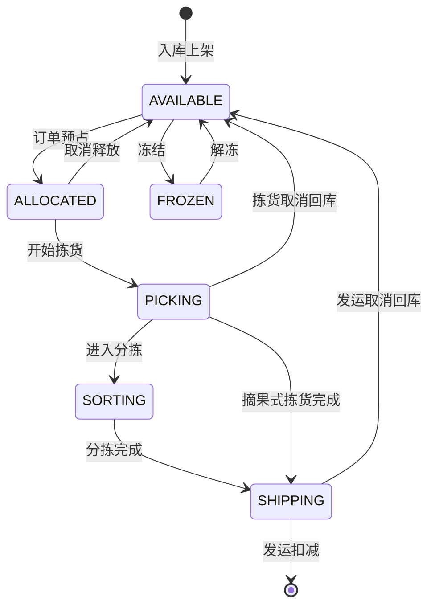

# 库存全场景管理深度深化分析

---

## 一、业务定义与目标

### 1.1 定义

库存管理（Inventory Management）是WMS的核心，对仓库中所有商品的库存数量、状态、位置、批次、效期进行全生命周期管理，涵盖库存查询、库存移动、库存调整、库存冻结、库存盘点、库存养护、库龄分析、库存周转、事务流水等。

### 1.2 核心目标

| 目标 | 衡量指标 |
|------|---------|
| 库存准确 | 库存准确率 >99.9% |
| 实时同步 | 库存更新延迟 <1秒 |
| 状态清晰 | 五态模型全覆盖 |
| 可追溯 | 库存流水100%可追溯 |
| 周转高效 | 库存周转率提升 |

### 1.3 库存五态模型

```
AVAILABLE（可用）→ 可分配/可出库的库存
ALLOCATED（预占）→ 已被订单预占，等待分配
PICKING（拣货中）→ 正在拣货作业
SORTING（分拣中）→ 播种式二次分拣中
SHIPPING（待发运）→ 复核打包完成，等待发运
FROZEN（冻结）→ 质检/盘点/异常冻结
```

状态流转：可用→预占→拣货中→分拣中→待发运→扣减（出库）；可用↔冻结（冻结/解冻）。

### 1.4 业务场景全景

```
库存全场景管理
├── 库存查询（实时库存/多维度查询/库存快照/库存预警）
├── 库存移动（移库/调拨/补货/库位整理）
├── 库存调整（盘盈盘亏/数量调整/金额调整）
├── 库存冻结（质检冻结/盘点冻结/异常冻结/批次冻结）
├── 库存盘点（全仓/循环/动态/抽盘/盲盘/明盘）
├── 库存养护（效期管理/近效期预警/温湿度/防虫防鼠）
├── 库龄分析（库龄分布/呆滞库存/周转分析）
├── 库存周转（周转率/周转天数/ABC分类）
├── 库存事务流水（所有库存变动记录/不可篡改/可追溯）
├── 虚拟库存（分拣中/格口/差异/暂存/在途）
└── 多维度库存（按货主/仓库/库区/库位/批次/效期/状态）
```

---

## 二、业务流程图

### 2.1 库存变动通用流程

```mermaid
flowchart TD
    A[业务触发] --> B[校验库存]
    B -->{库存充足?}
    C -->|否| D[库存不足/异常]
    C -->|是| E[Oracle原子扣减/增加]
    E --> F{扣减成功?}
    G -->|否| H[并发冲突/重试]
    H --> E
    G -->|是| I[更新库存状态]
    I --> J[记录库存流水]
    J --> K[更新Redis缓存]
    K --> L[发送库存事件Kafka]
    L --> M[完成]
```

### 2.2 库存移库流程

```mermaid
flowchart TD
    A[创建移库单] --> B[扫描源库位]
    B --> C[选择SKU/批次/数量]
    C --> D[扫描目标库位]
    D --> E[校验目标库位可用性]
    E -->{可用?}
    F -->|否| G[更换库位]
    G --> D
    F -->|是| H[确认移库]
    H --> I[源库位库存-]
    I --> J[目标库位库存+]
    J --> K[记录移库流水]
    K --> L[完成]
```

---

## 三、状态机设计

### 3.1 库存状态机（五态模型）



---

## 四、核心业务场景详解

### 4.1 库存查询

实时库存查询（按SKU/货主/仓库/库区/库位/批次/效期/状态多维度），库存快照（每日/每月定时快照，用于费收计算和历史追溯），库存预警（低于安全库存/高于上限/近效期/呆滞）。

### 4.2 库存移动

**移库**：库位间商品移动，源库位-目标库位+，总量不变。支持普通移库/补货移库/库位整理移库。

**调拨**：仓库间商品移动，调出仓库-，调入仓库+，在途库存管理。

**补货**：从存储区补货到拣货区，详见补货模块。

### 4.3 库存调整

盘盈盘亏调整（盘点后调整）、数量调整（错误修正）、金额调整（成本调整）。调整需审批，记录调整原因和前后值。

### 4.4 库存冻结

质检冻结（待检商品不可出库）、盘点冻结（盘点中库位锁定）、异常冻结（质量问题/客户投诉）、批次冻结（问题批次全量冻结）。冻结库存不可分配/出库，解冻后恢复可用。

### 4.5 库存盘点

详见盘点模块。全仓盘点/循环盘点/动态盘点/抽盘/盲盘/明盘。盘点差异调整库存。

### 4.6 库存养护

效期管理（生产日期/效期录入，近效期预警，先进先出/先效期先出），温湿度监控（冷链/医药），防虫防鼠，定期养护检查。

### 4.7 库龄分析

按入库时间统计库龄分布（0-30/30-60/60-90/90天以上），呆滞库存识别（超过N天无出库），库龄报表，呆滞库存处理建议（促销/退回/销毁）。

### 4.8 库存周转

周转率=出库数量/平均库存，周转天数=365/周转率。ABC分类（按出库金额/数量分类，A类重点管理）。周转分析报表。

### 4.9 库存事务流水

所有库存变动（入库/出库/移库/调整/盘点/冻结/解冻）都记录流水，包含变动类型/前后数量/库位/批次/操作人/时间/关联单据。流水不可篡改，用于追溯和审计。

### 4.10 虚拟库存体系

分拣中库存（二次分拣中的商品）、格口库存（分拣墙格口）、差异库存（复核差异）、暂存库存（收货暂存）、在途库存（调拨在途）。纳入统一五态模型管理，虚拟库位is_virtual=1标识。

---

## 五、库存变化分析

| 场景 | 库存变化 |
|------|---------|
| 入库上架 | 库位可用+ |
| 出库预占 | 可用-，预占+ |
| 开始拣货 | 预占-，拣货中+ |
| 发运 | 待发运-（扣减） |
| 移库 | 源库位-，目标库位+（总量不变） |
| 调拨出库 | 调出仓-，在途+ |
| 调拨入库 | 在途-，调入仓+ |
| 盘点盘盈 | 可用+ |
| 盘点盘亏 | 可用- |
| 冻结 | 可用-，冻结+ |
| 解冻 | 冻结-，可用+ |
| 补货 | 源库位-，目标库位+ |

---

## 六、技术实现方案

### 6.1 核心表设计

```sql
-- 库存表 wms_inventory (id/sku/barcode/batch_no/owner_code/warehouse_code/area_code/location_code/quantity/available_qty/allocated_qty/picking_qty/sorting_qty/shipping_qty/frozen_qty/production_date/expiry_date/inbound_date/version)
-- 库存流水 wms_inventory_transaction (txn_no/txn_type/sku/batch_no/location_code/before_qty/change_qty/after_qty/ref_type/ref_no/operator/operation_time)
-- 库存快照 wms_inventory_snapshot (snapshot_date/sku/batch_no/location_code/quantity/owner_code/warehouse_code)
-- 库位库存 wms_location_inventory (location_code/sku/batch_no/quantity/status)
-- 移库单 wms_transfer_order (transfer_no/from_location/to_location/sku/batch_no/qty/status)
-- 库存调整单 wms_inventory_adjust (adjust_no/sku/location_code/batch_no/before_qty/after_qty/adjust_qty/reason/status/approver)
```

### 6.2 Oracle原子扣减核心逻辑

```sql
-- 乐观锁扣减库存
UPDATE wms_inventory 
SET available_qty = available_qty - #{qty},
    picking_qty = picking_qty + #{qty},
    version = version + 1
WHERE id = #{id} 
  AND available_qty >= #{qty}
  AND version = #{version}
```

应用层：查询库存→校验数量→执行扣减→判断影响行数（0表示并发冲突，重试最多3次）→记录流水→更新Redis→发Kafka事件。

### 6.3 Redis库存检查

Redis维护可用库存缓存（key: wms:inventory:{sku}:{location}），下单前快速检查，扣减时同步更新。Redis仅做检查和预占，最终扣减在Oracle。

### 6.4 库存流水记录

每次库存变动异步写入流水表（Kafka消费者），流水只追加不修改，按月分区归档。

---

## 七、主流WMS对比

| 维度 | 富勒 | 曼哈特 | Blue Yonder | X WMS |
|------|------|--------|-------------|-------|
| 库存模型 | 基础三态 | 多状态 | AI库存优化 | 五态模型+虚拟库位 |
| 库存扣减 | 数据库直接 | 分布式锁 | AI预测扣减 | Oracle原子+乐观锁 |
| 批次效期 | 基础 | 完整GSP | AI效期优化 | 完整批次+FEFO |
| 库存流水 | 基础 | 完整 | AI分析 | 全量流水+不可篡改 |
| 库龄周转 | 基础 | 完整 | AI预测 | 完整分析+ABC |
| 虚拟库存 | 无 | 有限 | AI虚拟库位 | 完整虚拟库位体系 |

---

## 八、常见业务问题与解决方案

| 问题 | 解决方案 |
|------|---------|
| 库存不准 | 循环盘点+动态盘点+流水追溯+差异分析 |
| 并发超卖 | Oracle原子扣减+乐观锁+Redis预占+重试 |
| 库存状态混乱 | 五态模型+状态机严格控制+状态校验 |
| 效期管理混乱 | 批次效期强制录入+FEFO分配+近效期预警 |
| 呆滞库存 | 库龄分析+预警+处理流程+绩效考核 |
| 移库错误 | 扫码校验+库位可用性检查+双人复核 |
| 冻结库存被出库 | 状态校验+冻结标识+拦截规则 |
| 库存流水丢失 | 异步写入+失败重试+对账检查+不可篡改 |

---

## 九、与其他模块的关联关系

| 关联模块 | 关联点 |
|---------|--------|
| 入库管理 | 入库增加库存 |
| 出库管理 | 出库预占/扣减库存 |
| 波次算法 | 波次库存分配 |
| 库位管理 | 库位库存/库位属性 |
| 批次管理 | 批次库存/效期 |
| RF作业 | 移库/盘点作业 |
| 费收管理 | 库存快照计费 |
| KPI报表 | 库存周转率/准确率 |
| 质检管理 | 质检冻结/解冻 |
| 补货管理 | 补货库存移动 |
| 多租户 | 多货主库存隔离 |
| 数据归档 | 库存流水归档 |
| 行业插件 | GSP批次/冷链温度 |
