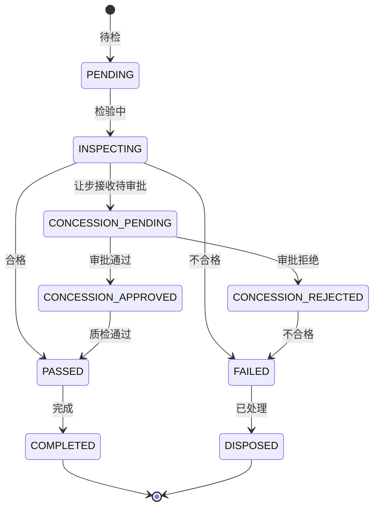

# 质检管理(QC)深度深化分析

---

## 一、业务定义与目标

### 1.1 定义

质检管理（Quality Control）是WMS中对入库商品、在库商品、出库商品进行质量检验和管控的功能模块，涵盖质检规则、抽样方案、检验项目、全检/抽检/免检、让步接收、不合格品处理、供应商质量评分、GSP合规等。

### 1.2 核心目标

| 目标 | 衡量指标 |
|------|---------|
| 质检覆盖 | 需质检商品覆盖率100% |
| 检验准确 | 质检准确率 >99% |
| 不合格管控 | 不合格品隔离率100% |
| 供应商评估 | 供应商质量评分完整 |
| GSP合规 | 医药GSP合规率100% |

### 1.3 业务场景全景

```
质检管理
├── 质检规则（全检/抽检/免检规则配置，按SKU/供应商/货主）
├── 抽样方案（GB/T 2828.1，AQL水平，正常/加严/放宽）
├── 检验项目（外观/数量/规格/效期/功能/包装/温湿度）
├── 质检作业（入库质检/在库养护/出库质检/退货质检）
├── 质检结果（合格/不合格/让步接收）
├── 不合格品处理（隔离/退货/销毁/返工/降级）
├── 让步接收（轻微不合格审批后接收）
├── 供应商质量评分（合格率/不良率/排名）
├── 质检报告（检验记录/报告生成）
└── GSP合规（医药首营/养护/温湿度/电子监管码）
```

---

## 二、业务流程图

### 2.1 入库质检流程

```mermaid
flowchart TD
    A[收货完成] --> B{需要质检?}
    C -->|免检| D[直接上架]
    C -->|是| E[生成质检任务]
    E --> F[确定抽样方案]
    F --> G[抽样]
    G --> H[逐项检验]
    H --> I{检验结果}
    J -->|合格| K[质检通过→上架]
    L -->|不合格| M[不合格品隔离]
    N -->|让步接收| O[审批]
    O -->{审批通过?}
    P -->|是| K
    P -->|否| M
    M --> Q[处理方式选择]
    Q --> R[退货供应商/销毁/返工]
```

---

## 三、状态机设计

### 3.1 质检单状态机



---

## 四、核心业务场景详解

### 4.1 质检规则

按SKU/供应商/货主配置质检类型：全检（每件都检）、抽检（按抽样方案）、免检（直接入库）。新供应商前N批全检，合格后转抽检。高价值/高风险商品全检。

### 4.2 抽样方案

遵循GB/T 2828.1（等同ISO 2859-1），按批量确定样本量字码，按AQL（接收质量限）确定接收数/拒收数。检验水平：一般检验水平I/II/III，特殊检验水平S-1~S-4。转移规则：正常→加严（连续5批2批不接收）→放宽（连续10批接收）。

### 4.3 检验项目

外观（破损/变形/污染）、数量（实收数量）、规格（型号/尺寸/颜色）、效期（生产日期/有效期/剩余效期）、功能（通电/性能测试）、包装（包装完整性/标签）、温湿度（冷链商品）、资质（合格证/说明书/认证）。

### 4.4 入库质检

收货完成后触发质检任务，按规则确定全检/抽检，抽样后逐项检验，记录检验结果，合格→上架，不合格→隔离处理，让步接收→审批后上架。

### 4.5 在库养护

定期对在库商品进行养护检查（效期/外观/温湿度），医药GSP要求定期养护（重点品种每月，一般品种每季），记录养护记录，发现问题及时处理。

### 4.6 出库质检

高价值/高风险商品出库前复核质检，退货商品入库质检，跨境商品出库质检。

### 4.7 不合格品处理

不合格品移入不合格品区（隔离库位），冻结库存，处理方式：退货供应商（创建退货出库单）、销毁（审批后销毁，记录销毁证明）、返工（重新包装/加工后重新质检）、降级（降等使用/打折销售）。

### 4.8 让步接收

轻微不合格（如包装轻微破损但不影响商品质量），可申请让步接收，需质量负责人审批，审批通过后正常入库，记录让步原因和审批人，纳入供应商质量评分。

### 4.9 供应商质量评分

按供应商统计：来料批次合格率、抽检不良率、交货及时率、质量问题次数。月度/季度评分排名，评分低的供应商加严检验或淘汰。

### 4.10 GSP合规

医药行业特殊要求：首营品种/首营企业审批、药品养护记录、温湿度监测记录、电子监管码核注核销、不合格药品台账、近效期催销表。

---

## 五、库存变化分析

| 质检动作 | 库存变化 |
|---------|---------|
| 收货待检 | 暂存区可用+（或质检冻结区） |
| 质检中 | 库存冻结（FROZEN） |
| 质检合格 | 冻结→可用，上架到存储区 |
| 质检不合格 | 冻结→不合格品区（仍冻结） |
| 让步接收 | 冻结→可用 |
| 不合格退货 | 不合格品库存-（出库） |
| 不合格销毁 | 不合格品库存-（销毁） |

---

## 六、技术实现方案

### 6.1 核心表设计

```sql
-- 质检规则 wms_qc_rule (rule_code/sku/supplier_code/owner_code/qc_type(FULL/SAMPLE/NONE)/aql_level/inspection_level/status)
-- 质检单 wms_qc_order (qc_no/ref_type/ref_no/sku/supplier_code/warehouse_code/qc_type/sample_qty/inspected_qty/status/result/inspector/inspect_time)
-- 质检明细 wms_qc_item (qc_id/item_name/standard/actual_value/result(PASS/FAIL)/remark)
-- 抽样方案 wms_qc_sampling_plan (plan_code/lot_size_from/lot_size_to/sample_size_code/sample_size/aql/accept_number/reject_number)
-- 不合格品 wms_qc_unqualified (qc_id/sku/batch_no/qty/unqualified_type/handle_method/status/dispose_time)
-- 让步接收 wms_qc_concession (qc_id/reason/approver/approve_time/status)
-- 供应商质量评分 wms_supplier_quality (supplier_code/period/total_batches/passed_batches/pass_rate/defect_rate/score/rank)
```

### 6.2 抽样方案计算核心逻辑

根据批量查样本量字码表→根据字码查样本量→根据AQL查接收数/拒收数→返回抽样方案。GB/T 2828.1标准表内置为数据库表或枚举。

### 6.3 质检核心逻辑

收货完成→查询质检规则→免检直接上架/全检或抽检生成质检任务→质检任务分配→PDA质检作业→逐项录入检验结果→系统判定合格/不合格→合格上架/不合格隔离→让步接收审批流程。

---

## 七、主流WMS对比

| 维度 | 富勒 | 曼哈特 | Blue Yonder | X WMS |
|------|------|--------|-------------|-------|
| 质检规则 | 基础 | 完整 | AI质检优化 | 全检/抽检/免检+规则引擎 |
| 抽样方案 | 有限 | GB2828完整 | AI抽样优化 | GB/T 2828.1完整 |
| 检验项目 | 基础 | 可配置 | AI项目推荐 | 可配置+多类型 |
| 让步接收 | 无 | 完整 | AI审批建议 | 审批流程+记录 |
| 不合格处理 | 基础 | 完整 | AI处理建议 | 隔离+退货+销毁+返工 |
| 供应商评分 | 基础 | 完整 | AI供应商分析 | 完整评分+排名 |
| GSP合规 | 有限 | 完整GSP | 合规AI | 完整GSP模块 |

---

## 八、常见业务问题与解决方案

| 问题 | 解决方案 |
|------|---------|
| 质检耗时影响入库 | 免检通道+抽检优化+并行质检+PDA移动作业 |
| 抽样不科学 | GB2828.1标准+AQL配置+转移规则 |
| 不合格品流出 | 隔离库位+冻结状态+出库拦截+双人复核 |
| 让步接收滥用 | 审批流程+权限控制+记录审计+供应商评分关联 |
| 供应商质量不可控 | 质量评分+加严检验+淘汰机制+定期评审 |
| 质检标准不统一 | 检验项目标准化+SOP+图片参考+培训 |
| GSP合规风险 | GSP模块+养护记录+温湿度+电子监管码+定期审计 |
| 质检数据无法追溯 | 质检流水+检验记录+报告存档+不可篡改 |

---

## 九、与其他模块的关联关系

| 关联模块 | 关联点 |
|---------|--------|
| 入库管理 | 入库质检触发/合格上架 |
| 库存管理 | 质检冻结/解冻/不合格品库存 |
| 退货管理 | 退货质检 |
| 供应商管理 | 供应商质量评分 |
| RF作业 | PDA质检作业 |
| 批次管理 | 批次效期检验 |
| 费收管理 | 质检费/VAS费 |
| 行业插件 | GSP质检/冷链温度检验 |
| KPI报表 | 质检合格率/供应商评分 |
| 消息通知 | 质检异常通知/审批通知 |
