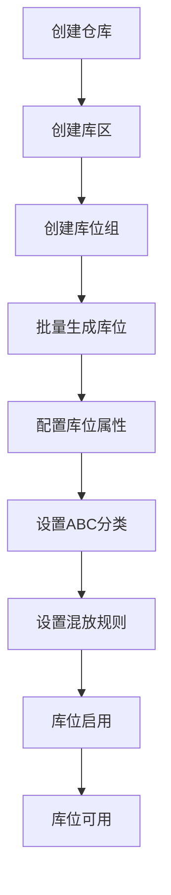
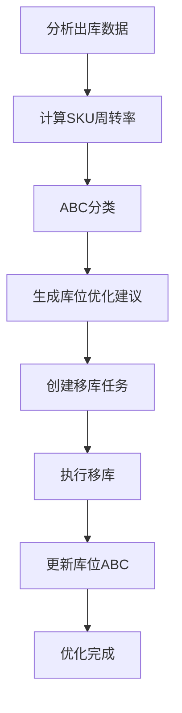
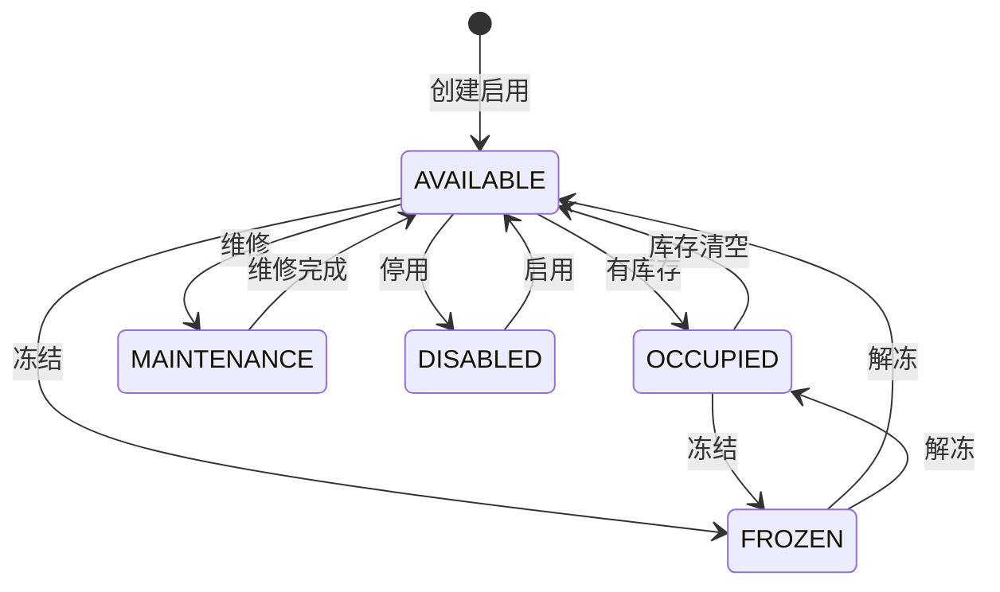

# 库位管理深度深化分析

---

## 一、业务定义与目标

### 1.1 定义

库位管理（Location Management）是WMS中对仓库物理空间进行四级架构（仓库→库区→库位组→库位）的精细化管理，涵盖库位属性、编码规则、ABC分类、利用率分析、库位优化、图形化展示等。

### 1.2 核心目标

| 目标 | 衡量指标 |
|------|---------|
| 空间高效利用 | 库位利用率 >85% |
| 拣货路径最短 | ABC分类准确率 >90% |
| 库位管理规范 | 库位编码规范率100% |
| 可视化 | 库位图形化覆盖率100% |

### 1.3 四级架构

```
仓库(Warehouse) → 库区(Area) → 库位组(Location Group/巷道) → 库位(Location)
```

- 仓库：物理仓库，独立建筑或区域
- 库区：仓库内功能分区（收货区/存储区/拣货区/发货区/退货区/不合格品区/冷链区）
- 库位组：一组库位（通常是一个巷道/一排货架）
- 库位：最小存储单元，有唯一编码

### 1.4 业务场景全景

```
库位管理
├── 仓库管理（仓库档案/属性/多仓库）
├── 库区管理（库区类型/编码/容量/温区）
├── 库位组管理（巷道/货架/排）
├── 库位管理
│   ├── 库位编码规则（仓库-库区-巷道-层-位）
│   ├── 库位属性（类型/尺寸/承重/温区/状态）
│   ├── 库位状态（可用/占用/冻结/维修/虚拟）
│   ├── 库位容量（体积/重量/最大SKU数）
│   ├── 库位混放规则（同SKU/同批次/同货主/任意）
│   └── 库位ABC分类（A类近出口/B类中间/C类远端）
├── 库位利用率分析（按仓库/库区/库位组/库位）
├── 库位优化（ABC重分配/呆滞品转移/空间整理）
├── 库位图形化展示（2D/3D仓库地图/热力图）
├── 库位查询（按SKU查库位/按库位查库存）
├── 库位调整（库位停用/启用/维修/变更属性）
└── 虚拟库位（分拣中/格口/差异/暂存/在途/系统）
```

---

## 二、业务流程图

### 2.1 库位创建与配置流程



### 2.2 库位优化流程



---

## 三、状态机设计

### 3.1 库位状态机



---

## 四、核心业务场景详解

### 4.1 仓库管理

仓库档案（编码/名称/地址/类型/面积/温区），支持多仓库，仓库级配置（是否允许混放/默认上架规则/快递商）。

### 4.2 库区管理

库区类型：收货区/存储区/拣货区/发货区/退货区/不合格品区/暂存区/冷链区/危险品区/VAS加工区。库区属性（温区/面积/容量/是否允许混放）。

### 4.3 库位编码规则

标准编码：仓库码-库区码-巷道码-层码-位码，如WH01-A-01-02-03表示1号仓库A区1巷道2层3位。支持自定义编码规则。

### 4.4 库位属性

类型（托盘位/货架位/地堆位/流利架/分拣格口）、尺寸（长宽高）、承重、温区（常温/冷藏/冷冻/恒温）、状态（可用/占用/冻结/维修/虚拟）、容量（最大体积/重量/SKU数）。

### 4.5 库位混放规则

- 专属库位：一SKU一位（清晰但利用率低）
- 同SKU混放：同SKU可多批次混放
- 同批次混放：同SKU同批次混放
- 同货主混放：同货主不同SKU混放
- 任意混放：不同货主SKU混放（3PL多货主同仓）

按仓库/库区配置混放策略，上架时校验。

### 4.6 ABC分类

按出库频率/金额分类：A类（高频高价值，近出口/低层/易拣取）、B类（中频，中间区域）、C类（低频低价值，远端/高层）。定期（每月/每季）根据出库数据重新分类，生成移库优化建议。

### 4.7 库位利用率分析

按仓库/库区/库位组/库位统计利用率（库存体积/库位容量、库存重量/承重、占用库位数/总库位数）。低利用率预警，高利用率扩容建议。

### 4.8 库位优化

基于ABC分类和出库数据，生成库位优化建议（A类移到近出口，C类移到远端，呆滞品移到高层），创建移库任务执行。大促前可预优化库位。

### 4.9 库位图形化展示

2D仓库平面图（库区/库位/状态颜色）、3D仓库模型（可选）、热力图（出库频率/库存密度）、库位状态实时展示（绿色可用/黄色占用/红色冻结/灰色维修）。

### 4.10 虚拟库位

详见虚拟库位体系。分拣中/格口/差异/暂存/在途/系统虚拟库位，is_virtual=1标识，纳入统一库存管理。

---

## 五、库存变化分析

库位管理本身不直接改变库存数量，但库位是库存的载体。移库时源库位-目标库位+，库位冻结时库存状态变为FROZEN，库位维修时需先移空库存。

---

## 六、技术实现方案

### 6.1 核心表设计

```sql
-- 仓库 wms_warehouse (warehouse_code/warehouse_name/address/warehouse_type/area/temperature_zone/status/is_mix_allowed)
-- 库区 wms_area (area_code/warehouse_code/area_name/area_type/temperature_zone/capacity/status)
-- 库位组 wms_location_group (group_code/warehouse_code/area_code/group_name/aisle_no/status)
-- 库位 wms_location (location_code/warehouse_code/area_code/group_code/location_type/width/height/depth/max_weight/temperature_zone/abc_class/status/is_virtual/virtual_type/max_sku/capacity_volume/barcode)
-- 库位库存 wms_location_inventory (location_code/sku/batch_no/owner_code/quantity/status)
-- 库位利用率快照 wms_location_utilization (snapshot_date/warehouse_code/area_code/location_code/used_volume/total_volume/used_weight/total_weight/utilization_rate)
```

### 6.2 库位批量生成

按库区/巷道/层数/位数批量生成库位编码，自动设置属性，支持预览和调整。

### 6.3 ABC分类计算

定时任务统计SKU出库频率和金额，按帕累托法则分类（A类前20%SKU贡献80%出库），更新库位ABC属性，生成优化建议。

### 6.4 库位可用性校验

上架/移库时校验：库位状态可用、容量足够、混放规则允许、温区匹配、承重足够。

---

## 七、主流WMS对比

| 维度 | 富勒 | 曼哈特 | Blue Yonder | X WMS |
|------|------|--------|-------------|-------|
| 库位架构 | 三级 | 四级+灵活 | AI动态分区 | 四级+虚拟库位 |
| 库位属性 | 基础 | 丰富 | AI属性推荐 | 完整属性+温区+容量 |
| ABC分类 | 基础 | 完整 | AI动态ABC | 完整+定期优化 |
| 混放规则 | 基础 | 完整 | AI混放优化 | 多策略+可配置 |
| 图形化 | 2D基础 | 2D+3D | AI可视化 | 2D+热力图+状态 |
| 利用率分析 | 基础 | 完整 | AI预测 | 完整+快照+预警 |
| 虚拟库位 | 无 | 有限 | AI虚拟库位 | 完整虚拟库位体系 |

---

## 八、常见业务问题与解决方案

| 问题 | 解决方案 |
|------|---------|
| 库位利用率低 | ABC优化+呆滞品转移+库位整合+容量配置 |
| 拣货路径长 | ABC分类+A类近出口+库位优化+路径算法 |
| 混放导致错货 | 混放规则+扫码校验+货主标识+分区管理 |
| 库位编码混乱 | 统一编码规则+批量生成+条码标签+规范培训 |
| 库位状态不准 | 实时状态更新+循环盘点+库位巡检+异常告警 |
| 冷链温区混乱 | 温区属性强制+温度监控+违规拦截+告警 |
| 库位维修影响作业 | 维修前移空+备用库位+维修计划+状态同步 |
| 虚拟库存管理混乱 | 虚拟库位体系+五态模型+统一管理+定期清理 |

---

## 九、与其他模块的关联关系

| 关联模块 | 关联点 |
|---------|--------|
| 入库管理 | 上架库位推荐/校验 |
| 出库管理 | 拣货库位分配 |
| 库存管理 | 库位库存/库位状态 |
| 波次算法 | 路径规划依赖库位布局 |
| RF作业 | 扫描库位码/库位导航 |
| 补货管理 | 补货目标库位/源库位 |
| 盘点管理 | 库位盘点 |
| 费收管理 | 库位面积计费 |
| 多租户 | 多货主同仓混放 |
| 行业插件 | 冷链温区/GSP库位 |
| KPI报表 | 库位利用率统计 |
