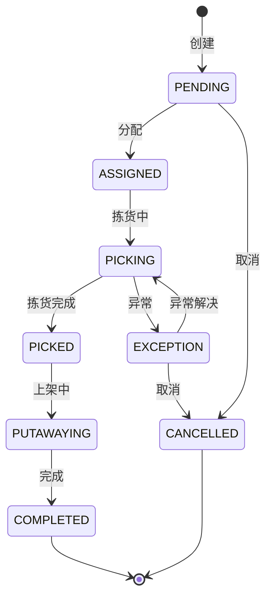

# 补货管理深度深化分析

---

## 一、业务定义与目标

### 1.1 定义

补货管理（Replenishment Management）是WMS中当拣货区库存低于安全水位时，自动或手动从存储区（整箱区/托盘区）向拣货区（拆零区）补充库存的功能模块，确保拣货作业不中断。

### 1.2 核心目标

| 目标 | 衡量指标 |
|------|---------|
| 拣货不中断 | 缺货率 <0.1% |
| 库存合理 | 拣货区库存周转率高 |
| 补货及时 | 补货及时率 >99% |
| 作业高效 | 补货作业效率高 |

### 1.3 业务场景全景

```
补货管理
├── 补货规则（安全库存/补货点/补货量/补货周期）
├── 补货需求计算（实时监控/定时计算/智能预测）
├── 补货任务管理（自动生成/手动创建/任务分配）
├── 补货类型（普通补货/紧急补货/越库补货/大促预补货/周期补货）
├── 补货策略（固定批量/经济订货量/按需补货/ABC差异化）
├── 补货执行（PDA补货拣货+上架）
├── 在途库存管理（补货中库存状态）
├── 补货异常（源库位无货/目标库位满/差异处理）
└── GSP补货（医药批次效期优先）
```

---

## 二、业务流程图

### 2.1 补货全流程

```mermaid
flowchart TD
    A[监控拣货区库存] --> B{低于补货点?}
    C -->|否| A
    C -->|是| D[计算补货量]
    D --> E[查找源库位]
    E -->{有库存?}
    F -->|否| G[缺货告警/采购建议]
    F -->|是| H[生成补货任务]
    H --> I[分配作业员]
    I --> J[补货拣货（源库位）]
    J --> K[补货上架（目标库位）]
    K --> L[库存移动完成]
    L --> M[补货完成]
```

---

## 三、状态机设计

### 3.1 补货任务状态机



---

## 四、核心业务场景详解

### 4.1 补货规则

为每个SKU在拣货区设置：安全库存（最低库存）、补货点（触发补货的库存水平）、补货量（每次补货数量）、补货上限（目标库位最大库存）。补货点=安全库存+补货提前期消耗量。

### 4.2 补货需求计算

**实时监控**：每次拣货扣减后检查是否低于补货点，低于则触发。
**定时计算**：每小时/每天定时计算所有SKU补货需求。
**智能预测**：基于历史出库量预测未来需求，提前补货（大促前预补货）。

### 4.3 补货类型

- **普通补货**：拣货区低于补货点，常规补货
- **紧急补货**：拣货区已缺货，优先补货（P0优先级）
- **越库补货**：收货后直接补到拣货区，不进入存储区
- **大促预补货**：大促前提前将存储区库存补到拣货区
- **周期补货**：按固定周期（每天/每班）补货
- **整托盘补货**：整托盘从存储区补到拣货区

### 4.4 补货策略

- **固定批量**：每次补固定数量（如一箱/一托盘）
- **经济订货量(EOQ)**：平衡补货成本和持有成本
- **按需补货(to-level)**：补到目标上限
- **ABC差异化**：A类高频小批量多频次，C类低频大批量少频次

### 4.5 补货执行

PDA作业：领取补货任务→扫描源库位→扫描商品条码→输入补货数量→扫描目标库位→确认上架。库存变化：源库位（存储区）-，目标库位（拣货区）+，在途状态（补货中）。

### 4.6 在途库存管理

补货任务创建后，源库位库存标记为"补货在途"（不可再分配给其他补货），目标库位预期库存增加。补货完成后在途清除。

### 4.7 补货异常

- **源库位无货**：实际库存不足，标记异常，查找其他源库位，触发盘点
- **目标库位满**：目标库位容量不足，推荐其他目标库位或部分补货
- **补货差异**：实补数量≠计划数量，记录差异，调整
- **批次效期**：GSP要求补货时按FEFO选择批次，近效期先补

### 4.8 GSP补货

医药行业补货需遵循：近效期先出（FEFO）、同批次集中、特殊药品双人复核、冷链药品温度监控、补货记录可追溯。

---

## 五、库存变化分析

| 补货动作 | 库存变化 |
|---------|---------|
| 补货任务创建 | 源库位可用→在途（预占） |
| 补货拣货 | 源库位在途→拣货中 |
| 补货上架 | 源库位拣货中-，目标库位可用+ |
| 补货完成 | 在途清除，目标库位可用 |
| 补货取消 | 在途→源库位可用 |

补货是库位间移动，总库存不变。

---

## 六、技术实现方案

### 6.1 核心表设计

```sql
-- 补货规则 wms_replenish_rule (sku/warehouse_code/area_code/safety_stock/reorder_point/replenish_qty/max_stock/replenish_type/status)
-- 补货任务 wms_replenish_task (task_no/sku/batch_no/from_location/to_location/plan_qty/actual_qty/status/priority/assignee/created_at/completed_at)
-- 补货在途 wms_replenish_in_transit (task_id/sku/batch_no/from_location/qty/status)
```

### 6.2 补货触发核心逻辑

库存变动后检查→低于补货点→计算补货量（上限-当前库存）→查找源库位（存储区有库存，按FIFO/FEFO）→生成补货任务→源库位库存预占（在途）→通知作业员。

### 6.3 补货执行核心逻辑

PDA扫描源库位→校验在途库存→拣货确认→扫描目标库位→校验容量/混放规则→上架确认→Oracle原子更新（源-目标+）→清除在途→任务完成。

---

## 七、主流WMS对比

| 维度 | 富勒 | 曼哈特 | Blue Yonder | X WMS |
|------|------|--------|-------------|-------|
| 补货规则 | 基础 | 完整规则引擎 | AI预测补货 | 完整+多策略 |
| 补货类型 | 普通+紧急 | 全类型 | AI智能补货 | 6种类型全覆盖 |
| 在途管理 | 基础 | 完整 | AI在途优化 | 完整在途状态 |
| 大促预补货 | 有限 | 完整 | AI大促预测 | 完整预补货 |
| GSP补货 | 有限 | 完整GSP | 合规AI | FEFO+批次+追溯 |

---

## 八、常见业务问题与解决方案

| 问题 | 解决方案 |
|------|---------|
| 拣货区缺货 | 安全库存优化+实时监控+紧急补货+预补货 |
| 补货不及时 | 优先级调度+自动分配+告警通知+绩效挂钩 |
| 源库位无货 | 库存准确率提升+循环盘点+多源库位查找+采购建议 |
| 目标库位满 | 容量实时校验+推荐替代库位+部分补货+库位优化 |
| 补货量不合理 | 历史数据分析+EOQ计算+ABC差异化+动态调整 |
| 大促补货压力 | 大促前预补货+增加补货人员+临时库位+优先级调度 |
| 补货差异 | 扫码校验+双人复核+差异记录+库存调整 |
| GSP批次混乱 | FEFO强制+批次校验+近效期预警+追溯记录 |

---

## 九、与其他模块的关联关系

| 关联模块 | 关联点 |
|---------|--------|
| 出库管理 | 拣货缺货触发紧急补货 |
| 库存管理 | 补货库存移动/在途状态 |
| 库位管理 | 源库位/目标库位校验 |
| 波次算法 | 波次缺货触发补货 |
| RF作业 | 补货PDA作业 |
| 入库管理 | 越库补货 |
| 批次管理 | FEFO补货批次选择 |
| 采购管理 | 存储区缺货触发采购建议 |
| KPI报表 | 补货及时率/缺货率统计 |
| 行业插件 | GSP补货/冷链补货 |
