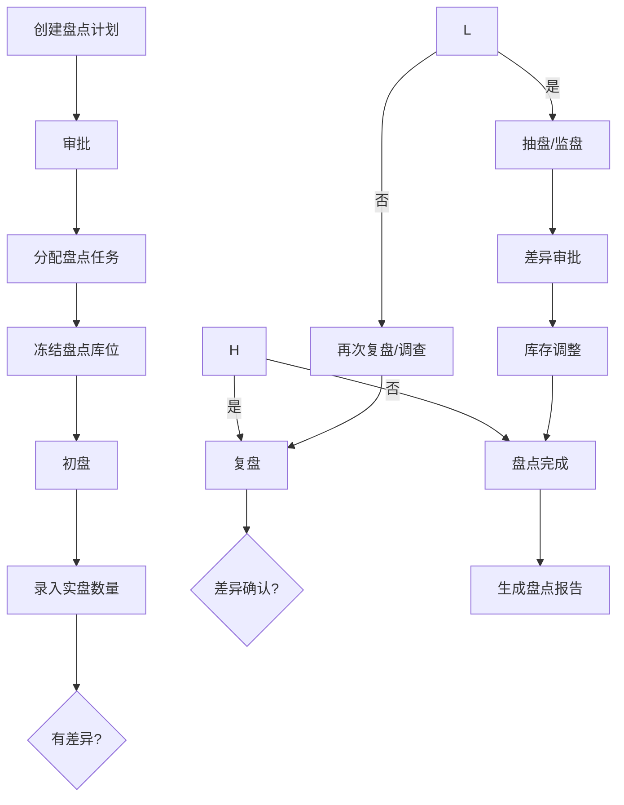
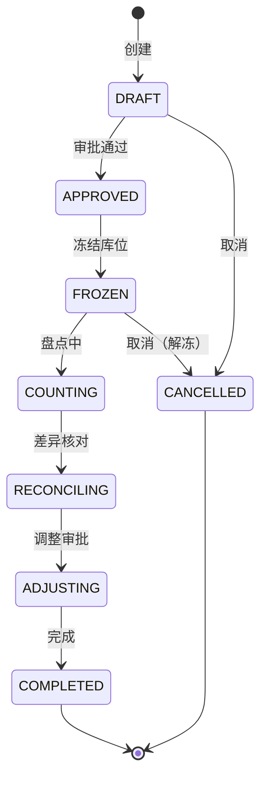

# 盘点管理深度深化分析

---

## 一、业务定义与目标

### 1.1 定义

盘点管理（Stocktake/Inventory Count）是WMS中对仓库实际库存进行清点核对，确保账实一致的功能模块，涵盖全仓盘点、循环盘点、动态盘点、抽盘、盲盘、明盘、RFID盘点、无人机视觉盘点等。

### 1.2 核心目标

| 目标 | 衡量指标 |
|------|---------|
| 账实一致 | 库存准确率 >99.9% |
| 盘点高效 | 盘点效率 >200行/小时/人 |
| 差异可控 | 差异处理率100% |
| 不影响作业 | 动态盘点不中断正常作业 |

### 1.3 业务场景全景

```
盘点管理
├── 盘点类型
│   ├── 全仓盘点（年终/季度全仓）
│   ├── 循环盘点（按计划轮流盘）
│   ├── 动态盘点（作业中发现异常即盘）
│   ├── 抽盘（随机抽查）
│   ├── 盲盘（不显示账面数）
│   ├── 明盘（显示账面数）
│   ├── RFID盘点（批量读取）
│   └── 无人机视觉盘点（拍照AI识别）
├── 盘点计划（计划制定/审批/分配）
├── 盘点执行（PDA扫码/数量录入/批量盘点）
├── 差异处理（差异确认/复盘/调整/审批）
├── 盘点报告（差异统计/准确率/原因分析）
├── ABC分类盘点（A类高频/B类中频/C类低频）
├── 盘点冻结（盘点中库位锁定）
├── GSP盘点（医药定期盘点/特殊药品双人）
└── 盘点五级质检（初盘/复盘/抽盘/监盘/审批）
```

---

## 二、业务流程图

### 2.1 盘点全流程



---

## 三、状态机设计

### 3.1 盘点单状态机



---

## 四、核心业务场景详解

### 4.1 盘点类型

- **全仓盘点**：全仓库所有库位一次性盘点，通常年终/季度，需停止作业或分区轮盘
- **循环盘点**：按计划轮流盘点不同区域，不停止作业，A类每月/B类每季/C类每半年
- **动态盘点**：作业过程中发现库存异常（拣货缺货/上架差异），立即触发该库位盘点
- **抽盘**：随机抽取部分库位/SKU盘点，用于验证库存准确率
- **盲盘**：不显示账面数量，盘点人员独立计数，更客观
- **明盘**：显示账面数量，盘点人员核对，效率高但可能有主观偏差
- **RFID盘点**：RFID标签批量读取，适合高价值/大件商品
- **无人机视觉盘点**：无人机拍照+AI识别数量，适合高位货架/大型仓库

### 4.2 盘点计划

制定盘点计划（类型/范围/时间/人员），审批后分配任务。支持按仓库/库区/库位/SKU/ABC分类设定盘点范围和频率。

### 4.3 盘点冻结

盘点开始前冻结盘点库位（库存状态FROZEN），冻结期间不可出库/移库，但可入库（需记录）。动态盘点可部分冻结或不冻结（记录盘点时刻库存）。

### 4.4 盘点执行

PDA作业：导航到库位→扫描库位码→逐SKU扫描商品条码→输入实盘数量→该库位完成→下一个库位。支持盲盘（不显示账面）和明盘（显示账面）。

### 4.5 差异处理

初盘有差异→复盘（第二人重新盘）→差异确认→抽盘/监盘（第三人抽查）→差异审批→库存调整（盘盈+盘亏-）。差异原因记录（错收/错发/损耗/被盗/系统错误）。

### 4.6 ABC分类盘点

A类商品（高价值/高频）每月盘点，B类每季度，C类每半年。循环盘点计划自动生成，确保高价值商品高频盘点。

### 4.7 五级质检

初盘（第一人）→复盘（第二人，差异时）→抽盘（第三人抽查10%）→监盘（主管监督）→审批（经理审批调整）。确保盘点准确。

### 4.8 GSP盘点

医药行业要求：定期盘点（每月至少一次全面检查）、特殊药品（麻精）双人盘点双签字、近效期药品重点盘点、盘点记录保存5年、不合格药品单独盘点。

---

## 五、库存变化分析

| 盘点动作 | 库存变化 |
|---------|---------|
| 盘点冻结 | 可用→冻结（FROZEN） |
| 盘盈调整 | 冻结→可用+（增加） |
| 盘亏调整 | 冻结→可用-（减少） |
| 盘点完成解冻 | 冻结→可用 |
| 盘点取消 | 冻结→可用 |

---

## 六、技术实现方案

### 6.1 核心表设计

```sql
-- 盘点单 wms_stocktake (stocktake_no/stocktake_type/warehouse_code/area_code/scope/status/plan_start/plan_end/actual_start/actual_end/approver)
-- 盘点明细 wms_stocktake_item (stocktake_id/location_code/sku/batch_no/book_qty/first_count_qty/second_count_qty/final_qty/diff_qty/status/remark)
-- 盘点人员 wms_stocktake_user (stocktake_id/user_id/role(COUNTER/RECOUNTER/SUPERVISOR))
-- 盘点差异 wms_stocktake_diff (stocktake_id/sku/location_code/book_qty/actual_qty/diff_qty/reason/status/adjust_time)
```

### 6.2 盘点核心逻辑

创建盘点单→冻结库位（UPDATE库存状态）→PDA初盘录入→差异自动比对→复盘录入→差异确认→审批→Oracle原子调整库存（盘盈+盘亏-）→记录库存流水→解冻→生成报告。

### 6.3 动态盘点触发

拣货缺货/上架差异/库存异常时自动创建动态盘点任务，锁定库位，通知盘点人员，盘点完成后自动调整并通知触发人。

---

## 七、主流WMS对比

| 维度 | 富勒 | 曼哈特 | Blue Yonder | X WMS |
|------|------|--------|-------------|-------|
| 盘点类型 | 基础 | 全类型 | AI智能盘点 | 8种全覆盖 |
| 循环盘点 | 基础 | 完整ABC | AI预测盘点 | ABC+自动计划 |
| 动态盘点 | 有限 | 完整 | AI异常触发 | 完整动态触发 |
| 盲盘明盘 | 支持 | 支持 | AI盲盘优化 | 支持+五级质检 |
| RFID/无人机 | 无 | 有限 | IoT+AI | RFID+视觉盘点 |
| GSP盘点 | 有限 | 完整GSP | 合规AI | 完整GSP模块 |

---

## 八、常见业务问题与解决方案

| 问题 | 解决方案 |
|------|---------|
| 盘点影响作业 | 循环盘点+动态盘点+分区轮盘+冻结时间最短化 |
| 盘点差异大 | 循环盘点+动态盘点+原因分析+流程改进+培训 |
| 盘点效率低 | PDA扫码+批量盘点+RFID+路径优化+明盘 |
| 差异处理慢 | 自动比对+复盘流程+移动审批+差异原因库 |
| 盘点不准确 | 盲盘+五级质检+双人复核+差异复盘+抽盘 |
| 高位货架难盘 | 无人机视觉+RFID+伸缩扫描枪+定期整托盘盘 |
| GSP合规风险 | GSP模块+双人双签+记录保存+定期审计 |
| 盘点后库存不准 | 调整审批+流水记录+事后复盘+持续改进 |

---

## 九、与其他模块的关联关系

| 关联模块 | 关联点 |
|---------|--------|
| 库存管理 | 盘点冻结/调整库存 |
| 库位管理 | 盘点库位/库位状态 |
| RF作业 | PDA盘点作业 |
| 出库管理 | 拣货缺货触发动态盘点 |
| 入库管理 | 上架差异触发动态盘点 |
| 批次管理 | 批次盘点/效期盘点 |
| KPI报表 | 库存准确率/差异统计 |
| 行业插件 | GSP盘点/冷链盘点 |
| 费收管理 | 盘点服务费 |
