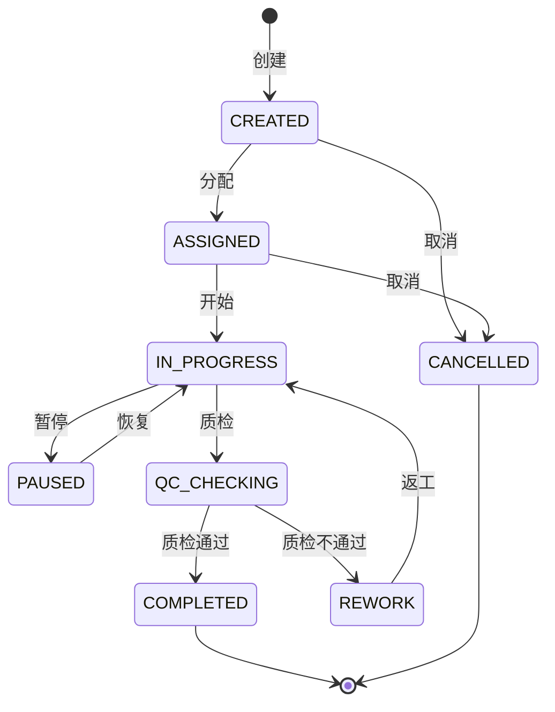

# 增值服务(VAS)深度深化分析

---

## 一、业务定义与目标

### 1.1 定义

增值服务（Value-Added Services, VAS）是WMS中在基础仓储服务（入库/存储/出库）之外，为客户提供的额外加工服务，包括贴标、组合包装、拆零、定制加工、礼品包装、质量管控等，是3PL企业的重要收入来源。

### 1.2 核心目标

| 目标 | 衡量指标 |
|------|---------|
| 服务多样化 | 支持VAS类型 >10种 |
| 计费准确 | VAS计费准确率100% |
| 作业高效 | VAS作业效率高 |
| 质量可控 | VAS质量合格率 >99% |

### 1.3 业务场景全景

```
增值服务(VAS)
├── 贴标服务（商品贴标/箱标/托盘标/价格标签/促销标签/电子监管码）
├── 组合包装（套装组合/买赠组合/礼盒包装/重新包装）
├── 拆零服务（整箱拆零/大包装改小包装/分装）
├── 定制加工（刻字/组装/简单加工/说明书插入）
├── 礼品包装（礼品盒/丝带/贺卡/定制包装）
├── 质量管控（复检/挑选/分级/重新质检）
├── 退换货处理（退货检验/重新包装/二次销售）
├── 其他VAS（吊牌更换/喷码/覆膜/捆扎/套袋）
├── VAS工单管理（创建/分配/执行/完成）
├── VAS计费（按件/按批/按工时/按材料）
└── 与出库协同（出库前VAS/VAS后出库）
```

---

## 二、业务流程图

### 2.1 VAS作业流程

```mermaid
flowchart TD
    A[VAS需求] --> B[创建VAS工单]
    B --> C[分配作业员]
    C --> D[领取物料/商品]
    D --> E[VAS加工作业]
    E --> F[质量检查]
    F -->{合格?}
    G -->|否| H[返工]
    H --> E
    G -->|是| I[完成确认]
    I --> J[记录工时/耗材]
    J --> K[VAS计费]
    K --> L[返回存储/出库]
```

---

## 三、状态机设计

### 3.1 VAS工单状态机



---

## 四、核心业务场景详解

### 4.1 贴标服务

商品贴标（价格标签/促销标签/中文标签）、箱标（外箱标签）、托盘标（SSCC）、电子监管码（医药）。贴标方式：人工贴标/自动贴标机。贴标后扫描确认。

### 4.2 组合包装

套装组合（多个SKU组合成套装）、买赠组合（主商品+赠品）、礼盒包装（节日礼盒）、重新包装（换包装/换规格）。组合后生成新SKU或关联原SKU。

### 4.3 拆零服务

整箱拆零（大包装拆成小包装）、分装（大桶分装成小瓶）、重新计量。拆零后更新库存和SKU关联。

### 4.4 定制加工

刻字/印花、简单组装（配件组装）、说明书插入、吊牌更换、喷码/打码。按客户要求定制。

### 4.5 礼品包装

礼品盒包装、丝带装饰、贺卡填写、定制包装纸。节日/促销期间高频。

### 4.6 质量管控

复检（客户要求重新质检）、挑选（挑选合格品/不合格品）、分级（按质量分级）、重新包装（破损包装更换）。

### 4.7 VAS工单管理

VAS需求来源：出库单关联VAS、独立VAS订单、入库时VAS。创建工单→分配作业员→执行→质检→完成→计费。支持批量VAS（一批商品统一加工）。

### 4.8 VAS计费

计费方式：按件（每件固定费用）、按批（每批固定费用）、按工时（实际工时×费率）、按材料（耗材成本+加工费）、组合计费。VAS完成后自动计算费用，计入客户账单。

### 4.9 与出库协同

出库单可关联VAS服务（如出库前贴标/组合包装），拣货后先送VAS区加工，完成后再复核打包出库。VAS是出库流程的中间环节。

---

## 五、库存变化分析

| VAS动作 | 库存变化 |
|---------|---------|
| 领取商品 | 存储区可用→VAS区（在制） |
| 组合包装 | 原SKU库存-，新SKU库存+ |
| 拆零 | 大包装库存-，小包装库存+ |
| 贴标/加工 | 库存状态变化（在制→可用），数量不变 |
| VAS完成 | VAS区→存储区/出库区 |
| 耗材使用 | 耗材库存- |

---

## 六、技术实现方案

### 6.1 核心表设计

```sql
-- VAS服务定义 wms_vas_service (service_code/service_name/category/billing_method/unit_price/status)
-- VAS工单 wms_vas_order (vas_order_no/ref_type/ref_no/service_code/sku/qty/status/assignee/started_at/completed_at)
-- VAS工单明细 wms_vas_order_item (vas_order_id/sku/batch_no/from_location/qty/status)
-- VAS耗材 wms_vas_material (vas_order_id/material_sku/qty/cost)
-- VAS工时 wms_vas_labor (vas_order_id/operator/work_hours/cost)
-- VAS计费 wms_vas_billing (vas_order_id/service_code/qty/unit_price/amount/billing_method)
```

### 6.2 VAS核心逻辑

创建VAS工单→分配作业员→领取商品（库存移到VAS区）→执行加工→质检→完成→记录工时耗材→计算费用→库存移回存储/出库区。

---

## 七、主流WMS对比

| 维度 | 富勒 | 曼哈特 | Blue Yonder | X WMS |
|------|------|--------|-------------|-------|
| VAS类型 | 基础 | 丰富 | AI推荐VAS | 8大类全覆盖 |
| VAS工单 | 基础 | 完整 | AI调度 | 完整工单+质检 |
| VAS计费 | 基础 | 完整 | AI计费优化 | 多方式+自动计费 |
| 出库协同 | 基础 | 完整 | AI协同 | 完整流程协同 |

---

## 八、常见业务问题与解决方案

| 问题 | 解决方案 |
|------|---------|
| VAS计费不准 | 工时记录+耗材记录+自动计费+对账 |
| VAS质量不稳定 | SOP+质检+返工+培训+绩效 |
| VAS影响出库时效 | VAS优先级+并行作业+预加工+产能规划 |
| 组合包装库存混乱 | 新SKU管理+BOM关联+库存追溯 |
| 耗材成本失控 | 耗材定额+领用记录+成本核算+损耗分析 |
| VAS作业排队 | 工单优先级+产能调度+并行作业+外包 |

---

## 九、与其他模块的关联关系

| 关联模块 | 关联点 |
|---------|--------|
| 出库管理 | 出库前VAS加工 |
| 入库管理 | 入库时VAS（贴标/重新包装） |
| 库存管理 | VAS区库存/组合包装库存变化 |
| 费收管理 | VAS费用计费 |
| RF作业 | VAS PDA作业 |
| 产品档案 | 组合SKU/BOM管理 |
| 质检管理 | VAS质检 |
| KPI报表 | VAS作业量/收入统计 |
