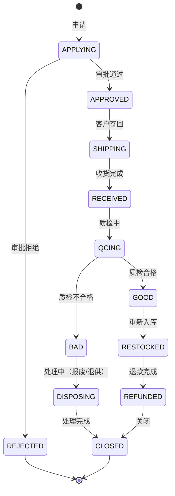

# 退货管理(RMA)深度深化分析

---

## 一、业务定义与目标

### 1.1 定义

退货管理（Return Merchandise Authorization, RMA）是WMS中对客户退货、供应商退货、调拨退货进行全流程管理的功能模块，涵盖退货申请、退货收货、退货质检、退货入库、退款/换货、退货报废、跨境退货等。

### 1.2 核心目标

| 目标 | 衡量指标 |
|------|---------|
| 退货处理及时 | 退货处理及时率 >95% |
| 质检准确 | 退货质检准确率 >99% |
| 库存准确 | 退货入库准确率100% |
| 可追溯 | 退货全链路可追溯 |

### 1.3 退货类型

| 类型 | 说明 | 流向 |
|------|------|------|
| 客户退货(B2C) | 消费者退货（7天无理由/质量问题） | 退货区→质检→良品上架/不良品处理 |
| 客户退货(B2B) | 经销商退货 | 同上 |
| 供应商退货 | 退给供应商（不合格品/错发） | 存储区→退货出库→供应商 |
| 调拨退货 | 调拨在途/入库后退回 | 调出仓退回 |
| 跨境退货 | 跨境电商退货（海外仓退货） | 退货→清关→质检→处理 |

### 1.4 业务场景全景

```
退货管理
├── 退货申请（RMA申请/审批/退货单号生成）
├── 退货收货（扫描退货单/逐件收货/差异处理）
├── 退货质检（五级质检：外观/功能/配件/包装/效期）
├── 退货入库（良品上架/不良品隔离/待检区）
├── 退款管理（退款确认/退款执行/退款状态）
├── 换货管理（换货订单/换货出库）
├── 退货报废（审批/销毁/记录）
├── 退货原因分析（原因统计/改进）
├── 跨境退货（清关/税务/逆向物流）
└── 退货报表（退货率/原因分布/处理时效）
```

---

## 二、业务流程图

### 2.1 客户退货全流程

```mermaid
flowchart TD
    A[客户申请退货] --> B[RMA审批]
    B -->{通过?}
    C -->|否| D[拒绝]
    C -->|是| E[生成退货单号]
    E --> F[客户寄回]
    F --> G[退货收货]
    G --> H[退货质检]
    H -->{质检结果}
    I -->|良品| J[重新上架]
    K -->|不良品| L[不良品区]
    M -->|待检| N[待检区]
    J --> O[退款/换货]
    L --> P[报废/退回供应商]
    N --> Q[进一步质检]
    O --> R[退货完成]
    P --> R
```

---

## 三、状态机设计

### 3.1 退货单状态机



---

## 四、核心业务场景详解

### 4.1 退货申请

客户/客服发起退货申请（订单号/退货原因/退货商品/数量），系统校验（订单状态/退货时效/退货规则），审批通过后生成RMA退货单号，提供退货地址和寄回指引。

### 4.2 退货收货

商品到仓后扫描退货单号→系统展示退货明细→逐件扫描商品条码→输入实收数量→差异处理（少件/多件/错件）→收货完成入退货区。

### 4.3 退货质检

五级质检：外观（破损/污渍/划痕）、功能（通电/性能）、配件（配件齐全）、包装（原包装/吊牌）、效期（是否过期/近效期）。质检结果：良品（可二次销售）、不良品（不可销售）、待检（需进一步检测）。

### 4.4 退货入库

良品→重新上架到存储区（可用库存+）；不良品→不合格品区（冻结）；待检→待检区（冻结）。记录退货批次和原出库批次关联。

### 4.5 退款管理

质检完成后触发退款（良品全额退/不良品协商退款），退款执行（对接支付平台/财务系统），退款状态跟踪，退款完成通知客户。

### 4.6 换货管理

客户选择换货而非退款，创建换货出库单，从库存分配新商品，出库发运，原退货商品走退货流程。

### 4.7 退货报废

不良品处理：退回供应商（创建退货出库单）、报废销毁（审批后销毁，记录销毁证明）、降级处理（打折销售/员工内购）。

### 4.8 退货原因分析

统计退货原因（质量问题/尺寸不合/不喜欢/错发/物流损坏/其他），按SKU/供应商/时间分析，输出退货率报表，驱动产品改进和供应商管理。

### 4.9 跨境退货

跨境电商退货涉及：海外仓收货、清关（进口报关）、税务处理（退税/补税）、逆向物流、质检后重新上架或销毁。流程更复杂，周期更长。

---

## 五、库存变化分析

| 退货动作 | 库存变化 |
|---------|---------|
| 退货收货 | 退货区可用+（待检状态） |
| 质检合格 | 退货区-，存储区可用+ |
| 质检不合格 | 退货区-，不合格品区冻结+ |
| 退货报废 | 不合格品区-（销毁扣减） |
| 退回供应商 | 不合格品区-（退货出库） |
| 换货出库 | 存储区可用-（新商品出库） |

---

## 六、技术实现方案

### 6.1 核心表设计

```sql
-- 退货单 wms_return_order (return_no/rma_no/order_no/customer_code/return_type/reason/status/refund_amount/created_at/completed_at)
-- 退货明细 wms_return_item (return_id/sku/barcode/batch_no/plan_qty/received_qty/qc_result/status/location_code)
-- 退货质检 wms_return_qc (return_id/sku/qc_item/result/remark/inspector)
-- 退款记录 wms_refund_record (return_no/refund_amount/refund_method/status/refund_time/transaction_no)
-- 换货单 wms_exchange_order (exchange_no/return_no/outbound_no/status)
-- 退货报废 wms_return_dispose (return_no/sku/qty/dispose_method/approver/dispose_time/certificate)
```

### 6.2 退货核心逻辑

创建退货单→审批→客户寄回→收货扫描→质检（五级）→良品上架/不良品隔离→退款/换货→报废/退供→关闭。库存变动通过Oracle原子更新+流水记录。

---

## 七、主流WMS对比

| 维度 | 富勒 | 曼哈特 | Blue Yonder | X WMS |
|------|------|--------|-------------|-------|
| 退货类型 | 基础 | 全类型 | AI退货预测 | 5种全覆盖 |
| 退货质检 | 基础 | 完整五级 | AI质检 | 五级质检+记录 |
| 退款换货 | 基础 | 完整 | AI退款优化 | 完整退款换货流程 |
| 跨境退货 | 无 | 有限 | AI跨境优化 | 完整跨境退货 |
| 原因分析 | 基础 | 完整 | AI原因分析 | 完整分析+报表 |

---

## 八、常见业务问题与解决方案

| 问题 | 解决方案 |
|------|---------|
| 退货处理慢 | 流程优化+并行处理+预分拣+SLA |
| 退货质检标准不一 | 五级质检标准化+SOP+图片参考+培训 |
| 良品二次销售混乱 | 退货批次标识+单独库位+状态管理 |
| 退款不及时 | 自动触发+支付对接+状态跟踪+超时告警 |
| 退货率高 | 原因分析+产品改进+供应商管理+客服优化 |
| 跨境退货复杂 | 海外仓+清关代理+税务咨询+流程标准化 |
| 退货丢件/少件 | 收货逐件扫描+称重校验+差异记录+物流索赔 |
| 不良品积压 | 定期处理+退供/报废流程+审批+考核 |

---

## 九、与其他模块的关联关系

| 关联模块 | 关联点 |
|---------|--------|
| 出库管理 | 原出库单关联/换货出库 |
| 入库管理 | 退货收货/良品重新入库 |
| 库存管理 | 退货区库存/不合格品库存 |
| 质检管理 | 退货质检 |
| 费收管理 | 退货处理费/退款 |
| RF作业 | 退货PDA收货/质检 |
| 客户管理 | 客户退货记录/信用 |
| API平台 | 退货申请/退款回调API |
| KPI报表 | 退货率/处理时效统计 |
| 行业插件 | 跨境退货/GSP退货 |
