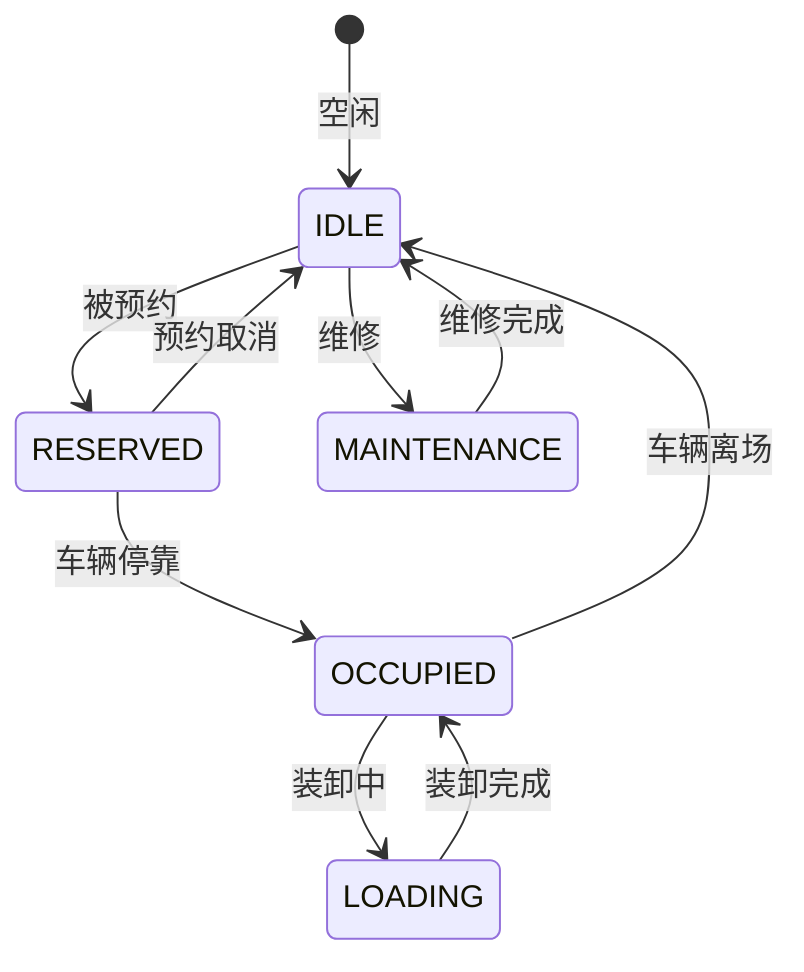

# 预约与月台管理深度深化分析

---

## 一、业务定义与目标

### 1.1 定义

预约与月台管理（Appointment & Dock Management）是WMS中对供应商/承运商到仓时间预约、月台资源分配、车辆调度、装卸作业管理的功能模块，确保仓库出入口有序高效运转。

### 1.2 核心目标

| 目标 | 衡量指标 |
|------|---------|
| 月台利用率 | >80% |
| 车辆等待时间 | <30分钟 |
| 装卸效率 | 高 |
| 预约准时率 | >90% |

### 1.3 业务场景全景

```
预约与月台管理
├── 预约管理
│   ├── 入库预约（供应商送货预约）
│   ├── 出库预约（承运商提货预约）
│   ├── 越库预约
│   ├── 预约审批
│   ├── 预约变更/取消
│   └── 预约规则（时间窗口/提前期/容量限制）
├── 月台管理
│   ├── 月台档案（编号/类型/尺寸/设备）
│   ├── 月台类型（收货月台/发货月台/越库月台/冷链月台）
│   ├── 月台状态（空闲/占用/预约/维修）
│   ├── 月台分配（自动/手动）
│   └── 月台调度（叫号/排队/优先级）
├── 车辆管理
│   ├── 车辆签到（扫码/车牌识别）
│   ├── 车辆排队
│   ├── 车辆叫号
│   ├── 车辆离场
│   └── 车辆历史记录
├── 装卸作业
│   ├── 卸货作业（入库）
│   ├── 装车作业（出库）
│   ├── 装卸工时记录
│   └── 装卸异常处理
└── 月台报表（利用率/等待时间/准时率）
```

---

## 二、业务流程图

### 2.1 预约到仓全流程

```mermaid
flowchart TD
    A[供应商/承运商预约] --> B[系统校验容量]
    B -->{可预约?}
    C -->|否| D[提示其他时间]
    C -->|是| E[预约确认]
    E --> F[车辆到仓签到]
    F --> G[排队等待]
    G --> H[月台叫号]
    H --> I[车辆停靠月台]
    I --> J[装卸作业]
    J --> K[装卸完成]
    K --> L[车辆离场]
    L --> M[月台释放]
```

---

## 三、状态机设计

### 3.1 月台状态机



---

## 四、核心业务场景详解

### 4.1 预约管理

供应商/承运商通过API/门户预约到仓时间，系统校验月台容量和作业能力，确认后生成预约单。支持入库预约（送货）、出库预约（提货）、越库预约。预约规则：提前期（如提前24小时）、时间窗口（如每小时一个窗口）、每窗口容量限制。

### 4.2 月台管理

月台档案（编号/类型/尺寸/承重/设备/温区），月台类型：收货月台、发货月台、越库月台（收货后直接转发货）、冷链月台（温控）。月台状态实时更新。自动分配（按预约时间+月台类型+车辆尺寸），手动调整。

### 4.3 车辆管理

车辆到仓签到（扫码预约单/车牌识别），系统分配排队号，等待叫号。叫号规则：按预约时间优先、紧急订单优先、VIP客户优先。车辆停靠月台后开始装卸，完成后扫码离场，月台释放。

### 4.4 装卸作业

卸货：车辆停靠→开门→卸货→扫码收货→入暂存区。装车：集货完成→车辆停靠→扫码装车→发车确认。记录装卸开始/结束时间、作业人员、异常情况。

### 4.5 越库月台

越库专用月台，收货后商品直接通过越库通道转到发货月台装车，不进入存储区。越库月台需同时关联入库ASN和出库单。

### 4.6 冷链月台

冷链月台有温控设备，车辆停靠时连接温控，装卸过程保持温度。温度记录上传，异常告警。

---

## 五、库存变化分析

预约与月台管理本身不直接改变库存数量，但装卸作业触发库存变动：卸货→收货增加库存，装车→发运扣减库存。月台状态变化不影响库存。

---

## 六、技术实现方案

### 6.1 核心表设计

```sql
-- 预约单 wms_appointment (appointment_no/appointment_type/supplier_code/carrier_code/warehouse_code/expected_date/time_window/status/vehicle_no/driver/phone)
-- 月台 wms_dock (dock_code/warehouse_code/dock_type/width/height/max_weight/temperature_zone/status/equipment)
-- 月台预约 wms_dock_reservation (dock_code/appointment_no/start_time/end_time/status)
-- 车辆签到 wms_vehicle_checkin (checkin_no/appointment_no/vehicle_no/arrival_time/dock_code/checkout_time/status)
-- 装卸记录 wms_loading_record (record_no/dock_code/appointment_no/operation_type/start_time/end_time/operator/qty/status)
```

### 6.2 月台分配核心逻辑

预约时查询空闲月台（类型匹配+时间窗口+尺寸匹配）→自动分配→生成月台预约→车辆到仓签到→叫号→月台状态更新→装卸完成→释放月台。

---

## 七、主流WMS对比

| 维度 | 富勒 | 曼哈特 | Blue Yonder | X WMS |
|------|------|--------|-------------|-------|
| 预约管理 | 基础 | 完整 | AI预约优化 | 完整预约+规则 |
| 月台调度 | 基础 | 完整 | AI智能调度 | 自动+手动+优先级 |
| 越库月台 | 有限 | 完整 | AI越库调度 | 完整越库流程 |
| 冷链月台 | 有限 | 完整 | 温控AI | 完整温控+记录 |
| 车牌识别 | 无 | 有限 | IoT集成 | API集成 |

---

## 八、常见业务问题与解决方案

| 问题 | 解决方案 |
|------|---------|
| 月台拥堵 | 预约管理+时间窗口+容量限制+叫号调度 |
| 车辆等待久 | 预约准时率+叫号优先级+月台效率+备用月台 |
| 预约不准时 | 迟到统计+供应商考核+超时释放+候补预约 |
| 越库混乱 | 专用月台+流程隔离+系统引导+人员培训 |
| 冷链断链 | 温控月台+温度监控+异常告警+操作规范 |
| 装卸效率低 | 月台设备+人员配置+作业标准+绩效挂钩 |

---

## 九、与其他模块的关联关系

| 关联模块 | 关联点 |
|---------|--------|
| 入库管理 | 入库预约/卸货收货 |
| 出库管理 | 出库预约/装车发运 |
| 费收管理 | 月台使用费/装卸费/滞留费 |
| RF作业 | 装卸PDA作业 |
| API平台 | 预约API/签到API |
| KPI报表 | 月台利用率/等待时间 |
| 行业插件 | 冷链月台/GSP月台 |
