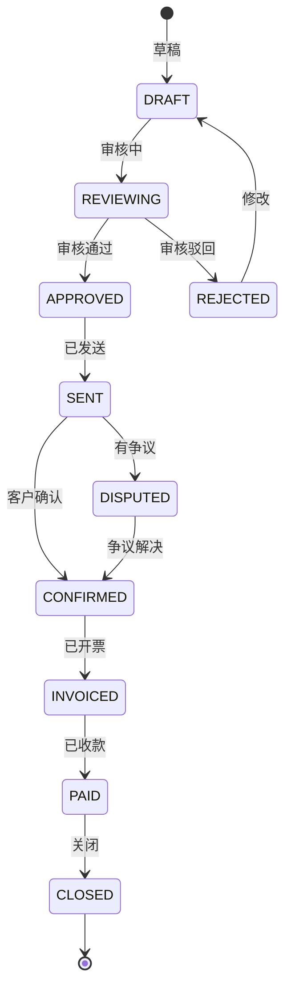

# 费收计费管理深度深化分析

---

## 一、业务定义与目标

### 1.1 定义

费收计费管理（Billing & Charge Management）是WMS中为3PL仓储企业提供的仓储服务费用计算、账单生成、对账、结算功能模块，涵盖仓储费、操作费、增值服务费、快递费、杂费等。

### 1.2 核心目标

| 目标 | 衡量指标 |
|------|---------|
| 计费准确 | 计费准确率100% |
| 账单及时 | 账单按时生成率100% |
| 对账高效 | 对账差异率 <1% |
| 费用透明 | 费用明细可追溯 |

### 1.3 业务场景全景

```
费收计费管理
├── 计费项目
│   ├── 仓储费（按面积/按库位/按托盘/按重量/按体积/按件）
│   ├── 入库操作费（按件/按托盘/按箱）
│   ├── 出库操作费（按件/按订单/按托盘）
│   ├── 增值服务费（贴标/组合/拆零等）
│   ├── 快递费（按重量/按体积重/按区域）
│   ├── 月台费/装卸费
│   ├── 滞留费/超期费
│   └── 其他杂费
├── 计费规则（按货主/按客户/按合同配置费率）
├── 计费周期（日结/周结/月结/即时）
├── 费用采集（作业量自动采集/手动录入）
├── 账单生成（自动/手动/预览/调整）
├── 对账管理（客户对账/差异处理/确认）
├── 结算管理（发票/收款/核销）
├── 费用报表（收入统计/客户排名/项目占比）
└── 合同管理（合同条款/费率/有效期）
```

---

## 二、业务流程图

### 2.1 计费全流程

```mermaid
flowchart TD
    A[作业完成] --> B[自动采集作业量]
    B --> C[匹配计费规则]
    C --> D[计算费用]
    D --> E[费用明细入库]
    E --> F[计费周期结束]
    F --> G[生成账单]
    G --> H[账单审核]
    H -->{通过?}
    I -->|否| J[调整账单]
    J --> H
    I -->|是| K[发送客户对账]
    K --> L{客户确认?}
    M -->|有差异| N[差异处理]
    N --> K
    M -->|确认| O[开票结算]
    O --> P[收款核销]
    P --> Q[账单完成]
```

---

## 三、状态机设计

### 3.1 账单状态机



---

## 四、核心业务场景详解

### 4.1 计费项目

仓储费：按占用面积/库位数/托盘数/重量/体积/件数计费，通常按日/月计算。
操作费：入库操作费（按件/托盘/箱）、出库操作费（按件/订单/托盘）。
增值服务费：VAS各项服务按件/按批/按工时计费。
快递费：按实际重量/体积重/区域计费，对接快递商报价。
其他：月台费、装卸费、滞留费（车辆超时）、超期费（库存超期）。

### 4.2 计费规则

按货主/客户/合同配置不同费率，支持阶梯费率（量越大单价越低）、首重续重、最低消费、免费额度。规则优先级：合同级>客户级>默认级。

### 4.3 费用采集

作业量自动采集：入库件数、出库件数、库存快照（每日/每月）、VAS作业量、快递重量。手动录入：杂费、特殊费用。采集后进入费用明细表，待计费。

### 4.4 账单生成

计费周期结束（如每月1日），系统自动汇总费用明细，按客户/货主生成账单。支持账单预览、手动调整（加减费用）、审核流程。

### 4.5 对账管理

账单发送客户，客户核对，有差异时提交争议，系统处理差异（补/退费用），确认后进入结算。

### 4.6 结算管理

开票（对接财务系统/开票平台）、收款记录、核销（收款核销账单）、账龄分析。

---

## 五、库存变化分析

费收计费不直接改变库存数量，但仓储费计算依赖库存快照（每日/每月库存数量/面积），库存变动影响仓储费。

---

## 六、技术实现方案

### 6.1 核心表设计

```sql
-- 计费规则 wms_billing_rule (rule_code/owner_code/customer_code/charge_item/rate/unit/阶梯配置/status/effective_date)
-- 费用明细 wms_charge_detail (detail_no/owner_code/customer_code/charge_item/qty/unit/rate/amount/ref_type/ref_no/charge_date/status)
-- 账单 wms_bill (bill_no/owner_code/customer_code/bill_period/total_amount/status/created_at/confirmed_at)
-- 账单明细 wms_bill_item (bill_id/charge_item/qty/amount/remark)
-- 对账记录 wms_reconciliation (bill_id/customer_code/dispute_content/dispute_amount/handle_result/status)
-- 结算记录 wms_settlement (bill_id/invoice_no/invoice_amount/paid_amount/paid_time/status)
```

### 6.2 计费核心逻辑

作业完成→事件触发→查询计费规则→计算费用→写入费用明细表。账单生成时汇总费用明细→生成账单→审核→发送→对账→结算。

仓储费特殊：每日定时任务生成库存快照，按月汇总计算仓储费。

---

## 七、主流WMS对比

| 维度 | 富勒 | 曼哈特 | Blue Yonder | X WMS |
|------|------|--------|-------------|-------|
| 计费项目 | 基础 | 丰富 | AI计费优化 | 8大类全覆盖 |
| 计费规则 | 基础 | 完整规则引擎 | AI动态费率 | 阶梯+合同+优先级 |
| 自动采集 | 基础 | 完整 | IoT自动采集 | 全作业量自动采集 |
| 对账结算 | 基础 | 完整 | AI对账 | 完整对账+结算 |
| 快递费 | 有限 | 完整 | AI比价 | 对接快递商报价 |

---

## 八、常见业务问题与解决方案

| 问题 | 解决方案 |
|------|---------|
| 计费不准 | 规则标准化+自动采集+对账+审计 |
| 账单争议多 | 费用明细透明+实时查询+对账流程+差异处理 |
| 仓储费计算复杂 | 库存快照+多维度计费+规则引擎+模拟计算 |
| 快递费差异 | 对接快递商API+重量校验+对账+索赔 |
| 计费规则变更 | 版本管理+生效日期+历史追溯+影响分析 |
| 多客户费率不同 | 合同级规则+优先级+模板+批量配置 |

---

## 九、与其他模块的关联关系

| 关联模块 | 关联点 |
|---------|--------|
| 入库管理 | 入库操作费采集 |
| 出库管理 | 出库操作费/快递费采集 |
| 库存管理 | 库存快照→仓储费 |
| VAS管理 | VAS服务费采集 |
| 预约月台 | 月台费/滞留费 |
| 客户货主 | 计费规则/账单归属 |
| API平台 | 账单API/对账API |
| KPI报表 | 收入统计/客户排名 |
| 数据归档 | 历史账单归档 |
