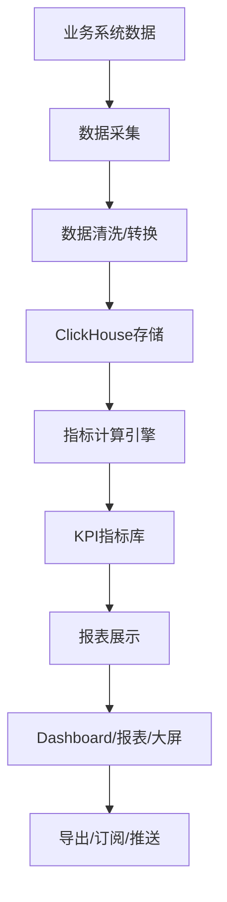

# KPI报表体系深度深化分析

---

## 一、业务定义与目标

### 1.1 定义

KPI报表体系（KPI & Reporting System）是WMS中对仓储运营各环节进行数据采集、指标计算、报表展示、分析预警的功能模块，为管理层和作业层提供决策支持。

### 1.2 核心目标

| 目标 | 衡量指标 |
|------|---------|
| 指标全面 | 覆盖入库/出库/库存/人员/设备/质量 |
| 数据实时 | 核心指标延迟 <5分钟 |
| 报表丰富 | 支持日报/周报/月报/自定义 |
| 可视化 | 图表化展示，直观易懂 |

### 1.3 业务场景全景

```
KPI报表体系
├── 入库KPI（收货及时率/收货准确率/上架及时率/质检合格率）
├── 出库KPI（订单按时发货率/出库准确率/拣货效率/复核通过率）
├── 库存KPI（库存准确率/库存周转率/库龄分布/呆滞库存占比）
├── 人员KPI（人均拣货量/人均收货量/作业效率/差错率）
├── 设备KPI（设备利用率/故障率/维护及时率）
├── 质量KPI（客诉率/退货率/破损率/错发率）
├── 费收KPI（收入/成本/利润率/客户排名）
├── 报表类型
│   ├── 实时看板（Dashboard）
│   ├── 日报/周报/月报
│   ├── 自定义报表
│   ├── 导出报表（Excel/PDF）
│   └── 订阅推送（邮件/消息）
├── 数据分析（趋势分析/对比分析/排名分析/异常分析）
├── 数据大屏（仓库运营大屏）
└── ClickHouse OLAP查询（大数据量报表）
```

---

## 二、业务流程图

### 2.1 KPI数据流转



---

## 三、状态机设计

KPI报表体系无核心状态机，报表任务有状态：待生成→生成中→已生成→已发送→失败。

---

## 四、核心业务场景详解

### 4.1 入库KPI

收货及时率（预约时间内收货比例）、收货准确率（实收=应收比例）、上架及时率（收货后24h内上架比例）、质检合格率、入库差异率。

### 4.2 出库KPI

订单按时发货率（承诺时间内发货比例）、出库准确率（无错发漏发比例）、拣货效率（件/小时/人）、复核通过率、订单取消率、快递及时率。

### 4.3 库存KPI

库存准确率（盘点账实一致比例）、库存周转率（出库量/平均库存）、周转天数、库龄分布、呆滞库存占比、库存可用率。

### 4.4 人员KPI

人均拣货量、人均收货量、人均上架量、作业效率（标准工时/实际工时）、差错率、出勤率、加班时长。

### 4.5 设备KPI

叉车/输送线/分拣机利用率、故障率、平均故障修复时间、维护及时率、设备稼动率。

### 4.6 质量KPI

客诉率、退货率、破损率、错发率、漏发率、客户满意度。

### 4.7 实时看板(Dashboard)

Web后台首页Dashboard，展示核心指标卡片+趋势图+排行榜+异常告警，支持按仓库/时间筛选，数据实时刷新。

### 4.8 报表订阅

定时生成报表（日报/周报/月报），自动推送到指定邮箱/消息，支持自定义报表模板和订阅人。

### 4.9 数据大屏

仓库运营大屏，全屏展示核心指标、实时作业动态、人员设备状态、异常告警，适合仓库现场和管理层展示。

### 4.10 ClickHouse OLAP

大数据量报表（库存流水/作业记录/订单明细）使用ClickHouse存储和查询，支持秒级聚合查询，Oracle业务库通过Kafka/定时同步到ClickHouse。

---

## 五、库存变化分析

KPI报表不直接改变库存，库存变动数据是KPI的数据源。库存准确率、周转率等指标基于库存数据计算。

---

## 六、技术实现方案

### 6.1 核心表设计

```sql
-- KPI指标定义 wms_kpi_define (kpi_code/kpi_name/category/formula/unit/target_value/status)
-- KPI指标值 wms_kpi_value (kpi_code/stat_date/warehouse_code/owner_code/actual_value/target_value/status)
-- 报表定义 wms_report_define (report_code/report_name/report_type/template/status)
-- 报表任务 wms_report_task (task_id/report_code/stat_period/status/generated_at/file_path)
-- 报表订阅 wms_report_subscription (report_code/subscriber/channel/cron/status)
```

### 6.2 数据同步架构

Oracle业务库→Kafka事件→ClickHouse消费写入→定时任务计算KPI→Dashboard查询ClickHouse实时展示。历史数据归档后仍可在ClickHouse查询。

### 6.3 指标计算

定时任务（PowerJob）按日/周/月计算KPI指标，写入KPI指标值表。实时指标通过ClickHouse实时聚合查询。

---

## 七、主流WMS对比

| 维度 | 富勒 | 曼哈特 | Blue Yonder | X WMS |
|------|------|--------|-------------|-------|
| KPI覆盖 | 基础 | 全面 | AI预测KPI | 7大类全覆盖 |
| 实时看板 | 基础 | 完整 | AI实时分析 | Dashboard+大屏 |
| 自定义报表 | 有限 | 完整 | AI报表生成 | 自定义+模板 |
| OLAP引擎 | 数据库 | 专用 | AI分析引擎 | ClickHouse |
| 数据大屏 | 有限 | 完整 | AI可视化 | 完整大屏 |

---

## 八、常见业务问题与解决方案

| 问题 | 解决方案 |
|------|---------|
| 报表数据不准 | 数据源校验+对账+指标定义标准化+审计 |
| 报表查询慢 | ClickHouse OLAP+预计算+索引+分页 |
| 指标定义不统一 | 指标库+公式标准化+数据字典+培训 |
| 实时性差 | Kafka实时同步+ClickHouse实时聚合+WebSocket推送 |
| 报表太多太杂 | 指标分层+核心报表+自定义+权限控制 |
| 数据孤岛 | 统一数据仓库+ETL+主数据管理 |

---

## 九、与其他模块的关联关系

| 关联模块 | 关联点 |
|---------|--------|
| 所有业务模块 | 数据来源 |
| 库存管理 | 库存KPI数据源 |
| 人员绩效 | 人员KPI |
| 费收管理 | 费收KPI |
| 系统监控 | 系统KPI |
| 消息通知 | 报表订阅推送 |
| 数据归档 | 历史报表归档 |
| API平台 | 报表数据API |
