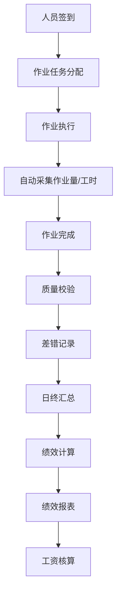

# 人员绩效管理深度深化分析

---

## 一、业务定义与目标

### 1.1 定义

人员绩效管理（Labor Performance Management）是WMS中对仓库作业人员的工作量、作业效率、质量、出勤进行记录、统计、分析、考核的功能模块，用于人员排班、绩效工资、效率优化。

### 1.2 核心目标

| 目标 | 衡量指标 |
|------|---------|
| 工作量透明 | 个人作业量100%可追溯 |
| 效率可量化 | 标准工时 vs 实际工时 |
| 质量可考核 | 差错率统计 |
| 绩效公平 | 多劳多得，数据驱动 |

### 1.3 业务场景全景

```
人员绩效管理
├── 人员档案（岗位/技能/等级/班组/排班）
├── 作业量采集（自动采集各环节作业量）
├── 工时管理（签到/签退/作业工时/等待工时/加班）
├── 效率分析（标准工时/实际工时/效率系数）
├── 质量考核（差错率/返工率/客诉关联）
├── 绩效计算（工作量+效率+质量+出勤综合评分）
├── 绩效工资（计件工资/计时工资/绩效奖金）
├── 排班管理（班次/人员分配/技能匹配）
├── 人员排名（个人/班组排名）
├── 培训管理（技能培训/考核/认证）
└── 人员报表（效率/质量/出勤/成本）
```

---

## 二、业务流程图

### 2.1 绩效数据流转



---

## 三、状态机设计

人员排班状态：休息→待命→作业中→休息；作业任务状态：待分配→已分配→执行中→已完成→异常。

---

## 四、核心业务场景详解

### 4.1 人员档案

人员基本信息、岗位（收货员/上架员/拣货员/复核员/打包员/叉车司机/管理员）、技能等级、所属班组、排班信息。支持一人多技能。

### 4.2 作业量采集

各环节作业完成时自动记录作业人员和作业量：收货件数、上架件数、拣货件数、复核件数、打包件数、移库件数、盘点行数。通过PDA操作人自动关联。

### 4.3 工时管理

签到/签退（PDA/人脸/指纹），作业工时（任务开始到结束）、等待工时（无任务时间）、加班工时。支持多班次（早班/中班/晚班）。

### 4.4 效率分析

标准工时（按作业类型和SKU/库位设定标准时间），实际工时，效率系数=标准工时/实际工时。效率>100%为高效，<80%需关注。

### 4.5 质量考核

差错率（错拣/错收/错发次数/总作业量）、返工率、客诉关联（因个人差错导致的客诉）。质量不达标扣绩效。

### 4.6 绩效计算

综合绩效=工作量(40%)+效率(30%)+质量(20%)+出勤(10%)。支持计件工资（按件计酬）、计时工资（按工时计酬）、绩效奖金（绩效系数×基本工资）。

### 4.7 排班管理

按作业量预测排班，技能匹配（叉车司机只能开叉车），人员负荷平衡，支持临时调班和加班申请。

### 4.8 人员排名

个人/班组排名（按效率/工作量/质量），实时排行榜，激励竞争。月度/季度/年度排名。

---

## 五、库存变化分析

人员绩效不直接改变库存，作业人员的操作导致库存变动，绩效记录的是操作行为和结果。

---

## 六、技术实现方案

### 6.1 核心表设计

```sql
-- 人员档案 wms_employee (employee_code/name/position/skill_level/team_code/status)
-- 作业记录 wms_labor_record (record_no/employee_code/operation_type/ref_no/qty/start_time/end_time/standard_time/actual_time/efficiency)
-- 考勤记录 wms_attendance (employee_code/date/shift/checkin_time/checkout_time/overtime_hours/status)
-- 差错记录 wms_labor_error (error_no/employee_code/operation_type/error_type/ref_no/qty/severity/status)
-- 绩效汇总 wms_performance_summary (employee_code/stat_period/total_qty/efficiency/error_rate/attendance_score/performance_score/performance_pay)
-- 排班 wms_schedule (schedule_id/date/shift/employee_code/position/status)
```

### 6.2 绩效计算核心逻辑

作业完成→自动写入作业记录（操作人/类型/数量/工时）→日终汇总→计算效率（标准工时/实际工时）→统计差错→综合绩效评分→生成绩效报表→对接工资系统。

---

## 七、主流WMS对比

| 维度 | 富勒 | 曼哈特 | Blue Yonder | X WMS |
|------|------|--------|-------------|-------|
| 作业量采集 | 基础 | 完整 | IoT自动采集 | 全环节自动采集 |
| 效率分析 | 基础 | 完整标准工时 | AI效率优化 | 标准工时+效率系数 |
| 绩效工资 | 有限 | 完整 | AI薪酬优化 | 计件+计时+绩效 |
| 排班管理 | 基础 | 完整 | AI智能排班 | 技能匹配+负荷平衡 |
| 实时排名 | 基础 | 完整 | AI激励 | 实时排行榜 |

---

## 八、常见业务问题与解决方案

| 问题 | 解决方案 |
|------|---------|
| 作业量分配不均 | 智能任务分配+负荷平衡+技能匹配 |
| 效率数据不准 | 自动采集+标准工时校准+异常剔除 |
| 质量考核难 | 差错记录+复核关联+客诉追溯 |
| 排班不合理 | 作业量预测+技能匹配+负荷平衡+调班流程 |
| 绩效争议 | 数据透明+实时查询+申诉流程+复核 |
| 人员流失 | 绩效激励+技能培训+晋升通道+关怀 |

---

## 九、与其他模块的关联关系

| 关联模块 | 关联点 |
|---------|--------|
| 所有作业模块 | 作业量/工时数据源 |
| RF作业 | PDA操作人自动关联 |
| KPI报表 | 人员KPI |
| 费收管理 | 人工成本核算 |
| 系统管理 | 用户/角色/权限 |
| 消息通知 | 绩效通知/排名推送 |
