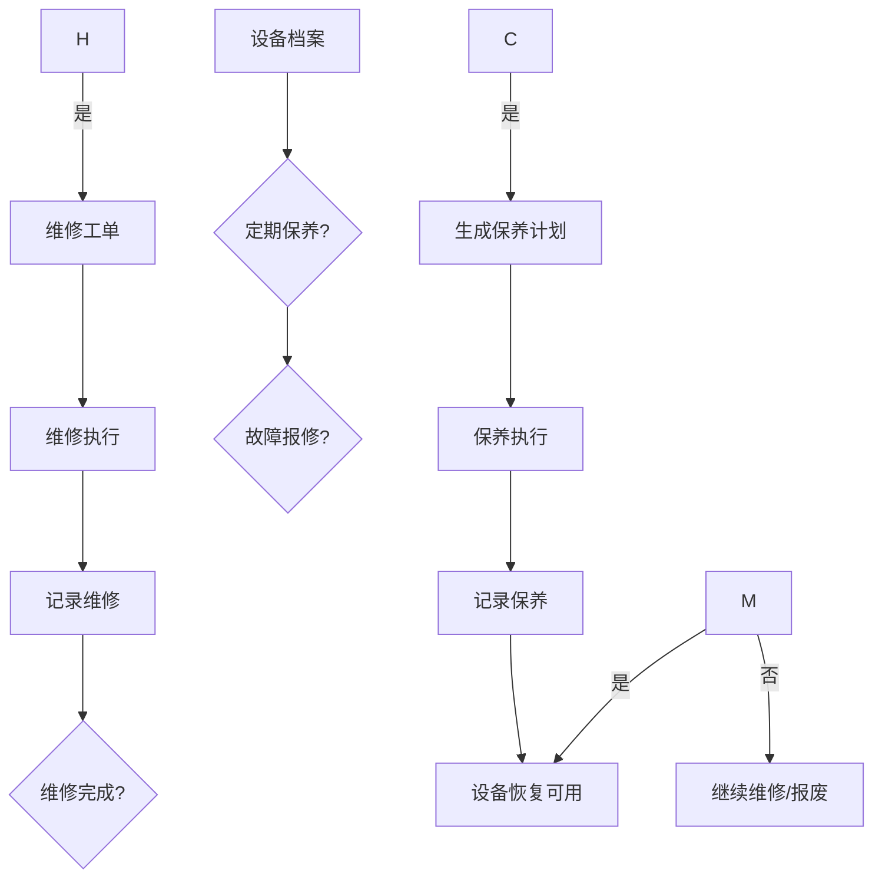
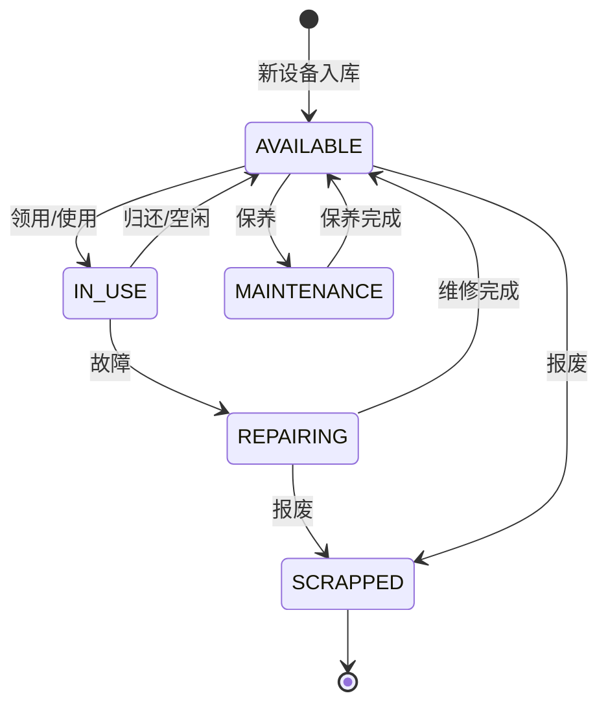

# 设备管理深度深化分析

---

## 一、业务定义与目标

### 1.1 定义

设备管理（Equipment Management）是WMS中对仓库内所有物流设备（叉车、托盘、货架、输送线、分拣机、电子秤、扫码枪、打印机、AGV等）进行档案、状态、维护、调度、利用率管理的功能模块。

### 1.2 核心目标

| 目标 | 衡量指标 |
|------|---------|
| 设备可用 | 设备可用率 >95% |
| 维护及时 | 维护及时率100% |
| 利用率高 | 设备利用率 >70% |
| 安全合规 | 安全事故率=0 |

### 1.3 业务场景全景

```
设备管理
├── 设备档案（设备编号/类型/型号/供应商/购置日期/状态）
├── 设备类型
│   ├── 搬运设备（叉车/地牛/AGV/堆高机）
│   ├── 存储设备（货架/托盘/料箱/周转箱）
│   ├── 输送设备（输送线/提升机/分拣机）
│   ├── 计量设备（电子秤/地磅/体积测量仪）
│   ├── 识别设备（扫码枪/RFID/PDA）
│   ├── 打印设备（标签打印机/面单打印机）
│   └── 其他（打包机/封箱机/缠绕机）
├── 设备状态（可用/使用中/维修/保养/报废）
├── 维护管理（保养计划/维修记录/备件管理）
├── 设备调度（叉车调度/AGV调度/设备分配）
├── 利用率分析（使用时长/作业量/空闲率）
├── 设备租赁（租赁设备管理/费用）
├── 安全管理（年检/安全检查/操作证）
└── 设备报表（利用率/故障率/维护成本）
```

---

## 二、业务流程图

### 2.1 设备维护流程



---

## 三、状态机设计

### 3.1 设备状态机



---

## 四、核心业务场景详解

### 4.1 设备档案

设备编号、类型、型号、品牌、供应商、购置日期、价格、保修期、技术参数、状态。支持设备二维码/条码标签，扫码查看设备信息。

### 4.2 叉车管理

叉车档案（编号/型号/载重/电池类型）、使用记录（领用人/使用时间/作业量）、电池管理（充电记录/电池寿命）、保养维修、年检。叉车调度（按作业需求分配最近空闲叉车）。

### 4.3 托盘管理

托盘档案（SSCC/类型/尺寸/承重/状态）、托盘流转跟踪（入库/出库/在途）、托盘租赁（按天计费）、托盘盘点、破损维修/报废。

### 4.4 输送线/分拣机

自动化设备状态监控（运行/停止/故障）、作业量统计、故障告警、维护保养。对接WCS设备控制系统。

### 4.5 电子秤/扫码枪/打印机

PDA/扫码枪绑定作业人员，电子秤对接打包台，打印机管理（打印队列/缺纸告警/故障）。

### 4.6 维护管理

保养计划（按时间/按使用时长）、保养执行记录、维修工单（报修/派工/维修/验收）、备件库存管理、维修成本统计。

### 4.7 设备调度

叉车调度（作业请求→查找最近空闲叉车→分配→导航）、AGV调度（对接AGV系统）、设备负荷平衡。

### 4.8 利用率分析

设备使用时长、作业量、空闲率、故障率、平均故障间隔(MTBF)、平均修复时间(MTTR)、维护成本。

---

## 五、库存变化分析

设备管理不直接改变商品库存。托盘/料箱等容器作为特殊库存管理，设备领用归还不影响商品库存。

---

## 六、技术实现方案

### 6.1 核心表设计

```sql
-- 设备档案 wms_equipment (equipment_code/equipment_type/model/brand/supplier_code/purchase_date/status/location)
-- 设备使用记录 wms_equipment_usage (equipment_code/user_id/start_time/end_time/operation_type/qty)
-- 保养计划 wms_maintenance_plan (plan_id/equipment_code/plan_type/plan_date/status)
-- 保养记录 wms_maintenance_record (record_id/equipment_code/plan_id/content/executor/executed_time/cost)
-- 维修工单 wms_repair_order (repair_no/equipment_code/fault_desc/status/reporter/repairer/start_time/end_time/cost)
-- 备件 wms_spare_part (part_code/part_name/equipment_type/stock_qty/unit_cost)
```

### 6.2 设备调度核心逻辑

作业请求（如叉车搬运）→查询空闲设备（类型匹配+位置最近+状态可用）→分配→更新设备状态为使用中→作业完成→归还→更新为可用→记录使用时长。

---

## 七、主流WMS对比

| 维度 | 富勒 | 曼哈特 | Blue Yonder | X WMS |
|------|------|--------|-------------|-------|
| 设备类型 | 基础 | 全面 | IoT设备管理 | 7大类全覆盖 |
| 维护管理 | 基础 | 完整 | AI预测维护 | 保养+维修+备件 |
| 设备调度 | 有限 | 完整 | AI智能调度 | 叉车+AGV调度 |
| 利用率分析 | 基础 | 完整 | AI分析 | MTBF/MTTR+成本 |
| WCS集成 | 有限 | 完整 | IoT集成 | API对接WCS |

---

## 八、常见业务问题与解决方案

| 问题 | 解决方案 |
|------|---------|
| 设备故障影响作业 | 预防性维护+备用设备+快速维修+故障告警 |
| 设备利用率低 | 调度优化+负荷平衡+共享使用+闲置处理 |
| 叉车电池管理 | 电池监控+充电排班+电池轮换+寿命管理 |
| 托盘丢失/破损 | 托盘跟踪+租赁管理+定期盘点+破损维修 |
| 维护不及时 | 保养计划+自动提醒+工单跟踪+绩效考核 |
| 设备安全事故 | 年检+操作证+安全检查+培训+告警 |

---

## 九、与其他模块的关联关系

| 关联模块 | 关联点 |
|---------|--------|
| 入库管理 | 叉车/托盘使用 |
| 出库管理 | 叉车/输送线/分拣机使用 |
| RF作业 | PDA/扫码枪绑定 |
| 库位管理 | 货架设备 |
| WCS集成 | 自动化设备控制 |
| 费收管理 | 设备租赁费/折旧费 |
| KPI报表 | 设备利用率/故障率 |
| 人员绩效 | 设备使用关联人员 |
