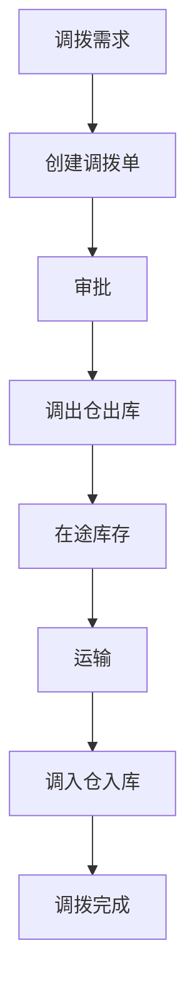
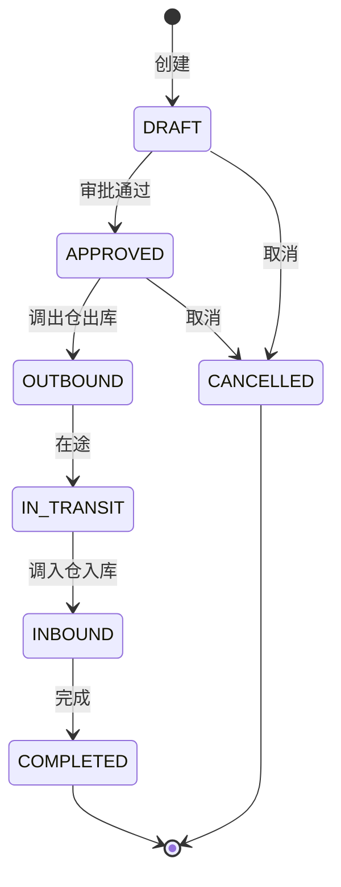

# 多仓协同管理深度深化分析

---

## 一、业务定义与目标

### 1.1 定义

多仓协同管理（Multi-Warehouse Collaboration）是WMS中对多个仓库之间的库存共享、订单分配、调拨协同、统一调度进行管理的功能模块，支持全国分仓、前置仓、中心仓+区域仓等多仓模式。

### 1.2 核心目标

| 目标 | 衡量指标 |
|------|---------|
| 库存共享 | 多仓库存统一视图 |
| 订单最优分配 | 就近发货/成本最优 |
| 调拨高效 | 调拨及时率 >95% |
| 库存均衡 | 各仓库存合理分布 |

### 1.3 多仓模式

```
多仓模式
├── 中心仓+区域仓（中心仓存储，区域仓发货）
├── 全国分仓（各区域独立仓，就近发货）
├── 前置仓（靠近消费者的小型仓，即时配送）
├── 保税仓+普通仓（跨境电商）
├── 自营仓+外包仓（3PL混合）
└── 虚拟仓（线上库存，实际在途/在制）
```

### 1.4 业务场景全景

```
多仓协同管理
├── 多仓库存视图（统一查询各仓库存/库存汇总）
├── 订单分配规则（就近发货/成本最优/库存优先/优先级）
├── 仓间调拨（调拨申请/审批/出库/在途/入库）
├── 库存共享（可售库存共享/安全库存隔离）
├── 多仓波次（跨仓订单拆分/合并）
├── 多仓报表（各仓库存/作业/效率对比）
├── 多仓权限（按仓授权/数据隔离）
├── 跨仓退货（退货到任意仓/库存归属）
└── 多仓费收（各仓独立计费/统一结算）
```

---

## 二、业务流程图

### 2.1 多仓订单分配流程

```mermaid
flowchart TD
    A[订单接收] --> B[查询各仓可用库存]
    B --> C[订单分配规则计算]
    C -->{分配策略}
    D -->|就近发货| E[选择最近仓]
    F -->|成本最优| G[选择综合成本最低仓]
    H -->|库存优先| I[选择库存最充足仓]
    E --> J[分配到目标仓]
    G --> J
    I --> J
    J --> K{单仓满足?}
    L -->|是| M[目标仓出库]
    L -->|否| N[拆单到多仓]
    N --> O[各仓分别出库]
```

### 2.2 仓间调拨流程



---

## 三、状态机设计

### 3.1 调拨单状态机



---

## 四、核心业务场景详解

### 4.1 多仓库存视图

统一查询各仓库库存（按SKU汇总各仓数量），支持按仓库/库区/批次/效期/状态多维度查询。库存汇总=各仓可用库存之和。实时同步各仓库存数据。

### 4.2 订单分配规则

订单到达时，按规则选择发货仓：
- **就近发货**：按收货地址选择最近仓库（距离/配送时效）
- **成本最优**：综合考虑库存成本+配送成本+操作成本
- **库存优先**：选择库存最充足的仓（避免拆单）
- **优先级**：VIP订单优先发优质仓，普通订单按规则
- **拆单**：单仓库存不足时拆到多仓分别发货

### 4.3 仓间调拨

A仓库存不足/B仓库存过剩→创建调拨单→审批→A仓（调出）出库→在途库存→运输→B仓（调入）入库→调拨完成。在途库存归属调入仓但不可用，入库后转为可用。

### 4.4 库存共享

各仓可售库存共享给订单分配系统，但每仓有安全库存隔离（低于安全库存不参与分配）。支持虚拟库存（在途/在制可预分配）。

### 4.5 多仓波次

跨仓订单拆分后各仓独立生成波次拣货。同一客户多仓发货时分别打包发运，物流单号分别跟踪。

### 4.6 跨仓退货

客户退货可退到任意仓（不一定是发货仓），退货入库后库存归属收货仓，原发货仓库存不回补。财务上按仓结算。

### 4.7 多仓权限

用户按仓库授权，只能查看/操作授权仓库的数据。管理员可查看所有仓。数据隔离通过warehouse_code实现。

---

## 五、库存变化分析

| 多仓动作 | 库存变化 |
|---------|---------|
| 订单分配到A仓 | A仓可用→预占 |
| 拆单到A+B仓 | A仓预占+B仓预占 |
| 调拨出库（A仓） | A仓可用-，在途+ |
| 调拨在途 | 在途库存（归属调入仓） |
| 调拨入库（B仓） | 在途-，B仓可用+ |
| 跨仓退货到C仓 | C仓可用+（原发货仓不变） |

---

## 六、技术实现方案

### 6.1 核心表设计

```sql
-- 仓库 wms_warehouse (已存在，增加is_virtual/sort_order/delivery_area)
-- 多仓库存视图（查询时聚合各仓wms_inventory）
-- 订单分配记录 wms_order_allocation (order_id/warehouse_code/allocation_rule/alloc_time)
-- 调拨单 wms_transfer_order (transfer_no/from_warehouse/to_warehouse/status/total_qty/created_at)
-- 调拨明细 wms_transfer_item (transfer_id/sku/batch_no/qty/from_location/to_location)
-- 在途库存 wms_in_transit (transfer_id/sku/batch_no/qty/from_warehouse/to_warehouse/status)
```

### 6.2 订单分配核心逻辑

订单接收→查询各仓可用库存（排除安全库存）→按分配规则评分（距离/成本/库存）→选择最优仓→单仓满足则分配，不满足则拆单→各仓独立处理出库。

### 6.3 调拨核心逻辑

创建调拨单→审批→调出仓出库（Oracle扣减+在途增加）→运输→调入仓入库（在途扣减+可用增加）→完成。在途库存统一纳入库存五态模型管理。

---

## 七、主流WMS对比

| 维度 | 富勒 | 曼哈特 | Blue Yonder | X WMS |
|------|------|--------|-------------|-------|
| 多仓模式 | 基础 | 全面 | AI多仓优化 | 6种模式全覆盖 |
| 订单分配 | 基础 | 完整规则引擎 | AI最优分配 | 多策略+拆单 |
| 仓间调拨 | 基础 | 完整 | AI调拨建议 | 完整调拨+在途 |
| 库存共享 | 有限 | 完整 | AI库存平衡 | 统一视图+安全库存 |
| 跨仓退货 | 有限 | 完整 | AI退货路由 | 任意仓退货+归属 |

---

## 八、常见业务问题与解决方案

| 问题 | 解决方案 |
|------|---------|
| 各仓库存不均衡 | 调拨建议+安全库存+库存平衡算法+定期调拨 |
| 订单分配不合理 | 多策略组合+成本模型+时效约束+人工调整 |
| 拆单增加成本 | 库存优先策略+合并发货+前置仓备货+调拨补货 |
| 调拨在途混乱 | 在途库存统一管理+物流跟踪+入库确认+差异处理 |
| 跨仓退货归属不清 | 退货仓归属+财务按仓结算+库存调拨调整 |
| 多仓数据不一致 | 实时同步+库存校准+定期对账+统一主数据 |

---

## 九、与其他模块的关联关系

| 关联模块 | 关联点 |
|---------|--------|
| 出库管理 | 多仓订单分配/拆单出库 |
| 入库管理 | 各仓独立入库 |
| 库存管理 | 多仓库存视图/在途库存 |
| 调拨管理 | 仓间调拨全流程 |
| 费收管理 | 各仓独立计费 |
| 多租户 | 多货主多仓 |
| API平台 | 多仓库存查询API |
| KPI报表 | 各仓对比报表 |
| 系统管理 | 多仓权限 |
