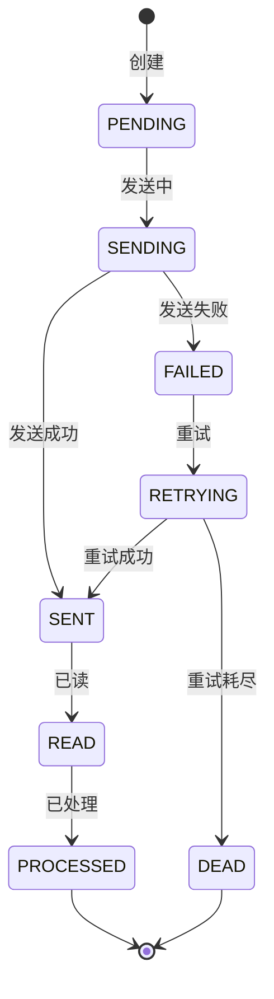

# 消息推送与通知模块深度深化分析

---

## 一、业务定义与目标

### 1.1 定义

消息推送与通知（Message Push & Notification）是WMS中对系统内各类业务事件、异常告警、任务通知、审批通知进行统一消息管理和多渠道推送的功能模块，确保相关人员及时获取关键信息。

### 1.2 核心目标

| 目标 | 衡量指标 |
|------|---------|
| 通知及时 | 关键通知延迟 <10秒 |
| 渠道全面 | 支持站内/短信/邮件/微信/钉钉 |
| 不遗漏 | 重要通知送达率100% |
| 不打扰 | 可配置通知偏好，避免骚扰 |

### 1.3 业务场景全景

```
消息推送与通知
├── 消息类型
│   ├── 业务通知（入库完成/出库完成/调拨完成）
│   ├── 任务通知（波次分配/补货任务/盘点任务/质检任务）
│   ├── 异常告警（缺货/库存差异/设备故障/温度异常/接口失败）
│   ├── 审批通知（采购审批/退货审批/让步接收/费用审批）
│   ├── 预警通知（库存预警/效期预警/库龄预警/安全库存）
│   ├── 系统通知（系统维护/版本更新/公告）
│   └── 报表推送（日报/周报/月报/KPI报表）
├── 推送渠道
│   ├── 站内消息（Web后台/PDA通知中心）
│   ├── 短信（阿里云/腾讯云短信）
│   ├── 邮件（SMTP/企业邮箱）
│   ├── 企业微信/钉钉/飞书（Webhook机器人）
│   ├── 语音电话（紧急告警）
│   └── 移动APP推送（PDA推送）
├── 消息管理
│   ├── 消息模板（可配置模板/变量替换）
│   ├── 通知规则（什么事件/通知谁/用什么渠道/什么时间）
│   ├── 消息队列（Kafka异步推送）
│   ├── 消息状态（未读/已读/已处理/发送失败）
│   ├── 消息重试（失败重试/死信队列）
│   └── 消息归档
├── 通知偏好
│   ├── 用户级偏好（渠道/时间段/免打扰）
│   ├── 角色级偏好（按角色配置通知）
│   └── 事件级偏好（按事件类型配置）
└── 消息报表（发送量/送达率/失败率/渠道统计）
```

---

## 二、业务流程图

### 2.1 消息推送全流程

```mermaid
flowchart TD
    A[业务事件触发] --> B[事件发布Kafka]
    B --> C[消息消费者]
    C --> D[匹配通知规则]
    D --> E[查询接收人]
    E --> F[渲染消息模板]
    F --> G[按渠道发送]
    G -->{发送成功?}
    H -->|是| I[记录已发送]
    H -->|否| J[重试队列]
    J --> K{重试次数<3?}
    L -->|是| G
    L -->|否| M[死信队列+告警]
    I --> N[站内消息入库]
    N --> O[用户查看/处理]
```

---

## 三、状态机设计

### 3.1 消息状态机



---

## 四、核心业务场景详解

### 4.1 业务通知

入库完成通知（通知收货员/质检员/上架员）、出库完成通知（通知客户/客服）、调拨完成通知、越库完成通知。业务完成时自动触发，通知相关人员和系统。

### 4.2 任务通知

波次分配通知（通知拣货员有新波次）、补货任务通知（通知补货员）、盘点任务通知、质检任务通知、VAS任务通知。PDA实时推送任务，作业员领取执行。

### 4.3 异常告警

缺货告警（拣货时库位无货，通知补货员/主管）、库存差异告警（盘点差异大，通知主管）、设备故障告警（叉车/输送线故障，通知维修）、温度异常告警（冷链超温，通知质量/主管）、接口失败告警（外部接口调用失败，通知运维）。告警分级（P0紧急/P1重要/P2一般），P0支持语音电话。

### 4.4 审批通知

采购审批、退货审批、让步接收审批、费用审批、库存调整审批。审批请求通知审批人，审批结果通知申请人。支持移动端审批。

### 4.5 预警通知

库存预警（低于安全库存/高于上限）、效期预警（近效期/过期）、库龄预警（呆滞库存）、月台预警（车辆超时）、人员预警（作业效率低）。定时任务检查，触发预警通知。

### 4.6 推送渠道

- **站内消息**：Web后台通知中心（红点/弹窗）、PDA通知栏，支持标记已读/处理
- **短信**：对接阿里云/腾讯云短信API，用于紧急告警和验证码
- **邮件**：SMTP发送，用于报表推送和审批通知
- **企业微信/钉钉/飞书**：Webhook机器人，用于团队通知和告警
- **语音电话**：用于P0级紧急告警（如冷库温度异常）
- **PDA推送**：WebSocket/长连接实时推送任务到PDA

### 4.7 消息模板

可配置消息模板（标题/内容/变量），支持变量替换（如{订单号}/{商品名}/{库位}），多语言模板。模板版本管理。

### 4.8 通知规则

事件→规则匹配→接收人→渠道→时间。规则可配置（什么事件通知谁、用什么渠道、是否免打扰）。支持按角色/部门/个人配置接收人。

### 4.9 通知偏好

用户可配置个人通知偏好（哪些事件接收、用什么渠道、免打扰时间段）。系统默认按角色配置，用户可自定义覆盖。

---

## 五、库存变化分析

消息通知不直接改变库存，库存变动事件触发消息通知（如库存低于安全库存触发预警）。

---

## 六、技术实现方案

### 6.1 核心表设计

```sql
-- 消息模板 wms_message_template (template_code/template_name/channel/title/content/status)
-- 通知规则 wms_notification_rule (rule_code/event_type/receiver_type/receiver_ids/channel/notify_time/status)
-- 消息记录 wms_message (msg_id/receiver_id/channel/template_code/title/content/biz_type/biz_no/status/send_time/read_time/process_time)
-- 通知偏好 wms_notification_preference (user_id/event_type/channel/enabled/mute_start/mute_end)
-- 消息发送日志 wms_message_log (log_id/msg_id/channel/send_result/error_msg/retry_count/send_time)
```

### 6.2 消息推送核心逻辑

业务事件→发布Kafka Topic(wms-message-send)→消费者消费→匹配通知规则→查询接收人→渲染模板→按渠道发送（站内直接入库，短信/邮件/钉钉调用API）→记录发送结果→失败重试（最多3次，指数退避）→死信队列告警。

### 6.3 PDA实时推送

WebSocket长连接，服务端推送任务通知到PDA，PDA弹窗提示。连接断开时降级为轮询。

---

## 七、主流WMS对比

| 维度 | 富勒 | 曼哈特 | Blue Yonder | X WMS |
|------|------|--------|-------------|-------|
| 消息类型 | 基础 | 全面 | AI智能通知 | 7大类全覆盖 |
| 推送渠道 | 站内+短信 | 多渠道 | AI多渠道 | 6渠道全覆盖 |
| 通知规则 | 基础 | 完整规则引擎 | AI规则优化 | 可配置规则+偏好 |
| 异常告警 | 基础 | 完整分级 | AI预测告警 | 分级+语音电话 |
| 消息重试 | 基础 | 完整 | AI自愈 | Kafka重试+死信 |

---

## 八、常见业务问题与解决方案

| 问题 | 解决方案 |
|------|---------|
| 消息轰炸/骚扰 | 通知偏好+免打扰+合并通知+频率限制 |
| 重要消息遗漏 | 多渠道并行+已读确认+升级通知+超时提醒 |
| 发送失败 | 重试机制+死信队列+备用渠道+告警 |
| PDA推送不及时 | WebSocket长连接+心跳+降级轮询+离线消息 |
| 告警太多麻木 | 告警分级+聚合告警+抑制重复+根因分析 |
| 消息模板维护难 | 模板可视化编辑+变量提示+预览+版本管理 |

---

## 九、与其他模块的关联关系

| 关联模块 | 关联点 |
|---------|--------|
| 所有业务模块 | 业务事件触发通知 |
| 入库管理 | 入库完成/质检任务通知 |
| 出库管理 | 波次分配/缺货告警/出库完成 |
| 库存管理 | 库存预警/效期预警/差异告警 |
| 设备管理 | 设备故障告警 |
| 系统管理 | 用户/角色/通知偏好 |
| API平台 | 接口失败告警/回调通知 |
| KPI报表 | 报表定时推送 |
| 系统监控 | 系统告警/运维通知 |
| 行业插件 | GSP预警/冷链温度告警 |
