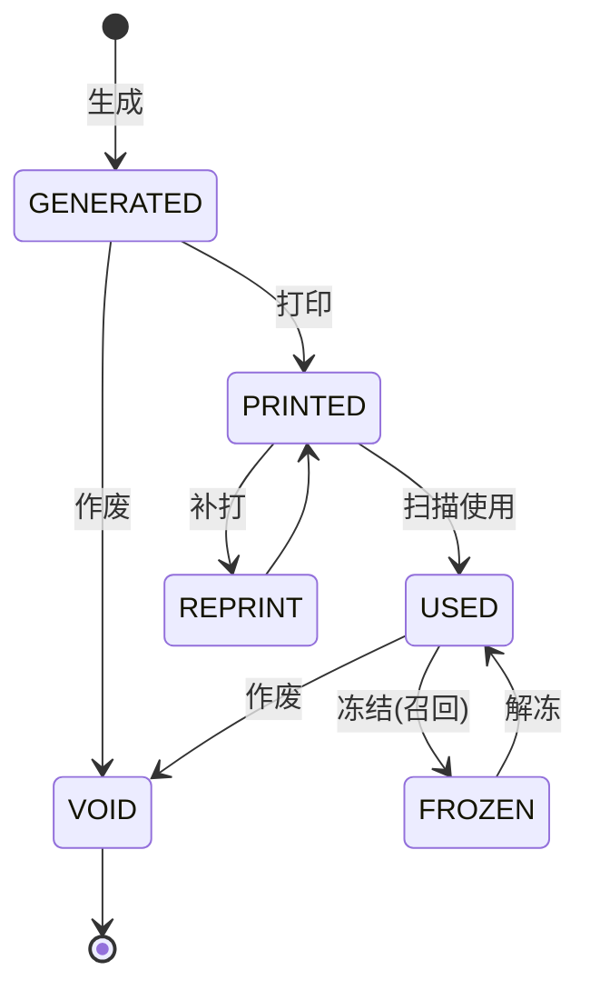
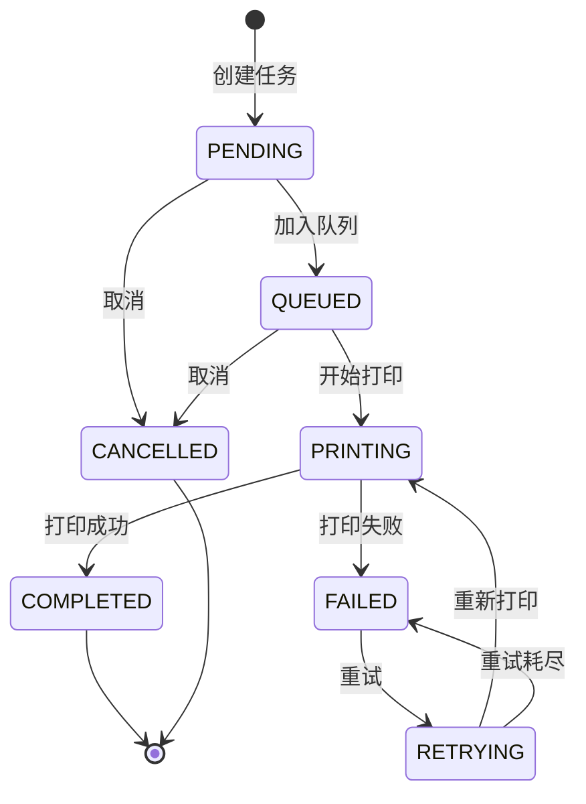

# 标签打印与条码管理深度深化分析

---

## 一、业务定义与目标

### 1.1 定义

标签打印与条码管理（Label Printing & Barcode Management）是WMS中对商品、包装、托盘、库位、批次等对象的条码进行规则定义、生成、打印、扫描识别和追溯管理的基础功能模块，涵盖条码规则引擎、标签模板设计、打印机管理、打印任务调度、条码扫描识别、条码关联追溯和行业特殊条码的完整体系。

条码是仓库作业的"语言"，从收货、上架、拣货、复核、盘点到发运，几乎所有作业环节都依赖条码扫描。

### 1.2 核心目标

| 目标 | 衡量指标 |
|------|---------|
| 条码唯一 | 重码率 = 0 |
| 打印高效 | 打印速度 >100张/分钟 |
| 扫描准确 | 识别率 >99.9% |
| 模板灵活 | 模板配置化率 >90% |
| 追溯完整 | 追溯覆盖率 100% |

### 1.3 业务场景全景

```
标签打印与条码管理
├── 条码管理（类型/规则/生成/校验/关联/状态/查询/作废）
├── 标签模板管理（设计/元素/变量/尺寸/分类/版本/预览/导入导出）
├── 打印机管理（档案/类型/语言/状态/服务器/分组/默认/监控）
├── 标签打印（即时/批量/定时/触发/补打/队列/预览/份数/偏移/日志）
├── 条码扫描（识别/校验/关联/查询/批量/防错/声音/离线）
├── 条码追溯（正向/反向/批次/序列号/托盘/报表/召回）
├── 快递面单（模板/获取/打印/关联/作废/回收/耗材）
└── 行业特殊条码（医药电子监管码/冷链温度/危险品/食品溯源/跨境/RFID）
```

---

## 二、业务流程图

### 2.1 条码生成与打印全流程

```mermaid
flowchart TD
    A[业务触发] --> B[确定条码类型]
    B --> C[匹配条码规则]
    C --> D[生成条码编号]
    D --> E[校验位计算]
    E --> F[唯一性校验]
    F -->{唯一?}
    G -->|否| H[重新生成]
    H --> D
    G -->|是| I[关联业务对象]
    I --> J[选择标签模板]
    J --> K[渲染标签内容]
    K --> L[打印预览]
    L --> M{确认打印?}
    N -->|否| O[取消/修改]
    N -->|是| P[选择打印机]
    P --> Q[生成打印任务]
    Q --> R[发送到打印队列]
    R --> S[打印机执行打印]
    S -->{打印成功?}
    T -->|是| U[更新条码状态为已使用]
    T -->|否| V[失败重试]
    V -->{重试<3?}
    W -->|是| S
    W -->|否| X[标记失败+告警]
    U --> Y[记录打印日志]
    X --> Y
```

### 2.2 条码扫描作业流程

```mermaid
flowchart TD
    A[扫描条码] --> B[条码识别解析]
    B --> C{格式校验}
    C -->|不合法| D[错误提示]
    C -->|合法| E[查询条码信息]
    E -->{条码存在?}
    F -->|否| G[未知条码提示]
    F -->|是| H[校验业务状态]
    H -->{状态正常?}
    I -->|已作废| J[作废提示]
    I -->|已使用| K[重复扫描提示]
    I -->|正常| L[执行业务操作]
    L --> M[更新条码状态]
    M --> N[记录扫描日志]
```

---

## 三、状态机设计

### 3.1 条码状态机



### 3.2 打印任务状态机



---

## 四、核心业务场景详解

### 4.1 条码规则与编码体系

**条码类型：**

| 条码类型 | 编码示例 | 用途 | 码制 |
|---------|---------|------|------|
| 商品条码(EAN13) | 6901234567890 | 商品最小包装 | EAN-13 |
| 内部商品码 | SKU00120260818001 | 内部商品码 | Code 128 |
| 箱码(ITF14) | 16901234567890 | 外箱条码 | ITF-14 |
| 托盘码(SSCC) | 00123456789012345678 | 托盘标识 | SSCC-18 |
| 库位码 | WH01-A-01-02-03 | 库位标识 | Code 128 |
| 批次码 | B20260818001 | 批次标识 | Code 128 |
| 序列号 | SN202608180001 | 单品序列号 | Code 128 |
| 快递单号 | SF1234567890 | 快递包裹 | 各快递商规则 |

**编码规则结构：** 前缀 + 分类码 + 日期 + 流水号 + 校验位

**校验位算法：** Mod10（EAN-13标准）/ Mod11 / 自定义

### 4.2 标签模板设计

**标签模板类型：**

| 模板类型 | 尺寸(mm) | 内容 | 打印时机 |
|---------|---------|------|---------|
| 商品标签 | 40×30/50×30 | 商品名/条码/规格/批次/效期 | 收货后/上架前 |
| 箱标 | 100×80/100×100 | 箱码/商品/数量/批次/重量 | 码盘后/装箱后 |
| 托盘标 | 100×150 | SSCC/商品汇总/数量/重量/目的地 | 码盘完成后 |
| 库位标 | 80×50/100×60 | 库位编码/条码/区域/属性 | 库位创建/更换 |
| 快递面单 | 100×180(三联) | 收件人/发件人/商品/条码 | 打包称重后 |
| 危险品标 | 100×100 | UN编号/危险品标识/警示语 | 出库前 |

**模板元素：** 文本/一维码/二维码/图片/图形/变量绑定

### 4.3 打印机管理

**打印机类型：** 工业条码机(Zebra ZT411)/桌面条码机/便携打印机/激光打印机/热敏打印机/打印服务器

**打印语言：** ZPL/EPL/CPCL/TSPL/PCL

**状态监控：** ONLINE/PRINTING/PAUSED/OUT_OF_PAPER/OUT_OF_RIBBON/HEAD_OPEN/ERROR/OFFLINE

### 4.4 入库贴标与条码生成

收货完成后判断是否有原厂条码，无条码则自动生成内部码，按数量打印标签，粘贴后扫描确认关联，上架时扫描库位码+商品条码建立关联。

### 4.5 出库复核与快递面单打印

扫描订单号→逐件扫描商品条码校验→复核通过→称重→获取电子面单→渲染面单→打印→贴面单→扫描面单号关联→集货发运

### 4.6 托盘码盘与SSCC

SSCC-18结构：扩展位(1)+厂商识别码(7-10)+序列码(6-9)+校验位(1)。码盘完成生成SSCC，关联托盘内所有商品，打印托盘标签。

### 4.7 条码扫描与防错

**防错机制：** 格式校验/存在校验/状态校验/关联校验/重复校验/数量校验/位置校验/批次校验

### 4.8 条码追溯与召回

正向追溯（原料→客户）和反向追溯（客户→原料），支持批次/序列号/托盘级追溯，质量问题时快速冻结库存、通知客户、拦截快递、退货回收。

### 4.9 医药电子监管码

赋码→核注（入库）→核销（出库）→上传药监平台，特殊药品逐盒扫描、双人复核、实时上传。

---

## 五、库存变化分析

标签打印与条码管理不直接改变库存数量，但通过条码关联影响库存管理。条码是库存的标识和追踪手段，条码管理的准确性直接影响库存准确性。

---

## 六、技术实现方案

### 6.1 核心表设计

```sql
-- 条码规则表 wms_barcode_rule
-- 条码记录表 wms_barcode_record (barcode/barcode_type/sku/batch_no/location/order_no/pallet_no/status)
-- 标签模板表 wms_label_template (template_code/category/width_mm/height_mm/content/print_language/version)
-- 打印机表 wms_printer (printer_no/type/brand/print_language/ip/port/status/group_code)
-- 打印任务表 wms_print_task (task_no/template_code/printer_no/total_count/success_count/failed_count/status)
-- 打印明细表 wms_print_task_item (task_id/barcode/print_data/status/retry_count/fail_reason)
-- 扫描日志表 wms_scan_log (barcode/scan_type/biz_no/sku/location_code/qty/scanner/scan_result)
```

### 6.2 条码生成核心逻辑

- Redis原子递增生成流水号，支持DAILY/MONTHLY/YEARLY/NEVER重置周期
- 渲染编码模式（替换分类码/日期/流水号/变量）
- Mod10校验位计算（奇数位×3+偶数位×1，取10的补数）
- 唯一性校验，重码自动重新生成

### 6.3 标签打印核心逻辑

- 获取模板→获取打印机→渲染模板→创建打印任务→创建明细→加入打印队列
- 批量打印支持异步渲染、多打印机并行、失败补打

### 6.4 打印队列与执行

- Redis List作为打印队列，定时任务消费
- Socket发送ZPL到网络打印机（IP+9100端口）
- 失败重试（最多3次），更新打印机计数

### 6.5 条码扫描核心逻辑

- 格式校验→查询条码→状态校验→业务校验→重复扫描校验→执行业务操作→更新条码状态→记录扫描日志

---

## 七、主流WMS对比

| 维度 | 富勒 | 曼哈特 | Blue Yonder | X WMS |
|------|------|--------|-------------|-------|
| 条码规则 | 固定规则 | 可配置规则引擎 | AI编码推荐 | 完整规则引擎+校验位 |
| 标签模板 | 固定模板 | 高级设计器 | AI模板生成 | 可视化设计+多语言 |
| 打印机管理 | 基础 | 企业级打印管理 | 智能打印调度 | 全类型+状态监控+队列 |
| 扫码防错 | 基础校验 | 完整防错体系 | AI异常检测 | 全维度防错+提示 |
| 条码追溯 | 基础 | 完整追溯 | AI追溯分析 | 全链路+召回管理 |
| 电子监管码 | 有限 | 完整GSP | 合规集成 | 核注核销+上传 |
| SSCC托盘 | 基础 | 完整GS1标准 | AI托盘优化 | SSCC-18+托盘化作业 |

---

## 八、常见业务问题与解决方案

| 问题 | 解决方案 |
|------|---------|
| 条码重复 | 唯一索引+生成时校验+Redis原子序列+定期查重 |
| 打印模糊/断码 | 定期清洁打印头+调整浓度+更换碳带+质量检测 |
| 打印机离线 | 状态监控+自动切换备用打印机+离线缓存+告警 |
| 扫码不识别 | 打印质量控制+标签材质选择+扫码枪清洁+容错算法 |
| 面单获取失败 | 面单池预取+多快递商切换+失败重试+降级方案 |
| 批量打印慢 | 多打印机并行+打印服务器+本地缓存+任务优先级 |
| 大促打印拥堵 | 提前打印+增加打印机+批量优化+优先级调度 |

---

## 九、与其他模块的关联关系

| 关联模块 | 关联点 |
|---------|--------|
| 入库管理 | 收货贴标/生成商品条码/箱标 |
| 出库管理 | 复核扫码/快递面单打印 |
| 库存管理 | 库存条码关联/批次条码 |
| 库位管理 | 库位条码生成/打印 |
| 质检管理 | 不合格品标签/质检标签 |
| 批次管理 | 批次条码/效期标签 |
| 托盘管理 | SSCC托盘码/托盘标签 |
| 波次管理 | 波次标签/拣货单标签 |
| 费收管理 | 标签耗材费用统计 |
| 行业插件 | 电子监管码/温度标签/危险品标签 |
| API平台 | 条码API/面单API |
| 消息通知 | 打印机故障/缺纸告警 |
| KPI报表 | 打印量/扫码量统计 |
