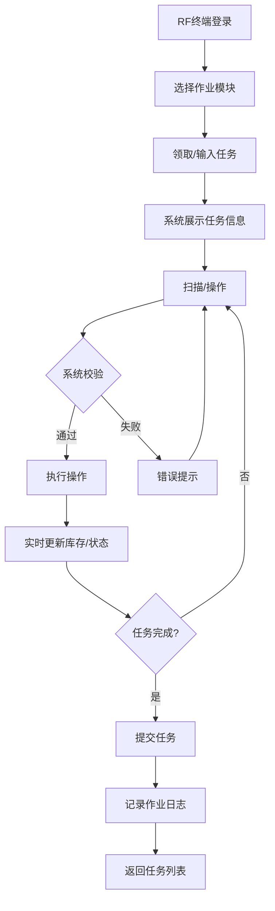
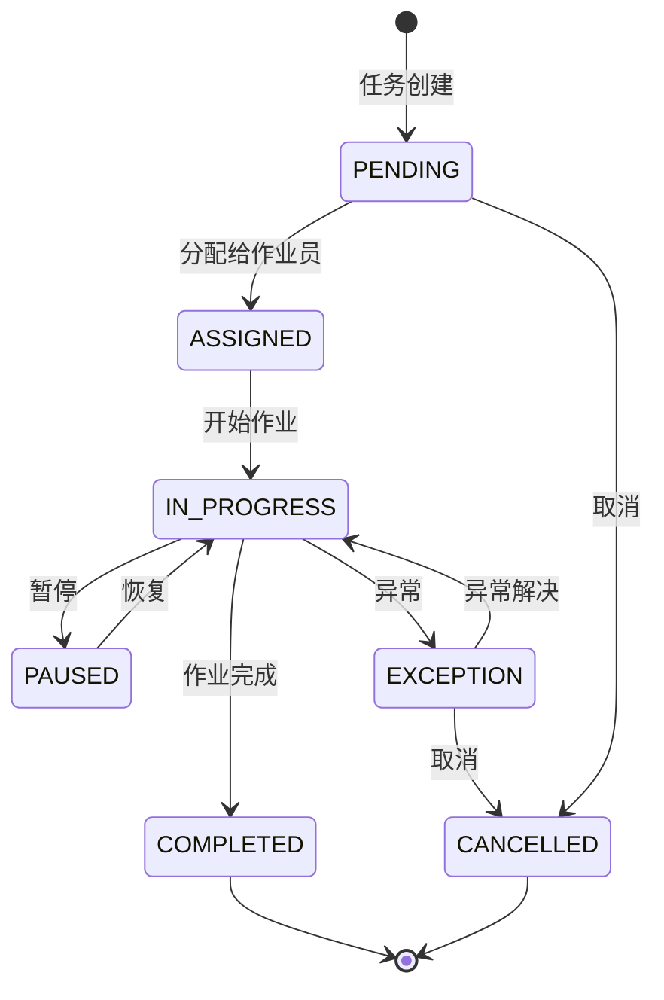
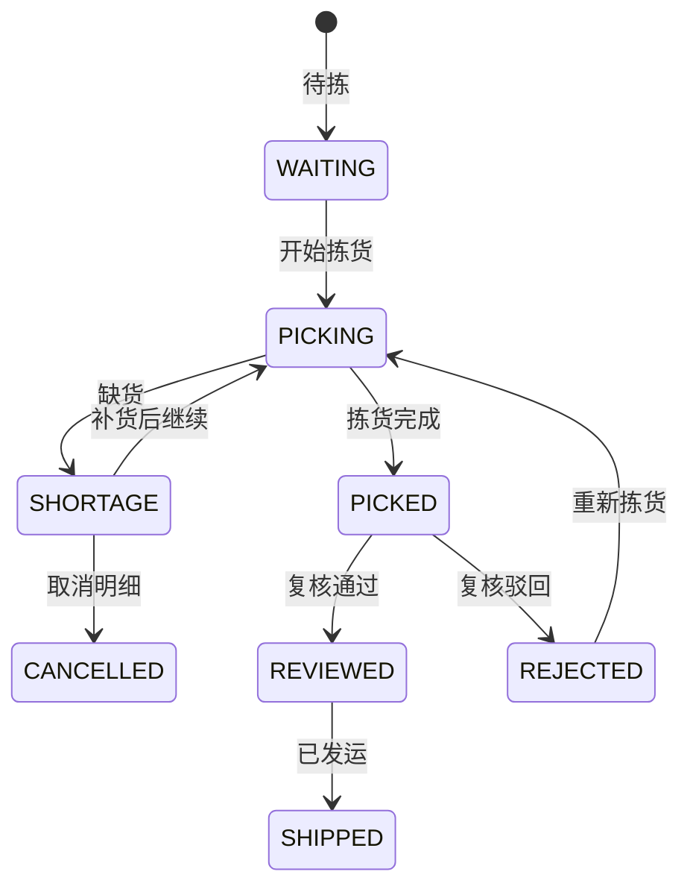

# RF作业（手持终端作业）深度深化分析

---

## 一、业务定义与目标

### 1.1 定义

RF作业（Radio Frequency Operations）是仓库作业人员通过PDA手持终端、RF枪、穿戴式扫描设备等移动终端，通过无线网络实时连接WMS系统，完成收货、上架、拣货、复核、打包、移库、盘点、补货、退货、集货发运等全流程仓库作业的执行方式。

RF作业是WMS的"手脚"——所有业务规则、库存操作、流程管控最终都通过RF终端落地到实际物理作业。

### 1.2 核心目标

| 目标 | 衡量指标 |
|------|---------|
| 作业准确 | 作业准确率 >99.95% |
| 作业高效 | 单次操作 <3秒 |
| 实时同步 | 数据延迟 <1秒 |
| 无纸化 | 无纸化率 100% |
| 可追溯 | 追溯覆盖率 100% |
| 离线可用 | 离线缓存 >1000条 |

### 1.3 终端类型

| 终端类型 | 特点 | 适用场景 |
|---------|------|---------|
| PDA手持终端 | 带屏幕+键盘/触屏+扫描头 | 通用作业 |
| RF枪（指环式） | 穿戴式，解放双手 | 拣货/复核 |
| 语音拣货终端 | 语音指令+语音确认 | 冷链/大件 |
| 工业平板 | 大屏+扫描 | 收货/复核 |
| 车载终端 | 安装在叉车/拣货车上 | 叉车作业/整托盘 |
| 智能眼镜 | AR显示+手势/语音 | 复杂作业（未来） |

---

## 二、业务流程图

### 2.1 RF作业通用流程



### 2.2 拣货RF详细流程

```mermaid
flowchart TD
    A[进入拣货模块] --> B[领取波次任务]
    B --> C[系统展示拣货路径]
    C --> D[导航到第一个库位]
    D --> E[扫描库位码]
    E -->{库位正确?}
    F -->|否| G[错误提示]
    G --> D
    F -->|是| H[扫描商品条码]
    H -->{商品匹配?}
    I -->|否| J[错误提示]
    J --> H
    I -->|是| K[输入/扫描数量]
    K -->{数量正确?}
    L -->|否| M[差异处理]
    M -->{缺货?}
    N -->|是| O[标记缺货+通知]
    N -->|否| P[调整数量]
    P --> Q
    L -->|是| Q[确认拣货]
    Q --> R[更新库存: 可用-拣货中+]
    R -->{还有下一个?}
    S -->|是| T[导航到下一个库位]
    T --> D
    S -->|否| U[拣货完成]
    U --> V[送到复核区]
    O --> R
```

---

## 三、状态机设计

### 3.1 RF作业任务状态机



### 3.2 拣货任务明细状态机



---

## 四、核心业务场景详解

### 4.1 收货RF作业

**预约收货（有ASN）：** 扫描ASN单号→系统展示明细→逐行扫描商品条码/箱码/托盘码→输入实收数量→批次/效期录入→差异处理（短收/超收/错收）→收货完成→触发质检/上架

**盲收（无ASN）：** 扫描商品条码→系统识别SKU→输入数量/批次/效期→选择供应商/货主→确认收货

**越库收货：** 扫描ASN识别越库订单→收货时直接关联出库单→商品直接送到发货区

### 4.2 上架RF作业

**推荐上架：** 扫描收货单/托盘码→系统按上架规则推荐库位（同SKU集中/ABC分类/重量适配/批次管理/容量校验）→导航到推荐库位→扫描库位码确认→扫描商品条码→输入数量→确认上架

**直接上架：** 扫描商品→扫描目标库位→校验库位可用性→输入数量→确认

**整托盘上架（叉车）：** 车载终端→扫描托盘码SSCC→推荐整托盘库位→扫描库位确认→整托盘上架

### 4.3 拣货RF作业（核心）

**波次拣货：** 领取波次→按路径导航→扫描库位码→扫描商品条码→输入数量→确认拣货→库存更新（可用→拣货中）→下一个库位→完成送复核

**摘果式：** 一人一单，按订单逐个库位拣货，适用B2B订单（SKU多/单量少）

**播种式（二次分拣）：** 先集中拣货→送到分拣墙→按订单播种（扫描商品→系统提示格口→扫描格口确认），适用B2C电商（SKU少/单量大）

**路径优化：** S型/分区/最短路径/中点返回/最大间隙

**缺货处理：** 标记缺货→检查其他库位→有库存推荐替代库位→无库存订单部分缺货/整单缺货→触发紧急补货/库位盘点

### 4.4 复核RF作业

逐件扫描商品条码→校验是否在订单中/重复扫描→实时进度展示→异常处理（错扫/多扫/漏扫）→全部正确→复核通过进入打包

称重复核：电子秤读取重量→与理论重量对比→误差范围内通过→超出报警人工复核

### 4.5 打包RF作业

扫描订单→推荐包装箱→选择箱型→商品装箱→称重（自动/手动）→获取快递面单→打印面单→贴面单扫描关联→封箱确认→送集货区

### 4.6 盘点RF作业

选择盘点任务（全盘/循环/抽盘/盲盘/明盘）→导航到库位→扫描库位码→逐SKU扫描商品条码→输入实盘数量→该库位完成→下一个库位→生成差异表→复盘/调整

### 4.7 移库RF作业

扫描源库位→选择SKU/批次→输入数量→扫描目标库位→校验可用性→确认移库→源库位-目标库位+

### 4.8 离线作业

网络正常时提前下载任务和基础数据→网络中断自动切换离线模式→作业数据存本地数据库→网络恢复自动同步→冲突检测和处理（库存冲突以服务器为准）

离线限制：不能实时查库存/不能获取新任务/不能调外部API

---

## 五、库存变化分析

| RF作业 | 库存变化 |
|--------|---------|
| 收货 | 暂存区可用+ |
| 上架 | 暂存区-，存储库位可用+ |
| 拣货 | 存储库位可用-，拣货中+ |
| 复核 | 拣货中不变 |
| 打包 | 拣货中-，待发运+ |
| 发运 | 待发运- |
| 移库 | 源库位-，目标库位+（总量不变） |
| 盘点调整 | 盘盈+，盘亏- |
| 补货 | 源库位-，目标库位+ |
| 码盘 | 散货-，托盘+ |

---

## 六、技术实现方案

### 6.1 核心表设计

```sql
-- RF作业任务表 wms_rf_task (task_no/task_type/ref_no/status/assignee/device_id/priority/total_items/finished_items)
-- RF作业明细表 wms_rf_task_item (task_id/sku/barcode/batch_no/from_location/to_location/plan_qty/actual_qty/status/sort_order)
-- RF作业日志表 wms_rf_operation_log (task_id/operation_type/barcode/location/sku/qty/operator/device_id/result/duration_ms)
-- RF设备管理表 wms_rf_device (device_no/device_type/brand/model/os/status/current_user/last_heartbeat)
-- 离线作业队列表 wms_rf_offline_queue (device_id/operation_type/operation_data/sync_status/retry_count)
```

### 6.2 RF任务调度核心逻辑

- 创建任务→加入Redis List队列（按类型）→作业员领取（leftPop原子操作）→加锁防重复领取→更新状态为ASSIGNED→开始作业IN_PROGRESS→完成明细→更新进度→全部完成COMPLETED→释放任务放回队列

### 6.3 拣货RF核心逻辑

- 扫描库位→查找该库位待拣明细→扫描商品条码→匹配明细（不匹配提示应在哪个库位）→确认数量→Oracle原子扣减库存→成功完成明细/库存不足标记缺货→部分拣货标记SHORTAGE

### 6.4 离线同步核心逻辑

- 终端上传离线操作→写入离线队列表→定时任务同步（每5秒）→解析操作数据执行→成功标记SUCCESS/失败重试→冲突以服务器为准

### 6.5 RF终端心跳与状态

- 每30秒心跳→更新设备状态ONLINE/last_heartbeat→返回服务器时间和版本更新提示→登录绑定用户→返回Token和数据版本

---

## 七、主流WMS对比

| 维度 | 富勒 | 曼哈特 | Blue Yonder | X WMS |
|------|------|--------|-------------|-------|
| RF功能覆盖 | 基础RF作业 | 全功能RF+语音 | AI辅助RF | 全功能RF+离线+语音 |
| 拣货模式 | 摘果/播种 | 全模式+区域 | AI动态调度 | 全模式+路径优化 |
| 路径优化 | 基础S型 | 高级路径 | AI最优路径 | S型+分区+最短路径 |
| 离线作业 | 有限 | 完整离线 | 实时优先 | 完整离线+冲突处理 |
| 扫码防错 | 基础 | 多层防错 | AI异常检测 | 三重校验+实时提示 |
| 语音拣货 | 不支持 | 完整集成 | 语音+AI | 支持语音拣货 |
| 任务调度 | 人工分配 | 智能调度 | AI任务分配 | 队列+优先级+智能分配 |

---

## 八、常见业务问题与解决方案

| 问题 | 解决方案 |
|------|---------|
| PDA网络不稳定 | 离线模式+WiFi优化+5G/4G备份+数据压缩 |
| 扫码不灵敏 | 打印质量控制+清洁扫描头+灵敏度调整+手动输入备用 |
| 拣货错货 | 三重扫码校验+库位商品绑定+相似商品预警+复核把关 |
| 拣货效率低 | 路径优化+ABC库位优化+波次优化+任务均衡分配 |
| 缺货频繁 | 动态盘点+安全库存预警+紧急补货+库存准确率KPI |
| 重复作业 | 任务锁+状态机+实时同步+幂等设计 |
| 离线数据冲突 | 乐观锁+冲突检测+以服务器为准+人工复核 |
| 设备丢失 | 设备绑定+远程锁定+GPS定位+使用审计 |
| 作业员作弊 | 操作日志+异常检测+抽查复核+绩效与质量挂钩 |
| 系统响应慢 | 缓存+异步处理+数据库优化+本地预加载 |

---

## 九、与其他模块的关联关系

| 关联模块 | 关联点 |
|---------|--------|
| 入库管理 | 收货RF/上架RF任务 |
| 出库管理 | 拣货/复核/打包/发运RF |
| 波次管理 | 波次拣货任务 |
| 库存管理 | 移库/盘点/库存查询 |
| 补货管理 | 补货RF任务 |
| 退货管理 | 退货收货/上架RF |
| 标签条码 | 扫码/打印标签 |
| 人员绩效 | 作业数据采集 |
| 设备管理 | PDA设备管理 |
| 消息通知 | 任务通知/异常告警 |
| KPI报表 | 作业数据统计 |
| 质检管理 | 质检RF作业 |
| VAS管理 | 增值服务RF |
