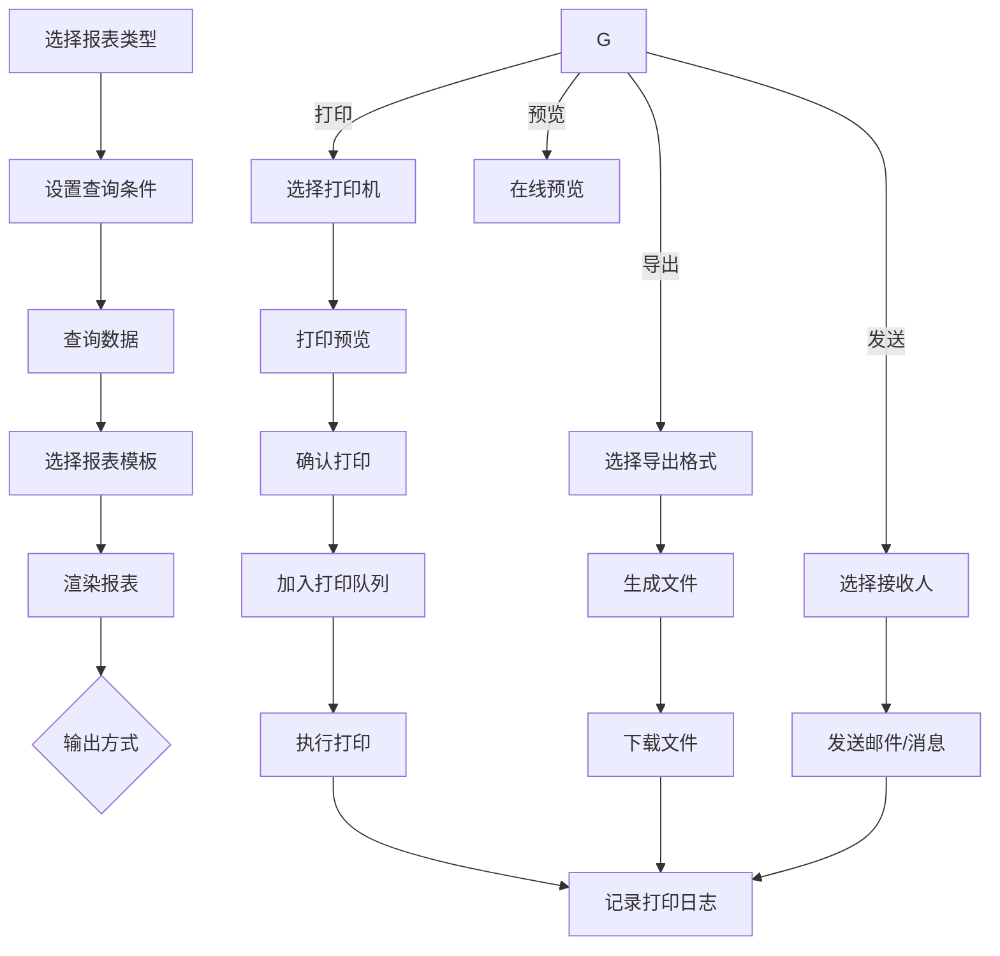
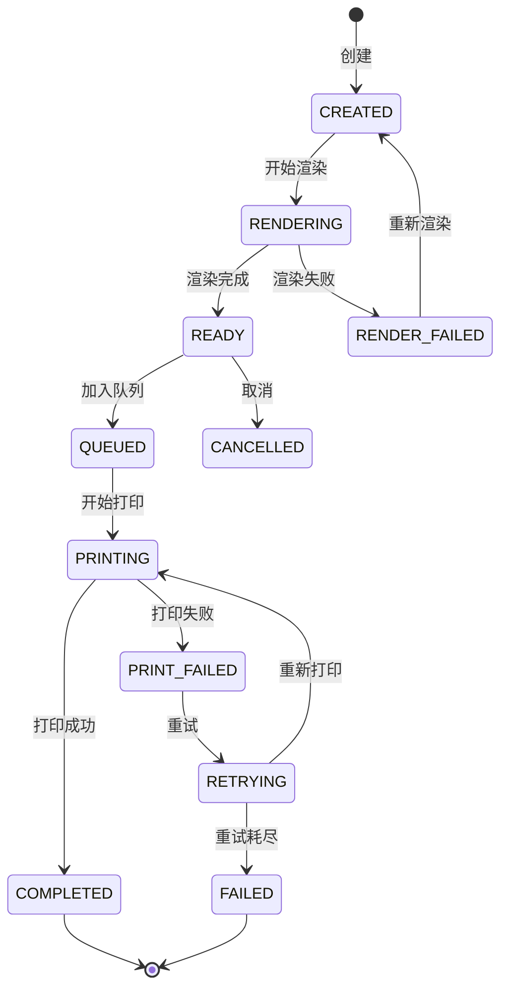
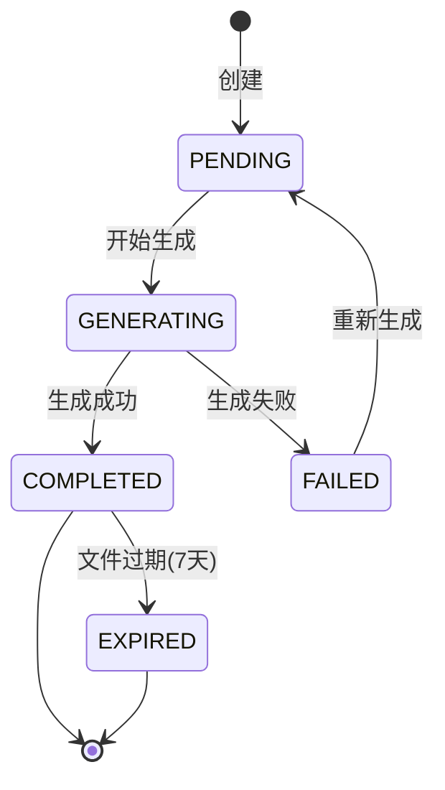

# 报表打印深度深化分析

---

## 一、业务定义与目标

### 1.1 定义

报表打印（Report Printing）是WMS中对业务单据、统计报表、分析报表进行模板设计、数据渲染、格式排版、打印输出和文件导出的功能模块，涵盖业务单据打印、统计分析报表、自定义报表设计、报表模板管理、打印队列调度、多格式导出、定时报表自动生成和大屏数据展示的完整体系。

### 1.2 核心目标

| 目标 | 衡量指标 |
|------|---------|
| 模板灵活 | 模板配置化率 >90% |
| 格式标准 | 格式合规率 100% |
| 打印高效 | 批量打印 >100份/分钟 |
| 多格式导出 | 支持格式 >5种 |
| 数据准确 | 数据准确率 100% |
| 定时自动 | 自动化率 >80% |

### 1.3 业务场景全景

```
报表打印
├── 业务单据打印（入库单/出库单/拣货单/盘点单/质检单/费收账单）
├── 统计分析报表（入库/出库/库存/作业效率/质量/财务/KPI看板）
├── 自定义报表（设计器/数据源/查询条件/字段/分组/图表/订阅）
├── 报表模板管理（分类/设计/变量/版本/预览/导入导出）
├── 打印管理（打印机/队列/批量/定时/份数/预览/日志）
├── 导出管理（Excel/PDF/CSV/HTML/图片/进度/文件管理）
├── 定时报表（定时任务/自动生成/邮件发送/订阅/失败重试）
├── 大屏展示（运营总览/作业监控/KPI绩效/仓库可视化/大促战报/冷链监控）
└── 行业特殊报表（GSP/冷链/电商大促/跨境）
```

---

## 二、业务流程图

### 2.1 报表打印通用流程



### 2.2 定时报表流程

```mermaid
flowchart TD
    A[定时任务触发] --> B[获取报表配置]
    B --> C[查询报表数据]
    C --> D[渲染报表]
    D --> E[生成文件]
    E --> F{发送方式}
    G -->|邮件| H[获取收件人]
    H --> I[发送邮件带附件]
    F -->|消息| J[推送系统消息]
    F -->|打印| K[自动打印]
    I --> L[记录发送日志]
    J --> L
    K --> L
    L -->{成功?}
    M -->|否| N[失败重试]
    N --> L
    M -->|是| O[完成]
```

---

## 三、状态机设计

### 3.1 打印任务状态机



### 3.2 导出任务状态机



---

## 四、核心业务场景详解

### 4.1 业务单据打印

入库单/出库单/送货单/拣货单/盘点单/质检单/费收账单，每种单据包含单据头、明细、汇总、签字区，支持自动打印和人工打印，多份数控制。

### 4.2 统计报表

入库日报/出库日报/库存日报/人员绩效报表，包含汇总统计、明细、图表，支持每日自动生成邮件发送。

### 4.3 自定义报表设计器

数据源选择→查询条件配置→字段配置→分组汇总→排序→图表配置→保存→订阅，支持拖拽式设计。

### 4.4 报表模板管理

模板元素（文本/表格/图片/条码/分页）、变量绑定、布局设置、版本管理、模板导入导出。

### 4.5 批量打印

选择对象→选择模板打印机→批量渲染（异步）→加入队列→多打印机并行→失败补打→完成统计。

### 4.6 导出功能

支持Excel/PDF/CSV/HTML/图片，大文件异步导出+分批处理+文件压缩+7天自动过期。

### 4.7 定时报表与订阅

配置报表+查询条件+cron表达式+输出格式+发送方式（邮件/消息/打印），失败自动重试。

### 4.8 大屏展示

运营总览/作业监控/KPI绩效/仓库可视化/大促战报/冷链监控，React+ECharts+WebSocket实时推送，自适应大屏分辨率。

### 4.9 行业特殊报表

医药GSP（购销记录/温湿度/电子监管码/首营审批）、食品冷链（温度监控/断链告警/溯源）、电商大促（实时战报/复盘）、跨境（海关申报/原产地）。

---

## 五、库存变化分析

报表打印本身不改变库存，但报表数据反映库存状态。入库单/出库单/盘点单是库存变化的凭证，库存报表反映库存状态。

---

## 六、技术实现方案

### 6.1 核心表设计

```sql
-- 报表模板表 wms_report_template (template_code/category/report_type/paper_size/content/variables/version)
-- 打印任务表 wms_print_job (job_no/template_code/printer_no/biz_type/print_type/total_pages/status/render_data)
-- 导出任务表 wms_export_job (job_no/report_code/export_format/query_params/total_rows/file_path/status)
-- 定时报表配置表 wms_scheduled_report (report_code/cron_expression/query_params/export_format/send_type/email_list)
-- 自定义报表表 wms_custom_report (report_code/data_source/query_config/field_config/chart_config)
-- 打印日志表 wms_print_log (job_id/template_code/printer_no/pages/copies/result)
```

### 6.2 报表渲染核心逻辑

解析模板→渲染文本变量（${variable}）→渲染表格（动态数据+分组+汇总）→渲染图片/条码→计算分页→返回渲染结果。

### 6.3 打印任务核心逻辑

创建任务→异步渲染（模板+数据→打印格式）→加入打印队列→打印执行器消费→Socket发送ZPL到打印机→失败重试→更新状态。

### 6.4 导出功能核心逻辑

异步导出→分批查询数据（避免内存溢出）→生成文件（EasyExcel/iText）→通知用户→7天自动过期清理。

### 6.5 定时报表核心逻辑

PowerJob定时任务→检查到期报表→生成文件→按发送方式（邮件/消息/打印）发送→记录日志→更新下次执行时间。

---

## 七、主流WMS对比

| 维度 | 富勒 | 曼哈特 | Blue Yonder | X WMS |
|------|------|--------|-------------|-------|
| 单据打印 | 基础固定模板 | 高级设计器 | AI报表生成 | 模板设计器+多格式 |
| 统计报表 | 标准报表 | 丰富+BI | AI分析报表 | 标准+自定义+BI集成 |
| 自定义报表 | 有限 | 高级设计器 | AI自然语言 | 拖拽设计器+图表 |
| 导出功能 | Excel/PDF | 全格式 | 全格式+云存储 | 全格式+异步+大文件 |
| 定时报表 | 基础 | 完整订阅 | AI智能推送 | 定时+订阅+多渠道 |
| 大屏展示 | 基础 | 企业级BI | AI实时大屏 | 多类型大屏+实时推送 |
| 批量打印 | 基础 | 高级批量 | AI批量优化 | 批量+队列+失败补打 |

---

## 八、常见业务问题与解决方案

| 问题 | 解决方案 |
|------|---------|
| 报表数据慢 | ClickHouse OLAP+预计算+缓存+异步查询+分页 |
| 导出超时/内存溢出 | 异步导出+分批写入+行数限制+文件压缩 |
| 打印格式错乱 | 模板预览+打印校准+标准模板+驱动更新 |
| 批量打印慢 | 多线程渲染+多打印机并行+预渲染+优先级调度 |
| 报表数据不准 | 统一数据口径+定时快照+数据校验+版本管理 |
| 模板修改影响生产 | 版本管理+草稿/发布+灰度+回滚 |
| 大促报表压力大 | 报表库读写分离+ClickHouse+限流+预生成 |
| 打印失败无人知 | 状态监控+失败告警+自动重试+打印日志 |
| 客户要求特殊格式 | 自定义模板+客户专属模板+模板导入 |
| 报表权限泄露 | 行级权限+列级权限+数据脱敏+操作审计 |
| 导出文件堆积 | 自动过期(7天)+定时清理+存储告警+归档 |
| 大屏数据不实时 | WebSocket推送+定时刷新+数据缓存+降级 |

---

## 九、与其他模块的关联关系

| 关联模块 | 关联点 |
|---------|--------|
| 入库管理 | 入库单/收货单/退货单打印 |
| 出库管理 | 出库单/拣货单/送货单打印 |
| 库存管理 | 库存报表/盘点单/移库单 |
| 质检管理 | 质检报告/不合格品单 |
| 费收管理 | 账单/对账单/发票 |
| KPI报表 | 统计报表/大屏 |
| 人员绩效 | 绩效报表/工资单 |
| 标签打印 | 标签模板/打印机复用 |
| 消息通知 | 报表推送/导出通知 |
| 系统管理 | 报表权限/操作日志 |
| API平台 | 报表API/导出API |
| 行业插件 | GSP/冷链/电商特殊报表 |
| ClickHouse | 报表数据源/OLAP查询 |
