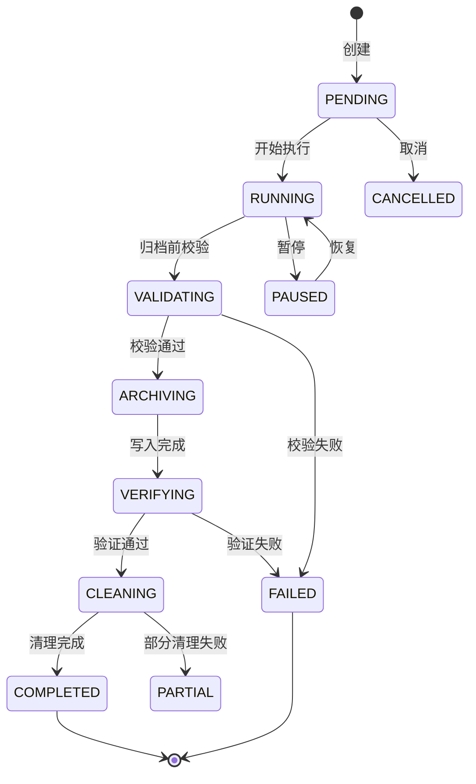
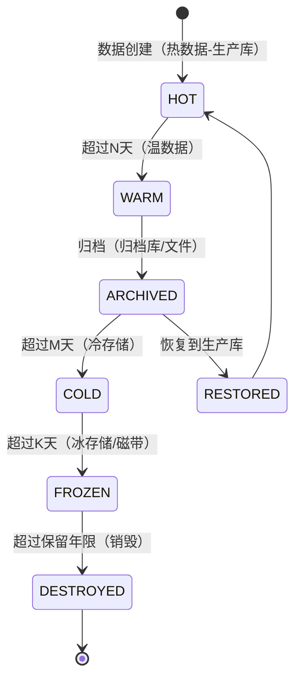

# 数据归档深度深化分析

---

## 一、业务定义与目标

### 1.1 定义

数据归档（Data Archiving）是WMS中对不再频繁访问的历史业务数据、操作日志、临时数据按照预设策略从生产库迁移到归档存储（归档库/文件/冷存储），并支持历史数据查询、恢复和合规审计的数据生命周期管理功能，涵盖归档策略定义、归档范围配置、定时归档执行、归档存储管理、历史数据查询、数据恢复、数据清理销毁和归档监控。

### 1.2 核心目标

| 目标 | 衡量指标 |
|------|---------|
| 性能保障 | 生产库单表 < 5000万行 |
| 存储优化 | 存储成本降低 >50% |
| 合规保留 | 合规率 100% |
| 可查询 | 查询响应 < 5秒 |
| 可恢复 | 恢复成功率 100% |
| 自动化 | 自动化率 >95% |

### 1.3 业务场景全景

```
数据归档
├── 归档策略管理（策略定义/范围配置/保留周期/频率/时间窗口/阈值/优先级）
├── 归档范围（业务单据/库存流水/作业记录/系统日志/临时数据/归档排除）
├── 归档存储（归档数据库/归档文件/冷存储/压缩存储/分区存储/存储层级）
├── 归档执行（定时/手动/增量/全量/批量/校验/监控/验证/清理）
├── 归档查询（历史单据/库存/流水/检索/导出/报表/性能优化）
├── 数据恢复（单条/批量/全量/校验/审批/日志）
├── 数据清理与销毁（过期删除/临时清理/日志清理/文件清理/销毁审批/记录）
├── 归档监控（任务监控/量统计/存储统计/性能统计/异常告警/容量预测）
└── 合规管理（保留年限/完整性校验/防篡改/审计日志/合规报表/销毁证明）
```

---

## 二、业务流程图

### 2.1 数据归档通用流程

```mermaid
flowchart TD
    A[定时任务触发] --> B[加载归档策略]
    B --> C[确定归档范围和条件]
    C --> D[统计待归档数据量]
    D --> E{超过批量阈值?}
    F -->|是| G[分批处理]
    F -->|否| H[单批处理]
    G --> I[归档前校验]
    H --> I
    I -->{校验通过?}
    J -->|否| K[记录异常+告警]
    J -->|是| L[写入归档存储]
    L --> M[验证写入完整性]
    M -->{验证通过?}
    N -->|否| O[回滚+告警]
    N -->|是| P[删除源数据]
    O --> Q
    P --> Q[记录归档日志]
    Q --> R{还有下一批?}
    S -->|是| T[处理下一批]
    T --> I
    S -->|否| U[归档完成]
    U --> V[生成归档报告]
```

### 2.2 归档数据查询流程

```mermaid
flowchart TD
    A[用户查询历史数据] --> B[判断时间范围]
    B -->{在生产库保留期内?}
    C -->|是| D[查询生产库]
    C -->|否| E{在归档库保留期内?}
    F -->|是| G[查询归档库]
    F -->|否| H{在文件/冷存储?}
    I -->|是| J[从冷存储检索]
    I -->|否| K[数据已销毁/不存在]
    D --> L[返回结果]
    G --> L
    J --> L
    L --> M[记录查询审计日志]
```

---

## 三、状态机设计

### 3.1 归档任务状态机



### 3.2 归档数据生命周期



---

## 四、核心业务场景详解

### 4.1 归档策略配置

按数据类型配置生产库保留期、归档库保留期、冷存储保留期、总保留年限、归档频率、执行时间窗口、批量大小。

**保留周期参考：** 入库/出库单生产库180天+归档3年+冷存7年=总10年；库存流水生产365天+归档3年；操作日志生产180天+归档3年；导出文件7天。

### 4.2 业务单据归档

已完成的出入库单按时间归档，同时归档关联明细表/日志，先归档子表再归档主表，删除顺序明细→主表，归档后生产库删除，归档库只读保留。

### 4.3 库存流水归档

数据量最大的表，按月分区，使用Oracle分区交换（EXCHANGE PARTITION）高效归档，超过365天的分区交换到归档表后删除分区。

### 4.4 日志数据归档

操作日志/登录日志/接口日志，成功接口日志可直接删除（价值低），失败日志归档保留，压缩为Parquet文件存对象存储。

### 4.5 归档存储管理

四层存储：热（Oracle生产库SSD）→温（Oracle归档库）→冷（对象存储OSS/S3）→冰（磁带/归档存储），归档库只读+压缩表+精简索引，冷存储按天打包ZSTD压缩。

### 4.6 归档数据查询

根据时间条件自动路由：生产库保留期内查生产库，归档期查归档库，跨期联合查询合并结果，冷存储提示恢复后查询，归档库按时间分区裁剪。

### 4.7 数据恢复

发起恢复申请→审批（敏感数据）→从归档库查询→校验完整性→写入生产库（跳过已存在记录）→验证→记录日志，支持单条/批量/全量恢复。

### 4.8 数据清理与销毁

超过保留年限的数据安全销毁，需审批（财务/质量负责人），数据库DELETE/TRUNCATE+文件删除+对象存储删除，记录销毁时间/范围/数量/操作人/审批人，生成销毁证明，永久保存销毁记录。

临时数据每日清理：导出文件>7天、打印缓存>1天、离线缓存>30天、临时表>1天。

### 4.9 合规与审计

GSP药品购销记录保留5年、会计法凭证30年、税收数据10年、电商交易3年。归档数据防篡改（只读权限+哈希校验+区块链存证可选），所有查询/恢复/销毁操作审计，生成合规报表。

---

## 五、库存变化分析

数据归档不直接改变库存数量。归档的是历史数据，不影响当前实时库存。归档前确保所有相关业务流程已完成，库存流水归档前确保当前库存已结算。

---

## 六、技术实现方案

### 6.1 核心表设计

```sql
-- 归档策略表 wms_archive_strategy (strategy_code/source_table/archive_table/filter_condition/archive_target/retention_days/production_days/frequency/window/batch_size)
-- 归档任务表 wms_archive_task (task_no/strategy_code/status/source_table/total_count/archived_count/failed_count/current_batch/total_batches)
-- 归档批次表 wms_archive_batch (batch_no/task_id/source_table/record_count/data_hash/file_path/status)
-- 归档查询审计表 wms_archive_audit_log (operation_type/source_table/query_condition/result_count/operator)
-- 数据销毁记录表 wms_data_destroy_record (source_table/destroy_range/record_count/approver/operator/hash_before/certificate)
```

### 6.2 归档执行核心逻辑

创建归档任务→统计待归档数量→分批处理（每批5000）：查询本批数据→计算哈希→写入归档库→验证写入数量→记录归档批次→删除源数据→更新进度→全部完成更新策略最后归档时间。

### 6.3 归档查询核心逻辑

根据时间条件判断数据分布→分别查询生产库/归档库→合并结果按时间排序→记录审计日志，跨库查询使用Oracle DB Link或应用层聚合。

### 6.4 数据恢复核心逻辑

审批检查→从归档库查询→校验哈希→写入生产库（跳过已存在记录，主键冲突处理）→验证恢复结果→记录恢复日志。

### 6.5 数据清理核心逻辑

PowerJob定时任务→清理过期导出文件/打印缓存/离线缓存/临时表→销毁超过保留年限数据（需审批）→记录销毁证明。

### 6.6 Oracle分区归档

库存流水表按月RANGE分区，归档时使用ALTER TABLE EXCHANGE PARTITION将分区交换到归档表，然后DROP PARTITION，效率极高（元数据操作，不移动数据）。

---

## 七、主流WMS对比

| 维度 | 富勒 | 曼哈特 | Blue Yonder | X WMS |
|------|------|--------|-------------|-------|
| 归档策略 | 基础定时 | 企业级策略 | AI智能归档 | 完整策略引擎+多维度 |
| 归档存储 | 归档表 | 归档库+数仓 | 云原生分层 | 归档库+对象存储+冷存储 |
| 归档性能 | 基础 | 分区交换+高效 | AI优化 | Oracle分区+批量+并行 |
| 历史查询 | 有限 | 跨库查询+BI | 统一查询层 | 自动路由+跨库联合 |
| 数据恢复 | 有限 | 完整恢复 | 自助恢复 | 单条/批量/全量+审批 |
| 数据销毁 | 基础删除 | 合规销毁 | 自动生命周期 | 审批+销毁证明+审计 |
| 合规支持 | 有限 | 完整合规包 | 行业合规AI | GSP/财务/税务完整 |
| 监控告警 | 基础 | 企业级监控 | AI预测 | 完整监控+容量预测 |

---

## 八、常见业务问题与解决方案

| 问题 | 解决方案 |
|------|---------|
| 归档慢/超时 | 分批处理+分区交换+并行归档+时间窗口+索引优化 |
| 归档影响生产 | 低峰期执行+批量提交+NOLOCK+限流+只读副本归档 |
| 归档数据丢失 | 先写后删+写入验证+哈希校验+事务保障+备份 |
| 查询历史数据慢 | 归档库建索引+分区裁剪+查询路由+异步导出 |
| 恢复数据冲突 | 恢复前检查+跳过已存在+恢复到临时表+人工确认 |
| 存储成本高 | 分层存储+压缩+冷存储+生命周期管理 |
| 归档不彻底 | 关联表配置+级联归档+完整性检查+定期核对 |
| 合规风险 | 保留年限配置+销毁审批+销毁证明+合规报表 |
| 大促归档冲突 | 大促暂停归档+延后执行+降低批次+优先保障业务 |
| 归档空间不足 | 容量监控+增长预测+自动扩容+告警 |
| 数据不一致 | 归档前锁定+快照+状态过滤+时间点一致性 |
| 归档任务失败无人知 | 任务监控+失败告警+自动重试+归档报告 |

---

## 九、与其他模块的关联关系

| 关联模块 | 关联点 |
|---------|--------|
| 入库管理 | 入库单/明细/日志归档 |
| 出库管理 | 出库单/明细/日志归档 |
| 库存管理 | 库存流水/快照归档 |
| RF作业 | 作业日志/扫描日志归档 |
| 质检管理 | 质检单/报告归档 |
| 费收管理 | 账单/对账记录归档 |
| 报表打印 | 导出文件清理/打印日志归档 |
| 系统管理 | 操作日志/登录日志归档 |
| API平台 | 接口调用日志归档 |
| 消息通知 | 消息记录归档 |
| PowerJob | 归档定时任务调度 |
| KPI报表 | 归档数据统计/容量报表 |
| 行业插件 | GSP/冷链特殊归档要求 |
