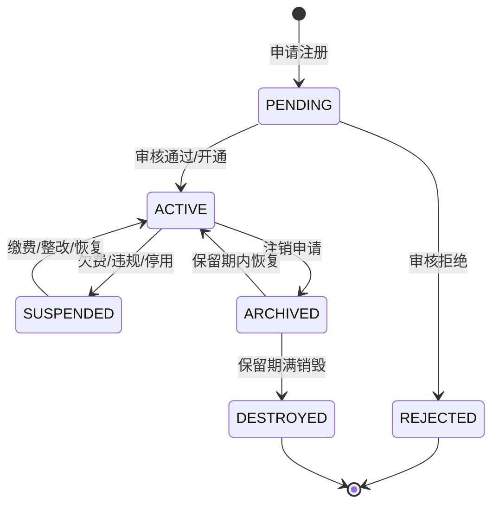

# 多租户管理深度深化分析

---

## 一、业务定义与目标

### 1.1 定义

多租户管理（Multi-Tenancy Management）是WMS中支持在同一套系统实例中为多个相互独立的货主/客户/仓库/店铺提供仓储服务，实现数据隔离、权限隔离、配置隔离和资源隔离，同时支持平台级统一管理和租户级自主管理的核心基础功能模块。

WMS的多租户本质是"一套系统服务多个货主"——3PL企业用一套WMS同时服务多个品牌方/货主，每个货主数据隔离、配置独立、计费分开。

### 1.2 核心目标

| 目标 | 衡量指标 |
|------|---------|
| 数据隔离 | 隔离级别 100% |
| 配置独立 | 配置独立率 >95% |
| 权限隔离 | 越权访问 = 0 |
| 资源共享 | 资源利用率 >70% |
| 弹性扩展 | 新租户开通 < 1小时 |
| 计费灵活 | 计费准确率 100% |

### 1.3 四层租户模型

```
平台层（Platform）→ 租户层（Tenant/货主）→ 仓库层（Warehouse）→ 店铺层（Shop）
- 一个租户可多个仓库，一个仓库可服务多租户（多货主同仓）
- 一个租户可多个店铺（电商多平台多店铺）
```

### 1.4 业务场景全景

```
多租户管理
├── 租户模型（类型/层级/关系/状态/等级）
├── 数据隔离（共享库共享表/共享库独立Schema/独立库，tenant_id自动注入，隔离例外，跨租户访问）
├── 租户生命周期（注册/初始化/配置/启用/停用/恢复/注销/迁移）
├── 租户权限（平台管理员/租户管理员/仓库管理员/作业员/查看员/店铺运营）
├── 租户配置（业务规则/标签模板/报表模板/系统参数/快递商/仓库/行业插件）
├── 租户计费（按单/按件/按面积/按库存/按托盘/阶梯/保底/混合，仓储费/操作费/VAS费/耗材费/运输费）
├── 租户资源管理（仓库/人员/设备/API配额/存储配额）
├── 租户数据管理（导入/导出/备份/恢复/归档/销毁）
├── 跨租户操作（平台查询/跨租户报表/跨租户调拨/库存共享/订单分配）
├── 租户监控（活跃度/资源使用/API调用/作业量/异常告警/健康度评分）
└── 租户审计（操作日志/登录日志/配置变更/数据访问/跨租户操作/合规审计）
```

---

## 二、业务流程图

### 2.1 租户开通流程

```mermaid
flowchart TD
    A[租户申请] --> B[提交资料]
    B --> C[平台审核]
    C -->{审核通过?}
    D -->|否| E[拒绝+说明原因]
    D -->|是| F[创建租户]
    F --> G[初始化基础数据]
    G --> H[配置租户参数]
    H --> I[创建租户管理员]
    I --> J[分配仓库资源]
    J --> K[配置计费规则]
    K --> L[发送开通通知]
    L --> M[租户启用]
    M --> N[租户登录使用]
```

### 2.2 数据隔离访问流程

```mermaid
flowchart TD
    A[用户请求] --> B[认证获取用户信息]
    B --> C[获取用户所属tenant_id]
    C --> D[MyBatis拦截器]
    D --> E[SQL解析]
    E -->{表需要隔离?}
    F -->|是| G[自动追加tenant_id条件]
    F -->|否| H[原SQL执行]
    G --> I[执行SQL]
    H --> I
    I --> J[返回本租户数据]
```

### 2.3 租户注销流程

```mermaid
flowchart TD
    A[注销申请] --> B[结清费用]
    B -->{有欠费?}
    C -->|是| D[催缴/限制操作]
    C -->|否| E[数据备份]
    E --> F[数据归档]
    F --> G[确认归档完整]
    G --> H[停用租户账号]
    H --> I[释放资源]
    I --> J[数据保留期90天]
    J -->{期满?}
    K -->|是| L[数据销毁]
    K -->|否| M[可恢复]
    L --> N[注销完成]
```

---

## 三、状态机设计

### 3.1 租户状态机



---

## 四、核心业务场景详解

### 4.1 数据隔离方案

**三种方案对比：** 共享库共享表（tenant_id字段，低成本高性能，X WMS选择）/ 共享库独立Schema（半物理隔离，中成本）/ 独立库（物理隔离，高成本）。

**X WMS实现：** 所有业务表增加tenant_code字段，MyBatis拦截器自动在SELECT/UPDATE/DELETE追加tenant_code条件，INSERT自动填充tenant_code。平台管理员可绕过隔离（需审计）。

**隔离例外表（9张）：** sys_user/sys_role/sys_permission/wms_warehouse/wms_area/wms_location/wms_owner/sys_dict/sys_config，通过权限控制访问范围。

### 4.2 多货主同仓管理

库存表增加owner_code字段区分货主，库位可混放（可配置策略：专属/混放/分区混放），作业单据带货主信息，扫码校验货主，按货主分别统计计费。

### 4.3 租户配置独立

各租户独立配置：业务规则（上架/分配/周转/波次）、标签模板、报表模板、快递商账号、系统参数、行业插件、质检规则、批次属性。配置继承机制：平台默认→租户→仓库→店铺，下级覆盖上级。

### 4.4 租户权限体系

平台超级管理员（全局）/平台运营（全局查询配置）/平台财务（全局计费）/租户管理员（本租户全部）/仓库管理员（指定仓库）/作业员（指定仓库作业）/查看员（只读）/店铺运营（指定店铺）。权限维度：功能权限+数据权限（租户/仓库/店铺/个人）+操作权限。

### 4.5 租户计费管理

计费模式：按单/按件/按面积/按库存/按托盘/阶梯/保底/混合。费用项目：仓储费（每日快照月底汇总）/操作费（入库出库按件）/VAS费/耗材费/运输费。流程：每日统计→每月1日生成账单→对账→收款核销→欠费处理（提醒→告警→限制→停用）。

### 4.6 跨租户操作

平台管理员跨租户查询（绕过隔离+审计），跨租户调拨（A货主→B货主，双方确认），租户间库存共享（关联公司），平台级汇总报表。

### 4.7 租户数据导入导出

新租户开通导入商品/客户/初始库存，注销时全量导出，导出需审批+审计+脱敏，大文件异步导出。

### 4.8 租户监控与健康度

监控活跃度（登录/作业/API）、资源使用（库存/库位/存储/配额）、业务健康（履约率/准确率/异常率）、财务健康（账单/欠费/付款），综合评分0-100分，用于差异化服务。

---

## 五、库存变化分析

多租户本身不直接改变库存，但通过owner_code隔离库存。跨租户调拨时A租户库存-，B租户库存+；租户注销时库存需清零或转移。

---

## 六、技术实现方案

### 6.1 核心表设计

```sql
-- 租户表 sys_tenant (tenant_code/tenant_name/tenant_type/tenant_level/status/expire_date/api_quota/storage_quota/industry_plugin)
-- 租户仓库关联表 sys_tenant_warehouse (tenant_code/warehouse_code/relation_type/mix_allowed)
-- 店铺表 sys_shop (shop_code/shop_name/tenant_code/platform/shop_type)
-- 租户配置表 sys_tenant_config (tenant_code/config_key/config_value/config_type)
-- 计费规则表 wms_billing_rule (rule_code/tenant_code/fee_item/billing_mode/unit_price)
-- 账单表 wms_billing_invoice (invoice_no/tenant_code/bill_month/total_amount/paid_amount/status)
-- 账单明细表 wms_billing_invoice_item (invoice_id/fee_item/description/quantity/unit_price/amount)
-- 租户操作审计表 sys_tenant_audit (tenant_code/operator/operation_type/operation_detail/ip_address)
```

### 6.2 数据隔离核心实现（MyBatis拦截器）

TenantContext ThreadLocal保存tenant_code，MyBatis StatementHandler拦截器解析SQL，提取表名，非隔离表跳过，已含tenant_code条件跳过，SELECT/UPDATE/DELETE自动追加tenant_code条件，INSERT通过MetaObjectHandler自动填充。

### 6.3 租户上下文过滤器

HTTP请求从JWT解析tenant_code/user_id/platformAdmin，设置到TenantContext ThreadLocal，从Header获取warehouse_code/shop_code，请求结束finally清理ThreadLocal防内存泄漏。

### 6.4 租户管理Service

创建租户→初始化默认配置（复制平台默认）→创建租户管理员→初始化计费规则；启用/停用/注销（检查未完成业务+欠费→备份→归档→停用用户→90天后销毁）。

### 6.5 跨租户查询支持

@PlatformAdminOnly注解，临时设置TenantContext.isPlatformAdmin=true绕过隔离，记录跨租户审计日志，执行完恢复原状态。

---

## 七、主流WMS对比

| 维度 | 富勒 | 曼哈特 | Blue Yonder | X WMS |
|------|------|--------|-------------|-------|
| 多租户支持 | 基础多货主 | 企业级多租户 | SaaS原生 | 完整四层多租户 |
| 数据隔离 | 共享表 | 多方案可选 | 独立库为主 | 共享表+拦截器 |
| 配置独立 | 部分独立 | 完整独立 | AI智能配置 | 完整独立+继承 |
| 计费管理 | 基础计费 | 企业级计费 | AI计费优化 | 完整计费引擎 |
| 跨租户操作 | 有限 | 完整 | 平台级BI | 完整+审计 |
| 租户自助 | 有限 | 完整门户 | 自助门户 | 租户管理后台 |
| 行业插件 | 有限 | 完整行业包 | AI行业适配 | 插件化+租户级 |

---

## 八、常见业务问题与解决方案

| 问题 | 解决方案 |
|------|---------|
| 数据越权访问 | MyBatis拦截器+行级权限+接口鉴权+渗透测试 |
| 租户间库存混淆 | owner_code强制+扫码校验+库位分区+混放规则 |
| 配置互相影响 | 租户级配置+配置继承+变更审计+配置回滚 |
| 计费不准确 | 每日快照+实时统计+账单核对+规则版本 |
| 新租户开通慢 | 自动化开通+配置模板+一键初始化+自助开通 |
| 跨租户查询慢 | tenant_code索引+分区+汇总表+ClickHouse |
| 租户注销数据残留 | 注销检查清单+数据归档+保留期+彻底销毁 |
| 平台管理员滥用 | 最小权限+操作审计+敏感操作审批+行为分析 |
| API配额超限 | 租户级限流+配额管理+超限告警+降级策略 |
| 多租户性能影响 | 资源隔离+大租户优先+SQL优化+报表读写分离 |
| 租户数据迁移 | 迁移工具+增量同步+校验比对+灰度切换 |
| 合规风险 | 数据本地化+敏感加密+合规审计+销毁证明 |

---

## 九、与其他模块的关联关系

| 关联模块 | 关联点 |
|---------|--------|
| 所有业务模块 | tenant_id数据隔离 |
| 系统管理 | 租户用户/角色/权限 |
| 费收管理 | 租户计费/账单 |
| 规则引擎 | 租户级规则配置 |
| 标签打印 | 租户级标签模板 |
| 报表打印 | 租户级报表模板 |
| API平台 | 租户级API密钥/限流 |
| 消息通知 | 租户级通知配置 |
| 数据归档 | 租户级数据归档 |
| KPI报表 | 平台级/租户级报表 |
| 库存管理 | 多货主库存隔离 |
| 仓库管理 | 租户仓库关联/资源分配 |
| 行业插件 | 租户级插件启用 |
