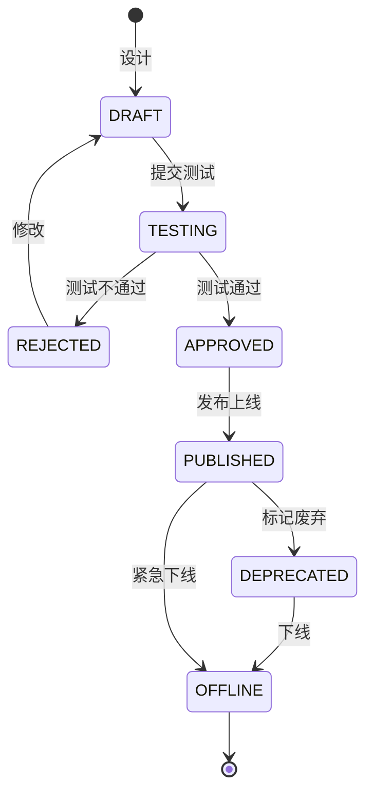
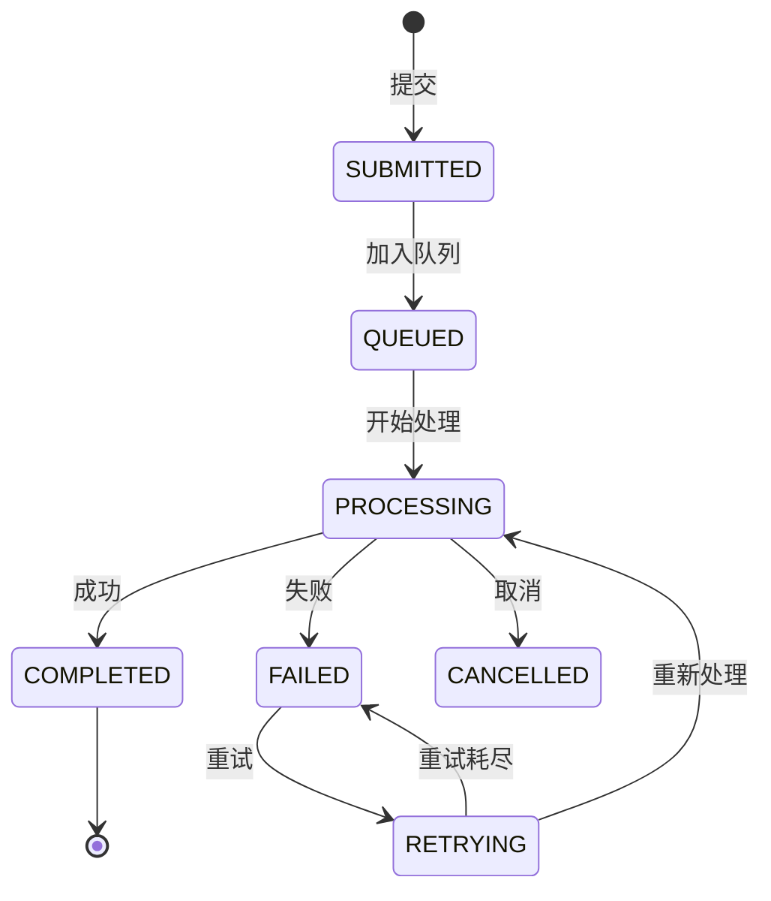

# API网关与API平台深度深化分析

---

## 一、业务定义与目标

### 1.1 定义

**API网关（API Gateway）** 是WMS系统的统一入口，负责所有外部请求的路由转发、认证鉴权、限流熔断、协议转换、日志监控和安全防护。

**API平台（API Platform）** 是在网关之上构建的API全生命周期管理平台，涵盖API设计、开发、测试、发布、文档、订阅、计费、监控和运维，支持ERP、电商平台、快递商、WCS/TMS等外部系统对接。

网关负责"流量进出"，平台负责"API治理"。

### 1.2 核心目标

| 目标 | 衡量指标 |
|------|---------|
| 统一入口 | 统一入口率 100% |
| 安全可靠 | 安全事件 = 0 |
| 高可用 | 可用性 >99.99% |
| 高性能 | P99延迟 <50ms |
| 可观测 | 可观测覆盖率 100% |
| 易对接 | 对接周期 <3天 |

### 1.3 业务场景全景

```
API网关与API平台
├── API网关（路由转发/认证鉴权/限流熔断/协议转换/请求改写/安全防护/日志监控/缓存加速）
├── API平台（API管理/文档/开发者中心/接入管理/安全管理/配额计费/异步API/Webhook/运维监控）
├── 外部系统对接（ERP/电商平台/快递商/WCS/TMS/财务系统）
└── API技术规范（RESTful/统一响应/统一错误码/分页/幂等/版本/安全）
```

---

## 二、业务流程图

### 2.1 API请求处理流程

```mermaid
flowchart TD
    A[客户端请求] --> B[负载均衡]
    B --> C[API网关]
    C --> D[IP黑白名单]
    D -->{通过?}
    E -->|否| F[拒绝403]
    E -->|是| G[协议解析/SSL终止]
    G --> H[认证鉴权]
    H -->{通过?}
    I -->|否| J[拒绝401]
    I -->|是| K[签名验证]
    K -->{通过?}
    L -->|否| M[拒绝401]
    L -->|是| N[限流检查]
    N -->{通过?}
    O -->|否| P[拒绝429]
    O -->|是| Q[路由转发]
    Q --> R[后端微服务]
    R --> S[业务处理]
    S --> T[响应返回]
    T --> U[响应改写/脱敏]
    U --> V[日志记录]
    V --> W[返回客户端]
```

### 2.2 电商订单对接流程

```mermaid
flowchart TD
    A[电商平台] -->|订单推送| B[API网关]
    B --> C[验签/鉴权]
    C --> D[订单解析/校验]
    D -->{校验通过?}
    E -->|否| F[返回错误]
    E -->|是| G[写入订单队列表]
    G --> H[返回成功]
    H --> A
    G --> I[Kafka消息]
    I --> J[订单消费者]
    J --> K[创建WMS出库单]
    K --> L[库存预占]
    L --> M[波次分配]
    M --> N[拣货作业]
    N --> O[发货完成]
    O --> P[发货回调]
    P --> Q[API网关]
    Q --> R[电商平台]
```

### 2.3 Webhook回调流程

```mermaid
flowchart TD
    A[业务事件] --> B[Kafka消息]
    B --> C[Webhook消费者]
    C --> D[查询订阅者]
    D --> E[构建回调消息+签名]
    E --> F[HTTP回调]
    F -->{成功?}
    G -->|是| H[记录成功日志]
    G -->|否| I[记录失败]
    I --> J{重试<5?}
    K -->|是| L[指数退避等待]
    L --> F
    K -->|否| M[死信队列+告警]
```

---

## 三、状态机设计

### 3.1 API生命周期状态机



### 3.2 异步任务状态机



---

## 四、核心业务场景详解

### 4.1 API网关核心能力

**路由转发：** 路径路由+Nacos服务发现+灰度路由（按Header/比例/租户）+动态配置热更新。

**认证鉴权：** JWT Token（内部/前端）+ API Key+Secret签名（外部系统，防篡改防重放）+ OAuth2.0，识别租户设置上下文，验证接口权限和IP白名单。

**限流熔断：** 全局/租户/API/IP四级限流，令牌桶算法，Resilience4j熔断降级（失败率>50%熔断，半开试探）。

**安全防护：** SQL注入/XSS/DDoS防护，防重放（timestamp+nonce 5分钟有效），敏感数据脱敏，请求大小限制，慢请求超时。

### 4.2 ERP系统对接

对接模式：API实时+消息队列异步（X WMS推荐）。基础数据同步（商品/客户/供应商/仓库 ERP→WMS），采购流程（ERP采购单→WMS ASN→收货回传ERP），销售流程（ERP销售单→WMS出库单→发货回传），库存同步（定时快照/实时变动）。

### 4.3 电商平台对接

适配器模式（每个平台一个适配器：淘宝TOP/京东JOS/拼多多PDD/抖音抖店），统一订单模型。订单拉取（定时轮询+平台推送Webhook结合），库存同步（实时推送+每小时校准+安全库存防超卖），发货回传（快递单号+物流公司）。

### 4.4 快递商对接

电子面单获取（API实时+面单池预取，大促预存面单号提高效率），物流轨迹查询/订阅，运费计算比价，取消订单回收面单，签收回传。面单池状态：AVAILABLE/ALLOCATED/USED/CANCELLED/EXPIRED。

### 4.5 WCS/TMS对接

WCS对接自动化设备（输送线/堆垛机/AGV/分拣机），TCP长连接+心跳+任务下发/回报/告警。TMS对接运输管理，运输计划/车辆调度/装车确认/轨迹/签收/运费结算。

### 4.6 异步API与批量处理

异步模式：提交任务返回taskId→查询状态→获取结果→回调通知。批量导入导出异步处理，分批每批1000条，进度实时更新Redis，失败记录可下载。

### 4.7 Webhook事件订阅

支持事件类型：入库/出库/库存/订单/质检/异常。可靠性：至少一次投递+失败重试（1/5/30/120/720分钟指数退避，最多5次）+死信队列+签名验证+幂等去重。

### 4.8 API安全与合规

HTTPS/TLS1.3+mTLS（高安全），API Key+Secret签名，敏感字段AES-256加密存储，响应脱敏，限流防DDoS，操作审计日志不可删除，个人信息保护。

---

## 五、库存变化分析

API网关与平台本身不直接改变库存，但通过API对接驱动库存变化：ERP采购单→收货库存+，电商订单→出库库存-，WCS入库任务→上架库存+，WCS出库任务→拣货库存-，库存查询API只读。

---

## 六、技术实现方案

### 6.1 核心表设计

```sql
-- API应用表 sys_api_app (app_key/app_secret/app_name/app_type/tenant_code/status/ip_whitelist/quota_daily/quota_minute/concurrent_limit/callback_url)
-- API订阅表 sys_api_subscription (app_key/api_code/api_version/status/rate_limit)
-- API元数据表 sys_api_metadata (api_code/api_name/category/version/method/path/request_params/response_schema/need_auth/need_sign/rate_limit/status)
-- API调用日志表 sys_api_call_log (trace_id/app_key/tenant_code/api_code/method/path/client_ip/request_body/response_body/response_code/response_time/status)
-- Webhook订阅表 sys_webhook_subscription (app_key/event_type/callback_url/secret/status/retry_count)
-- Webhook回调日志表 sys_webhook_log (event_id/event_type/app_key/callback_url/response_code/retry_no/status)
-- 异步任务表 sys_async_task (task_no/task_type/app_key/tenant_code/params/status/progress/total/processed/result_file/callback_url)
```

### 6.2 API网关核心配置

Spring Cloud Gateway + Nacos服务发现，路由按路径转发到4个微服务（wms-core/base/analytics/integration），默认过滤器Retry+CORS处理，RequestRateLimiter基于Redis令牌桶按租户限流。

### 6.3 认证鉴权过滤器

GlobalFilter获取X-API-Key→验证应用状态→IP白名单→时间戳有效性（5分钟）→Nonce去重（Redis 5分钟）→HMAC-SHA256签名验证（timestamp+method+path+body）→设置X-Tenant-Code/X-App-Key到Header转发。

### 6.4 限流过滤器

四级限流：全局10000QPS/租户500QPS/应用按配置/IP 60QPS，Redis Lua脚本原子计数，超限返回429。

### 6.5 Webhook回调实现

业务事件发布到Kafka wms-webhook-events→消费者查询订阅者→构建事件（eventId+eventType+timestamp+data）→HMAC签名→HTTP POST回调（10秒超时）→成功记录日志/失败指数退避重试（最多5次）→超5次入死信队列告警。

### 6.6 异步任务实现

提交任务→Kafka wms-async-tasks→消费者处理（EXPORT/IMPORT/BATCH）→分批查询生成文件→更新进度→完成回调通知，任务状态SUBMITTED→PROCESSING→COMPLETED/FAILED。

---

## 七、主流WMS对比

| 维度 | 富勒 | 曼哈特 | Blue Yonder | X WMS |
|------|------|--------|-------------|-------|
| API网关 | 基础网关 | 企业级网关 | 云原生网关 | Spring Cloud Gateway全功能 |
| API平台 | 有限 | 完整管理平台 | AI驱动平台 | 完整全生命周期管理 |
| 外部对接 | 主流系统 | 全生态 | AI智能对接 | 适配器+全平台覆盖 |
| 电商对接 | 主流平台 | 全渠道 | AI订单优化 | 多平台适配器+面单池 |
| 快递对接 | 主流快递 | 全快递商 | AI物流优化 | 面单池+批量+高并发 |
| 安全能力 | 基础 | 企业级 | 零信任 | 完整安全体系+合规 |
| 限流熔断 | 基础 | 高级 | AI自适应 | 多级限流+Resilience4j |
| 异步API | 有限 | 完整 | 事件驱动 | 异步任务+Webhook+Kafka |
| 开发者中心 | 无 | 完整 | AI门户 | 完整+沙箱环境 |

---

## 八、常见业务问题与解决方案

| 问题 | 解决方案 |
|------|---------|
| API被刷/攻击 | 多级限流+IP黑白名单+WAF+防重放+异常检测 |
| 对接系统不稳定 | 超时设置+重试+熔断降级+异步队列+本地缓存 |
| 大促API雪崩 | 限流+熔断+降级+扩容+排队+预案 |
| 面单获取慢 | 面单池预取+批量获取+多快递商切换+异步 |
| 电商订单重复 | 幂等设计+订单号去重+状态机+Redis去重 |
| 库存超卖 | 实时同步+安全库存+库存预占+定时校准 |
| 回调丢失 | 重试机制+死信队列+人工重发+至少一次投递 |
| API版本混乱 | URL版本(/v1/v2)+生命周期+废弃通知+兼容期 |
| 数据泄露 | 最小权限+数据脱敏+加密传输+审计日志 |
| 网关单点 | 网关集群+负载均衡+健康检查+自动故障转移 |
| 对接开发慢 | OpenAPI文档+在线调试+沙箱+示例代码 |
| 调用不可追溯 | 全链路TraceId+调用日志+性能监控+审计报表 |

---

## 九、与其他模块的关联关系

| 关联模块 | 关联点 |
|---------|--------|
| 所有业务模块 | API暴露/调用，请求路由 |
| 多租户管理 | 租户识别/配额/限流，tenant_id传递 |
| 系统管理 | 用户认证/权限/日志 |
| 消息通知 | Webhook回调/事件推送 |
| 费收管理 | API调用计费/配额 |
| KPI报表 | API调用统计/性能报表 |
| 数据归档 | API日志归档 |
| 标签打印 | 快递面单API |
| 库存管理 | 库存同步API/查询API |
| 出库管理 | 订单API/发货回传 |
| 入库管理 | ASN API/收货回传 |
| 行业插件 | 行业特殊API |
| PowerJob | 异步任务调度 |
| Kafka | 异步消息/事件 |
