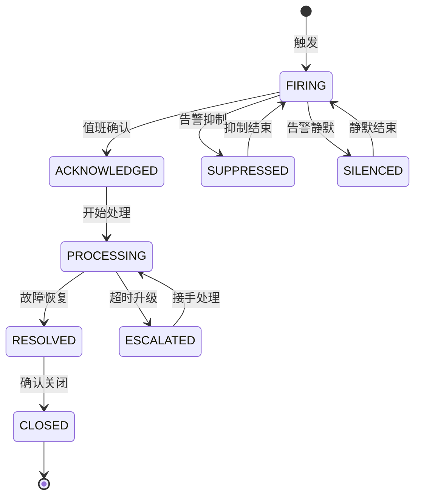
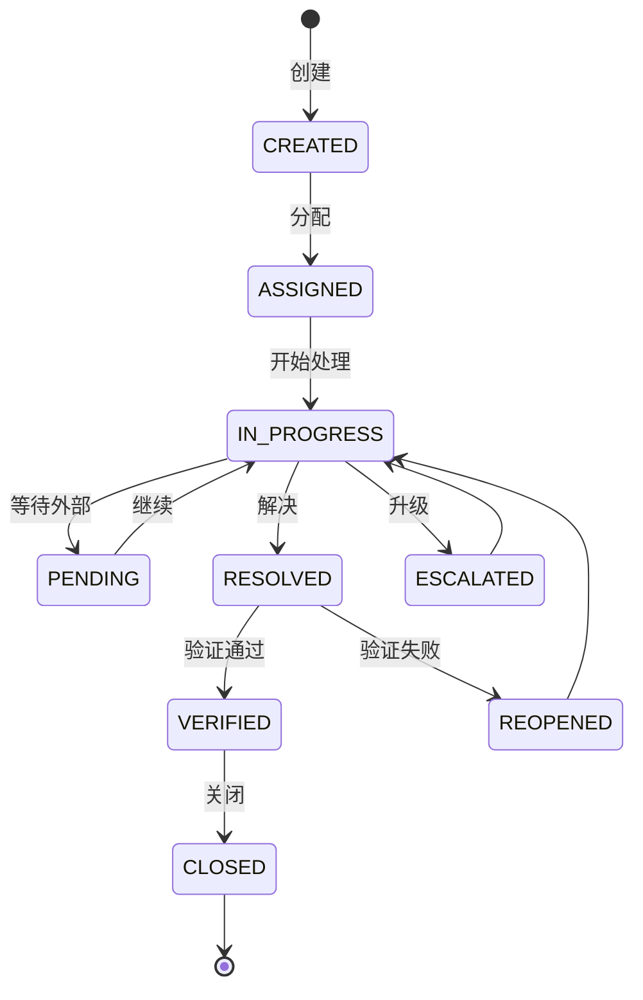

# 系统监控、安全审计与运维管理深度深化分析

---

## 一、业务定义与目标

### 1.1 定义

**系统监控**：对基础设施、应用服务、数据库、中间件、业务指标进行实时采集、可视化、异常检测和告警，保障7×24稳定运行。

**安全审计**：对用户操作、数据访问、权限变更、安全事件进行全面记录、分析和追溯，满足合规要求。

**运维管理**：对部署发布、配置变更、故障处理、日常巡检、值班、应急预案进行规范化流程化管理。

监控是"眼睛"（发现问题），审计是"记录仪"（追溯问题），运维是"手"（解决问题）。

### 1.2 核心目标

| 模块 | 目标 | 衡量指标 |
|------|------|---------|
| 系统监控 | 实时掌握状态，快速发现异常 | 告警准确率>95%，MTTD<1分钟 |
| 安全审计 | 所有操作可追溯，安全事件可发现 | 审计覆盖率100%，合规率100% |
| 运维管理 | 规范化运维，降低故障影响 | MTTR<30分钟，变更成功率>99% |

### 1.3 业务场景全景

```
系统监控、安全审计与运维管理
├── 系统监控
│   ├── 基础设施监控（服务器/OS/容器/网络/硬件）
│   ├── 中间件监控（Oracle/Redis/Kafka/Nacos/ClickHouse/PowerJob）
│   ├── 应用监控（JVM/接口/健康检查/线程池/连接池/日志）
│   ├── 业务监控（入库出库量/订单积压/库存准确率/面单成功率）
│   ├── 前端监控（页面性能/JS错误/API请求/PDA性能）
│   ├── 可视化看板（运维总览/基础设施/应用性能/业务实时/告警）
│   ├── 告警管理（规则/分级P0-P3/通知/收敛/升级/静默/复盘）
│   └── 链路追踪（TraceId/调用链/慢调用/错误链路/服务拓扑）
├── 安全审计
│   ├── 操作审计（登录/数据增删改查/配置变更/权限变更/导出打印/批量操作/敏感操作）
│   ├── 数据访问审计（敏感数据访问/跨租户访问/导出/修改前后值/频率分析）
│   ├── 安全事件（暴力破解/异常登录/越权/注入攻击/API滥用/数据泄露/内部违规）
│   ├── 合规审计（GSP/数据保留/个人信息/权限分离/操作留痕/审计报表）
│   ├── 审计日志（采集/不可篡改存储/查询/分析/归档）
│   └── 安全基线（密码策略/账户锁定/会话超时/权限最小化/加密检查/安全扫描）
└── 运维管理
    ├── 部署管理（环境/发布/蓝绿金丝雀滚动/回滚/配置/密钥/CI-CD）
    ├── 变更管理（申请/审批/实施/验证/回滚/记录）
    ├── 故障管理（发现/分级P0-P4/响应/处理/升级/复盘/知识库）
    ├── 日常巡检（每日/每周/每月/清单/记录/报告）
    ├── 值班管理（排班/交接/日志/通讯录/考核）
    ├── 应急预案（预案库/演练/流程/联系人/资源）
    ├── 备份恢复（数据库全量增量日志/文件/策略/验证/灾难恢复RTO/RPO/异地）
    ├── 容量管理（规划/监控/扩容/压测/成本优化）
    └── 运维自动化（脚本/平台/自愈/知识库/报表）
```

---

## 二、业务流程图

### 2.1 监控告警处理流程

```mermaid
flowchart TD
    A[指标采集] --> B[异常检测]
    B -->{超阈值?}
    C -->|否| A
    C -->|是| D[生成告警]
    D --> E[告警分级]
    E --> F[告警通知]
    F --> G[值班接收]
    G --> H[确认告警]
    H --> I[故障定位]
    I --> J[故障处理]
    J --> K[验证恢复]
    K -->{恢复?}
    L -->|否| M[升级/求助]
    M --> I
    L -->|是| N[关闭告警]
    N --> O[故障复盘]
    O --> P[改进措施]
```

### 2.2 安全事件响应流程

```mermaid
flowchart TD
    A[安全事件发现] --> B[事件定级]
    B -->{级别}
    C -->|高危| D[立即响应/阻断]
    E -->|中危| F[限时处理]
    G -->|低危| H[计划处理]
    D --> I[事件调查]
    F --> I
    H --> I
    I --> J[影响评估]
    J --> K[处置措施]
    K --> L[恢复验证]
    L --> M[事件记录]
    M --> N[复盘改进]
    N --> O[合规上报]
```

### 2.3 变更发布流程

```mermaid
flowchart TD
    A[变更申请] --> B[影响评估]
    B --> C[变更审批]
    C -->{通过?}
    D -->|否| E[拒绝/修改]
    D -->|是| F[制定发布计划]
    F --> G[发布窗口确认]
    G --> H[备份/快照]
    H --> I[执行发布]
    I --> J[发布验证]
    J -->{通过?}
    K -->|否| L[回滚]
    K -->|是| M[发布完成]
    L --> N[回滚验证]
    N --> M
    M --> O[变更记录]
    O --> P[监控观察]
```

---

## 三、状态机设计

### 3.1 告警状态机



### 3.2 故障工单状态机



---

## 四、核心业务场景详解

### 4.1 基础设施与中间件监控

**监控指标：** 服务器CPU>85%/内存>90%/磁盘>85%/网络带宽>80%/负载>核数×2；Oracle连接数>80%/慢SQL>10条/锁等待>30秒/表空间>85%/缓冲池命中率<95%；Redis内存>80%/命中率<90%/大Key>10MB/慢日志>10ms/主从延迟>1秒；Kafka消息积压>10000/消费延迟>5分钟/Broker离线/ISR收缩；ClickHouse查询延迟>30秒/磁盘>85%/合并队列>100。

**技术栈：** Prometheus+Node Exporter+JMX Exporter+Oracle Exporter+Redis Exporter采集，Prometheus TSDB短期存储，ClickHouse长期存储，Grafana可视化，Alertmanager告警路由。

### 4.2 应用性能监控（APM）

JVM监控（堆内存/GC/线程/类加载，Full GC>3次/小时P1告警，线程死锁P0）；接口监控（QPS/P95/P99/成功率/错误率，P99>3秒P2，错误率>5%P1）；健康检查（liveness存活/readiness就绪）；线程池/连接池监控（队列>80%告警，拒绝任务P1）。

链路追踪：Micrometer Tracing+Brave（Spring Boot 4.x内置），自动埋点HTTP/RPC/DB/Kafka，TraceId全链路传递，生产10%采样+错误100%，慢调用/错误记录到ClickHouse。

### 4.3 业务监控与大屏

实时监控入库量/出库量/待拣货/待复核/待发货/波次进度/面单成功率/库存预警/人员在线/设备状态。运维大屏1920×1080布局：顶部系统总览，左侧基础设施+中间件，中间业务实时，底部告警列表+接口性能趋势。React+ECharts+WebSocket实时推送，关键指标5秒刷新，告警红色闪烁+声音。

### 4.4 告警管理

**分级：** P0紧急（系统不可用，5分钟响应，电话+短信+@所有人）/P1重要（核心功能异常，15分钟，短信+企业微信）/P2一般（非核心异常，1小时，企业微信）/P3提示（4小时，企业微信/邮件）。

**收敛：** 相同标签告警合并，根因告警抑制衍生告警，维护期静默，短暂波动不告警（持续时间判断），5分钟内去重。

**升级：** P0 5分钟未确认→运维主管，15分钟未恢复→技术总监，30分钟→CTO。

### 4.5 操作审计

必须审计：登录登出/数据增删改/配置变更/权限变更/数据导出/批量删除/金额修改/审批/跨租户操作。记录内容：操作人/时间/IP/设备/类型/模块/对象/操作前值JSON/操作后值JSON/结果/失败原因/TraceId。

实现：@AuditLog注解+AOP切面，MyBatis拦截器记录修改前后值，登录过滤器记录登录日志，API网关记录调用日志，异步写入ClickHouse不影响主流程。审计日志只追加不可修改删除，近3月ClickHouse，3月-1年对象存储Parquet，1年以上冷存储。

### 4.6 安全事件管理

**事件类型：** 暴力破解（5分钟登录失败≥5次→自动锁定账号+封禁IP）/异常登录（非常用IP/异地）/越权访问/大量数据导出（>10000条告警）/SQL注入/XSS/API滥用/内部违规。

**响应：** 自动阻断（IP封禁/账号锁定/会话失效）+人工调查取证+处置（封禁/重置密码/权限回收）+恢复加固+合规上报。

### 4.7 部署与变更管理

**部署策略：** 滚动发布（常规）/蓝绿（重要发布）/金丝雀（高风险变更，先1实例验证再全量）/停机发布（DB大版本升级）。

**X WMS发布流程：** 代码评审→CI构建→测试环境验证→变更申请审批→发布窗口（低峰期凌晨2-4点）→备份→滚动发布先1实例→验证→全量→30分钟监控→完成。异常立即回滚。

**配置管理：** Nacos配置中心动态刷新+版本管理+变更审计，密钥加密存储（数据库密码/API Key/证书），敏感配置展示脱敏。

### 4.8 故障管理与复盘

**分级：** P0系统完全不可用（5分钟响应，30分钟恢复）/P1核心功能严重受损（15分钟，1小时）/P2非核心异常（1小时，4小时）/P3轻微问题（4小时，24小时）/P4优化建议。

**处理流程：** 发现→确认工单→定位（监控/日志/链路/变更）→紧急恢复优先（重启/回滚/扩容/切换）→验证→记录→复盘（时间线+5Why根因+影响评估+短期长期改进措施+责任人+跟踪）。

### 4.9 备份与灾难恢复

**备份策略：** Oracle RMAN（每周日0级全量+每日1级增量+归档日志实时，全量保留4周/增量2周/归档30天）；Redis RDB每小时+AOF实时保留7天；配置文件每次变更备份永久；附件每日增量每周全量保留3月；日志实时采集保留1年。

**恢复场景：** 实例故障重启/DG切换（RTO<5分钟）；数据误删按时间点恢复PITR（RTO<2小时）；存储损坏从备份恢复（RTO<4小时）；机房灾难异地备份恢复（RTO<4小时，RPO<24小时）。每月一次恢复测试验证备份可用性。

---

## 五、库存变化分析

本模块为运维与安全域，不直接改变库存。数据库备份恢复可能影响库存数据（恢复到某个时间点状态），系统故障可能导致作业中断库存停留在故障时刻，数据修复可能调整库存。

---

## 六、技术实现方案

### 6.1 核心表设计

```sql
-- 告警规则表 sys_alert_rule (rule_code/rule_name/category/metric/condition/threshold/duration/level/notify_channels/enabled)
-- 告警记录表 sys_alert_record (alert_no/rule_code/level/metric/actual_value/threshold/status/instance/assignee/ack_time/resolve_time)
-- 操作审计日志表 sys_audit_log (trace_id/user_id/username/tenant_code/operation_type/module/biz_type/biz_key/before_value/after_value/ip_address/result/cost_time/operation_time)
-- 安全事件表 sys_security_event (event_no/event_type/level/source/title/description/user_id/ip_address/status/handler/handle_result)
-- 故障工单表 sys_incident (incident_no/title/level/status/category/source/description/impact/root_cause/solution/assignee/duration_min)
-- 变更单表 sys_change_order (change_no/title/type/level/status/description/impact/rollback_plan/executor/approver/plan_time)
-- 备份记录表 sys_backup_record (backup_no/backup_type/target/file_path/file_size/duration/status/verified)
-- 巡检记录表 sys_inspection_record (inspection_no/type/inspector/items/issues/status)
```

### 6.2 监控告警核心实现

AlertService每分钟评估启用的规则→从Prometheus查询指标当前值→判断是否超阈值→首次异常记录开始时间→持续超过duration才告警→检查是否已有未解决告警去重→创建告警→通知。确认/解决/关闭更新状态。Redis缓存firing状态防重复。

### 6.3 操作审计AOP实现

@AuditLog(module, operation, bizType, recordBefore, recordAfter)注解，@Around切面记录TraceId/用户/租户/模块/操作/IP/UA，通过方法参数ID查询修改前值，proceed后记录结果和修改后值，cost_time，finally异步写入审计日志。

### 6.4 安全事件检测

SecurityEventService：checkBruteForce（登录失败计数Redis 5分钟，≥5次创建事件+锁定账号）；checkAbnormalLogin（非常用IP集合检测）；checkMassExport（导出>10000条告警）。事件创建后通知安全人员。

### 6.5 健康检查与自愈

/actuator/health/liveness存活检查，/actuator/health/readiness就绪检查（DB+Redis连接）。ThreadPoolMonitor每分钟检查线程池队列>80%告警，拒绝任务P1告警。关键服务异常可自动重启（Docker restart策略）。

---

## 七、主流WMS对比

| 维度 | 富勒 | 曼哈特 | Blue Yonder | X WMS |
|------|------|--------|-------------|-------|
| 系统监控 | 基础监控 | 企业级APM | AIOps | Prometheus+Grafana全栈 |
| 告警管理 | 基础告警 | 智能告警 | AI告警收敛 | 多级告警+收敛+升级 |
| 安全审计 | 基础日志 | 完整审计 | AI异常检测 | 全量审计+安全事件 |
| 运维管理 | 基础运维 | ITIL流程 | AI自愈 | 标准化+自动化 |
| 链路追踪 | 有限 | 完整分布式 | AI链路分析 | OpenTelemetry全链路 |
| 日志管理 | 基础 | ELK完整 | AI日志分析 | ClickHouse日志中心 |

---

## 八、常见业务问题与解决方案

| 问题 | 解决方案 |
|------|---------|
| 告警风暴 | 告警收敛+根因分析+告警抑制+分级通知 |
| 告警误报 | 持续时间判断+动态基线+告警调优+维护期静默 |
| 告警漏报 | 监控全覆盖+多层阈值+异常检测+定期巡检 |
| 故障定位慢 | TraceId全链路+日志集中+监控关联+故障知识库 |
| 审计日志被篡改 | 只追加+哈希校验+权限分离+异地备份 |
| 发布故障 | 灰度发布+自动化测试+快速回滚+发布窗口 |
| 备份不可用 | 定期恢复测试+备份监控+多份备份+异地备份 |
| 密码泄露 | 密码策略+加密存储+定期轮换+密钥管理 |
| 运维误删 | 变更审批+操作复核+操作审计+备份先行 |
| 大促系统过载 | 容量规划+压测+限流降级+扩容预案 |
| 日志量太大 | 分级日志+采样+过期清理+压缩存储 |
| 合规不通过 | 合规检查清单+定期审计+保留策略+合规报表 |

---

## 九、与其他模块的关联关系

| 关联模块 | 关联点 |
|---------|--------|
| 所有业务模块 | 操作审计/性能监控，审计日志/指标 |
| API网关 | API监控/调用日志/安全事件 |
| 多租户管理 | 跨租户操作审计/租户级监控 |
| 系统管理 | 用户操作审计/权限变更审计 |
| 消息通知 | 告警通知/安全事件通知 |
| 数据归档 | 日志归档/审计日志归档 |
| KPI报表 | 运维指标报表/SLA报表 |
| PowerJob | 定时任务监控/执行日志 |
| Kafka | 消息积压监控/消费延迟 |
| Oracle | 数据库监控/慢SQL/审计 |
| Redis | 缓存监控/大Key/命中率 |
| 行业插件 | GSP合规审计要求 |
